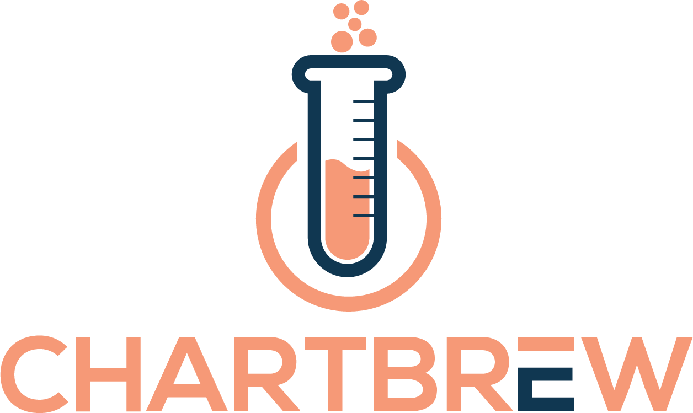

<p align="center">
  <a href="https://chartbrew.com">
    
  </a>
</a>

<p align="center">
  <a href="https://circleci.com/gh/chartbrew/chartbrew" target="_blank"></a>
  <a href="https://app.codacy.com/gh/chartbrew/chartbrew" target="_blank"></a>
  <a href="https://discord.gg/KwGEbFk" target="_blank"></a>
</p>

<p align="center">
  <strong>
    <a href="https://chartbrew.com">Chartbrew</a> is an open-source web application that can connect directly to databases and APIs and use the data to create beautiful charts. It features a chart builder, editable dashboards, embedable charts, query & requests editor, and team capabilities.
  </strong>
</p>

<p align="center">
  <strong><a href="https://chartbrew.com">Chartbrew as a service is available here</a></strong>
</p>

<br />

<p align="center">
  <a href="https://chartbrew.com">
    
  </a>
</p>

<hr />

📚 [**Read the full docs here**](https://docs.chartbrew.com)

🔧 [**Issues ready to be tackled**](https://github.com/orgs/chartbrew/projects/1)

🚙 [**Public roadmap over here**](https://trello.com/b/IQ7eiDqZ/chartbrew-roadmap)

💡 [**Have any ideas or discussion topics?**](https://github.com/chartbrew/chartbrew/discussions)

💬 [**Join our Discord**](https://discord.gg/KwGEbFk)

## Data sources

Currently, Chartbrew supports connections to these data sources.

* MySQL
* PostgreSQL
* MongoDB
* Firestore
* Realtime Database
* Google Analytics
* Customer.io
* REST APIs

Chartbrew also features dashboard templates with charts already prepared:

* Simple Analytics
* ChartMogul
* Mailgun
* Google Analytics

...or you can create your **custom templates** and replicate them across multiple dashboards.

## Prerequisites

* NodeJS v12 (should also work with v10)
  * For M1 Macs you might need the latest v14 or v15
* NPM
* MySQL (5+) or PostgreSQL (12.5+)

## Start

It is recommended you head over to the more detailed documentation to find out how to set up Chartbrew

[📚 You can find it here](https://docs.chartbrew.com/#getting-started)

## Quickstart

If you already have a MySQL or PostgreSQL server running, create a database called `chartbrew` and follow the prompts of the `create-chartbrew-app` command below.

**Important** Windows command line is not supported at the moment. Use something like [Cygwin](http://www.cygwin.com/) on Windows.

```sh
npx create-chartbrew-app chartbrew
```

The CLI tool creates a `chartbrew/.env` file which you can configure at any time if you want to change the database, API & client host, etc. The file contains comments explaining what each environmental variable is for. [Check out which need to be set here.](https://docs.chartbrew.com/#set-up-environmental-variables)

### Run the project in Development

Open two terminals, one for front-end and the other for back-end.

```sh
# frontend
cd client/
npm run start

# backend
cd server/
npm run start-dev
```

## Run with Docker

[Check the full guide in the docs.](https://docs.chartbrew.com/deployment/#run-the-application-with-docker)

### Quickstart

A [Chartbrew docker image](https://hub.docker.com/r/razvanilin/chartbrew) is built whenever a new version is released.

Before running the commands below, make sure you have a MySQL server already running and an empty database that Chartbrew can use. The database name should match the value of the `CB_DB_NAME` variable.

For `amd64` architecture:

```sh
docker pull razvanilin/chartbrew

docker run -p 4019:4019 -p 4018:4018 \
  -e CB_SECRET=enter_a_secure_string \
  -e CB_API_HOST=0.0.0.0 \
  -e CB_API_PORT=4019 \
  -e CB_DB_HOST=host.docker.internal \
  -e CB_DB_NAME=chartbrew \
  -e CB_DB_USERNAME=root \
  -e CB_DB_PASSWORD=password \
  -e REACT_APP_CLIENT_HOST=http://localhost:4018 \
  -e REACT_APP_API_HOST=http://localhost:4019 \
  razvanilin/chartbrew
```

For `arm64` architecture:

```sh
docker pull razvanilin/chartbrew:latest-arm64

docker run -p 4019:4019 -p 4018:4018 \
  -e CB_SECRET=enter_a_secure_string \
  -e CB_API_HOST=0.0.0.0 \
  -e CB_API_PORT=4019 \
  -e CB_DB_HOST=host.docker.internal \
  -e CB_DB_NAME=chartbrew \
  -e CB_DB_USERNAME=root \
  -e CB_DB_PASSWORD=password \
  -e REACT_APP_CLIENT_HOST=http://localhost:4018 \
  -e REACT_APP_API_HOST=http://localhost:4019 \
  razvanilin/chartbrew:latest-arm64
```

### Changing environmental variables

If you want to run your Docker image with new environmental variables, it's important to build the client application again withing the image. This is done by running the following command:

```sh
# replace 'your_container_name' with the name of your docker container where Chartbrew is running

docker exec -it -w /code/client your_container_name npm run build
```

## Deploy Chartbrew on Heroku and Vercel

[Read more on how to do this here](https://chartbrew.com/blog/how-to-deploy-chartbrew-on-heroku-and-vercel/)

## Acknowledgements

Many thanks to [everybody that contributed](https://github.com/chartbrew/chartbrew/graphs/contributors) to this open-source project 🙏

[Start here if you want to become a contributor](https://github.com/chartbrew/chartbrew/blob/master/CONTRIBUTING.md)
