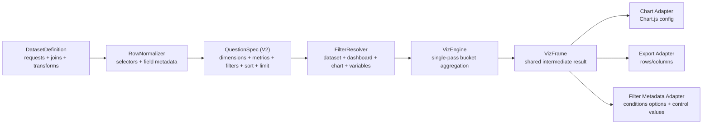

## Problem
Chartbrew's current visualization pipeline is built around legacy dataset fields like `xAxis`, `yAxis`, `yAxisOperation`, and `dateField`. That model works for simple X/Y charts but breaks down for multi-metric charts, breakout dimensions, mixed axes, reusable exports, and richer chart-builder UX. The current implementation also couples data shaping, filtering, aggregation, and Chart.js rendering too tightly inside `AxisChart`.

We need a new visualization pipeline that is source-agnostic across SQL, APIs, and NoSQL responses, but we must preserve all existing charts and datasets without requiring a risky bulk rewrite.

## Goals
- Introduce a V2 visualization model that supports multiple metrics, multiple dimensions, breakout series, mixed left/right axes, and post-aggregation operations.
- Keep datasets source-focused: requests, joins, transforms, and field metadata stay at the dataset layer.
- Preserve and improve dataset reusability: multiple charts must continue to reuse the same dataset cleanly, with chart-specific customization isolated to CDCs.
- Move chart question semantics to the chart side instead of storing them as dataset-global X/Y choices.
- Make filtering and variables first-class across dataset, chart, dashboard, export, embed, and AI flows.
- Unify chart rendering, filtering, and export around a shared intermediate representation.
- Preserve backward compatibility: existing charts continue to render and behave the same after schema rollout.
- Ensure V2 works with automated updates, alerts, embeds, and snapshots through the same `updateChartData()` lifecycle.
- Ensure the AI orchestrator and its tools understand V2 datasets/charts and can create, inspect, and update them safely.
- Provide a phased migration path with deterministic conversion utilities, migration reports, and optional backfill.

## Non-goals
- Replacing the current dataset request/join system in this project.
- Removing legacy fields immediately from `Dataset` or `ChartDatasetConfig`.
- Introducing multi-dashboard shared chart ownership in the first V2 rollout.

## Compatibility Contract
- Schema changes must be additive only.
- Existing charts must continue to render without user action.
- Existing filters, variables, dashboard filters, alerts, embeds, and exports must keep working for legacy charts.
- Existing `updateChartData(id, user, { filters, variables, ... })` callers must remain valid for both legacy and V2 charts.
- Existing automation entry points must keep working through the same public controller methods.
- No bulk migration will rewrite all existing chart rows on initial release.
- The canonical DB should not enter a partially migrated V2 state. Broad apply happens only after migration coverage exists for every current legacy chart type and the full-db dry-run is clean.
- Rollback must be possible by preserving legacy runtime/data and by using reversible migration scripts, not destructive data repair.

## Ownership Boundary
- `Dataset` remains a reusable source definition.
- `ChartDatasetConfig` remains the chart-specific customization and question layer.
- Versioning belongs to the chart question layer, not the dataset entity.
- A chart may still have multiple CDCs, but initial V2 rollout should require all CDCs on the same chart to use the same engine version.
- Mixed V1/V2 CDCs inside one chart are out of scope for the first rollout and should be blocked by validation.
- In the initial V2 rollout, a saved chart still belongs to exactly one dashboard.
- Draft authoring should be allowed outside dashboard context, but save/publish should assign the chart to one dashboard.
- A single dataset may be used simultaneously by:
  - legacy charts using dataset `xAxis` / `yAxis` / `dateField`
  - V2 charts using CDC `vizConfig`
- Dataset list and dataset picker UI should remain unified. Do not split datasets into separate V1 and V2 inventories.

## Proposed Architecture


- `DatasetDefinition`
  - Existing dataset responsibilities remain: `DataRequests`, joins, transforms, variable bindings.
- `Field Metadata`
  - Dataset-level catalog of inferred fields, types, roles, labels, and aggregation hints.
- `QuestionSpec`
  - Chart-side question definition: dimensions, metrics, filters, sort, limit, post-ops.
- `VizEngine`
  - Compiles selectors and predicates once, processes rows once, aggregates with maps.
- `VizFrame`
  - Canonical result used by chart rendering, tables, export, and filter metadata.

## Data Model
- `Dataset.name`
  - Canonical dataset display name for V2-era dataset UX and migration tooling.
  - Must stay synchronized with legacy `Dataset.legend` while legacy dataset flows remain in place.
- `Dataset.fieldsMetadata`
  - As defined in `FS-20251222-dataset-field-metadata`.
- `ChartDatasetConfig.vizVersion`
  - Integer, default `1`.
  - `1` = legacy X/Y path.
  - `2` = V2 question path.
- `ChartDatasetConfig.vizConfig`
  - JSON, nullable.
  - Stores question and series config for V2.
- `ChartDatasetConfig.configuration`
  - Remains available for legacy/runtime overrides such as variable values.
  - Do not overload this field with the primary V2 question definition.
- `DashboardFilter.configuration.bindings`
  - JSON, additive to current dashboard filter config.
  - Optional explicit target bindings for V2 field- or variable-based filters.
- Keep all legacy `Dataset` and `ChartDatasetConfig` fields unchanged.

### Reusability Rules
- Reusing an existing dataset must remain the default and recommended path for both V1 and V2 charts.
- V2 question semantics must live on `ChartDatasetConfig`, not on `Dataset`, so one dataset can power many different chart questions.
- A V2 chart builder session must be able to author charts with multiple CDCs by letting the user add, switch, and remove datasets within the same chart.
- Dataset picker/search flows should continue to show one dataset entry regardless of whether it is referenced by legacy charts, V2 charts, or both.
- Dataset-level field metadata should improve reuse by helping users discover usable dimensions/metrics without redefining the dataset.
- Field metadata must preserve a mapping between canonical V2 `fieldId` values and legacy traversal paths so old filters and new bindings can interoperate during migration.

### `vizConfig` shape
```js
{
  version: 2,
  dimensions: [
    { id: "d1", fieldId: "created_at", role: "x", grain: "month" },
    { id: "d2", fieldId: "product.category", role: "breakout" }
  ],
  metrics: [
    {
      id: "m1",
      fieldId: "id",
      aggregation: "count",
      label: "Orders",
      axis: "left",
      enabled: true,
      style: { color: "#3b82f6", fillColor: "transparent", lineStyle: "solid", pointRadius: 0, goal: null }
    },
    {
      id: "m2",
      fieldId: "revenue",
      aggregation: "sum",
      label: "Revenue",
      axis: "right",
      enabled: true,
      style: { color: "#10b981", fillColor: "transparent", lineStyle: "solid", pointRadius: 0, goal: 10000 }
    }
  ],
  filters: [
    {
      id: "f1",
      scope: "question",
      targetType: "field",
      fieldId: "status",
      operator: "is",
      valueSource: "literal",
      value: "paid",
      exposed: false
    },
    {
      id: "f2",
      scope: "question",
      targetType: "field",
      fieldId: "created_at",
      operator: "between",
      valueSource: "dashboardFilter",
      bindingId: "df_date_range",
      exposed: true
    }
  ],
  filterControls: [
    {
      id: "fc1",
      filterId: "f2",
      controlType: "dateRange",
      label: "Created at"
    }
  ],
  sort: [{ ref: "d1", dir: "asc" }],
  limit: null,
  postOperations: [{ type: "runningTotal", metricId: "m2" }],
  options: {
    includeEmptyBuckets: true,
    visualization: {
      type: "bar",
      dataMode: "series"
    },
    compatibility: {
      legacyRawChartType: "bar",
      legacyChartType: "bar"
    }
  }
}
```

- Migration-generated V2 configs may carry `options.visualization` and `options.compatibility` details to preserve legacy chart-family semantics until the dedicated V2 runtime and builder own those settings directly.

## Filtering And Variables
V2 must stop treating filtering as scattered special-case logic inside `AxisChart`. The runtime should compile one resolved filter plan from four distinct scopes plus variables.

### Filter Scopes
- Dataset filters
  - Current `Dataset.conditions` remain the reusable source-level and post-fetch row filter definition.
  - They continue to be shared by every chart using that dataset.
  - They may stay literal, reference variables, and remain exposeable to runtime controls.
- Question filters
  - New V2 per-chart filters live in `ChartDatasetConfig.vizConfig.filters`.
  - They define the chart question and never mutate the dataset record.
  - They can reference dataset fields, dashboard filter bindings, or variables.
- Dashboard filters
  - Dashboard filters remain project-level controls that can affect multiple charts at once.
  - V2 must support `date`, `field`, and `variable` dashboard filters through explicit bindings instead of relying only on legacy `dataset.dateField` heuristics.
  - A dashboard filter may bind to:
    - one or more V2 date-capable fields from `fieldsMetadata`
    - one or more dataset/question filters by `bindingId`
    - one or more variables such as `startDate`, `endDate`, `status`, or `customerId`
- Chart filters
  - Chart filters remain widgets shown on a specific chart.
  - They do not define a new filter scope in the engine.
  - They are a UI layer over exposed dataset or question filters and simply provide runtime values for them.
  - Runtime chart-filter selections must not mutate reusable dataset filter definitions or persisted V2 question defaults unless the user explicitly saves a configuration change.

### Variable Model
- `Variable` and `VariableBinding` remain the canonical persistence model.
- Variables must continue to work in three places:
  - request-time substitution for SQL/API/NoSQL requests
  - dataset filters whose values use `{{variable}}`
  - V2 question filters whose values are bound to variables or dashboard filters
- V2 should treat `{{startDate}}` and `{{endDate}}` as ordinary variable bindings, not as a one-off API exception.
- `updateChartData(id, user, { filters, variables, ... })` remains the runtime contract. V2 resolves those inputs into the compiled filter plan instead of bypassing them.

### Binding Rules
- Every filterable V2 field should be identified by `fieldId` from `fieldsMetadata`, not raw traversal strings in dashboard UI.
- Dashboard filters should support explicit `bindings[]` so the same dashboard control can map to different datasets/charts safely.
- A binding target must be able to identify chart scope explicitly with `chartId` and/or `cdcId` in addition to `datasetId`.
- `datasetId` alone is not sufficient when the same dataset is reused by multiple charts with different V2 questions or exposed filters.
- If a chart has multiple compatible date fields, V2 must require an explicit binding choice instead of guessing.
- Exposed filters should keep stable IDs so chart widgets, dashboard controls, exports, embeds, and AI tools can target them consistently.
- A chart filter value overrides the default value of the exposed filter it controls.
- A dashboard filter value overrides only the filters or variables explicitly bound to it.
- Variable precedence should stay predictable:
  - runtime URL/share/report variables
  - dashboard or chart-provided values
  - CDC configuration defaults
  - persisted dataset/request defaults

### Date Filter Rules
- Legacy charts may continue to use `dataset.dateField`.
- V2 charts must not require `dataset.dateField`.
- A V2 date filter can bind to:
  - a question dimension with a date/time field
  - a dataset filter targeting a date-capable field
  - variable bindings for source requests
- Dashboard date filters should work for SQL, API, and NoSQL datasets if the target is either:
  - a compatible normalized field in `fieldsMetadata`, or
  - an explicit start/end variable binding
- Date grain belongs to the question dimension (`day`, `week`, `month`, etc.), while date filtering belongs to the filter plan. The two must be related but independent.

### Execution Contract
- V2 should resolve runtime inputs in this order:
  - request/share/report variables
  - dashboard-provided values
  - chart-filter control values
  - CDC configuration defaults
  - persisted dataset/request defaults
- After resolving values, the engine should compile the logical dataset and question filters once.
- If the connector supports pushdown, the same resolved plan should be translated into source-level filters before the in-memory pass.
- The engine should compile one predicate set and apply it once per normalized row instead of running separate passes for dataset, dashboard, field, date, and variable filters.
- Source pushdown is preferred when the connector supports it, but the semantic result must match the in-memory path.
- Export, chart rendering, and filter option generation must read the same resolved filter plan and the same `VizFrame`.

### Dashboard Filter Configuration
Dashboard filters should evolve from heuristic field matching toward explicit bindings:

```js
{
  id: "df_date_range",
  type: "date",
  label: "Created at",
  bindings: [
    {
      chartId: 10,
      cdcId: "cdc_orders_main",
      datasetId: 42,
      targetType: "field",
      fieldId: "created_at",
      operator: "between"
    },
    {
      chartId: 11,
      cdcId: "cdc_api_orders",
      datasetId: 84,
      targetType: "variable",
      variableName: "startDate",
      role: "start"
    },
    {
      chartId: 11,
      cdcId: "cdc_api_orders",
      datasetId: 84,
      targetType: "variable",
      variableName: "endDate",
      role: "end"
    }
  ]
}
```

Legacy dashboard filters without explicit bindings should continue to use the current compatibility rules until edited or migrated.

## Execution Flow
- Legacy path
  - If `vizVersion !== 2`, keep using the current `AxisChart`/`DataExtractor` path unchanged.
- V2 path
  - `ChartController.updateChartData()` resolves dataset rows and field metadata.
  - `FilterResolver` merges dataset filters, question filters, dashboard filters, chart filter values, and variables into a compiled runtime plan.
  - `VizEngine` builds a `VizFrame` from `vizConfig` and the compiled filter plan.
  - Chart adapters convert `VizFrame` into Chart.js config.
  - Export adapter converts `VizFrame` into export rows.
  - Filter metadata adapter derives exposed condition values and control metadata from the same result set.
- Legacy adapter
  - Add `legacyToVizConfig(dataset, cdc)` to derive a deterministic V2 question from legacy fields.
  - Use it for migration scripts, dry-run validation, and lossless backfill generation.
- Automation contract
  - `ChartController.updateChartData()` remains the single runtime entry point for manual runs, cron updates, alerts, embeds, and snapshots.
  - V2 must plug into that method rather than creating a separate runtime path.

## Runtime Integrations
### Automated Updates
- Dashboard/chart cron jobs already rely on `ChartController.updateChartData()` and should continue to do so.
- V2 must not require separate schedulers or alternate execution APIs.
- `updateChartData()` must continue to persist the same chart-level runtime outputs needed by downstream jobs.
- V2 `updateChartData()` compatibility contract:
  - Normal runs persist `chart.chartData` in the legacy-compatible shape plus `chartDataUpdated`, and may refresh `Dataset.conditions[].values` from runtime `conditionsOptions`.
  - Filtered runs return filtered `chartData` to the caller but must not persist filtered chart output or dataset condition values.
  - Export runs return export-row payloads to the caller but must not persist export output or dataset condition values.
  - `conditionsOptions` remains a runtime-only side channel; it is used to refresh reusable filter values during normal runs and is never written into persisted `chart.chartData`.

### Alerts
- Current alert evaluation reads `chart.chartData.data.labels` and `chart.chartData.data.datasets[index].data` by CDC order.
- V2 must either:
  - preserve this chartData surface for alert-compatible chart types, or
  - refactor alerts to read a shared `VizFrame`/adapter contract without breaking existing rules.
- Alert compatibility is required for:
  - threshold above/below/between/outside
  - milestone
  - anomaly detection
- If a V2 chart/question cannot support a legacy alert mode, the UI must block or warn instead of failing at runtime.

### Snapshots And Embeds
- Snapshot generation uses the existing embedded/public chart routes and frontend rendering.
- V2 charts must render correctly through those same routes without special-case snapshot code.
- Persisted chart output must remain sufficient for Playwright-based chart snapshots and dashboard snapshots.
- Embedded/share renders that apply URL variables or share-policy variables must treat that output as runtime-only and must not overwrite persisted `chart.chartData`.
- Embedded/public payloads must keep returning legacy-compatible `chartData` plus `ChartDatasetConfigs` so existing frontend embed and snapshot rendering keeps working unchanged.
- Snapshot token access should remain compatible with the existing `snapshot` and `isSnapshot` route/query conventions.

### Public Dashboards And Share Filters
- Public dashboard/report share routes must keep treating non-field URL params as runtime variables for request bindings and V2 question filters.
- URL field filters such as `fields[status]=paid` must be normalized into runtime field filters before `updateChartData()` so both legacy and V2 chart execution see the same filter shape.
- Public/share dashboard filtering remains runtime-only and must not persist variable- or field-filter-specific chart output back to the chart rows.

### AI Orchestrator And Tools
- The AI orchestrator currently assumes legacy dataset fields such as `xAxis`, `yAxis`, `yAxisOperation`, and `dateField`.
- V2 rollout must update:
  - tool schemas in `orchestrator.js`
  - semantic-layer dataset serialization
  - creation/update tools
  - validation rules and entity creation rules
  - chart suggestion logic
- AI should understand both modes during migration:
  - prefer V2 for new chart authoring
  - preserve and edit legacy charts without forcing conversion
- AI tool design should mirror the product model:
  - datasets define source data
  - chart CDCs define V2 dimensions/metrics/breakouts/styling

## Migration Strategy
- Phase 0 is additive schema only: no runtime behavior change for existing charts.
- Legacy charts remain `vizVersion = 1` until explicitly converted or backfilled.
- New V2 charts should write `vizVersion = 2` and `vizConfig`; they do not need to mirror all legacy fields.
- During rollout, chart conversion should happen at whole-chart scope even though `vizVersion` is stored on each CDC.
- Dataset `conditions`, dataset/request variable bindings, and dashboard filter rows remain valid inputs during rollout.
- Legacy dashboard date filters keep current behavior until a chart or filter is explicitly upgraded to V2 bindings.
- V2 should support mixed projects where:
  - one dashboard filter still targets legacy `dateField`
  - another dashboard filter targets explicit V2 field bindings
  - some charts expose legacy dataset filters while others expose V2 question filters
- Existing traversal-path filters from `fieldsSchema` and `Dataset.conditions` must keep resolving even after V2 introduces canonical `fieldId` values.
- Do not rely on runtime feature flags or side-by-side production compare mode for rollout gating.
- Build migration tooling that can:
  - dry-run legacy chart conversion and emit validation output
  - write `vizVersion = 2` and `vizConfig` only when mapping is clean and supported
  - keep legacy columns after migration so rollback remains a data-selection choice, not a repair task
  - store migration audit output for review before production rollout
- Do not partially apply V2 migrations to the canonical DB while chart-type coverage is incomplete.
- Limited apply runs on local/staging/DB clones are acceptable for engine development and fixture creation.
- Legacy UI must show a `Legacy` badge and offer a migration entry point rather than a separate V2 preview mode.
- Dataset UI remains shared; migration actions belong on charts, not on datasets.

## UX
Detailed screen-by-screen UX is specified in `FS-20260318-visualization-pipeline-v2-screen-spec`. This section keeps only the product-level UX rules that affect architecture and migration.

### Entry Points And User Journey
- Chart authoring should no longer require entering a dashboard first.
- Add a global `New chart` CTA from the homepage/sidebar and keep `Create chart` entry points from datasets and relevant connection flows.
- Dashboards should remain the publishing and layout container, but not the only way to begin chart creation.
- The V2 authoring flow must preserve route context between chart and dataset editing:
  - when a chart opens a dataset, keep the `chart_id` and destination dashboard context in the route/query state
  - when the user finishes editing that dataset and clicks `Visualize`, return to the same chart instead of creating a second draft chart
  - when the user is editing a standalone dataset with no chart context, `Visualize` may still create a new draft chart from that dataset
- Breadcrumbs must reflect that authoring context:
  - chart builder should let the user return to the destination dashboard when one is known
  - dataset editor should always let the user return to the dataset list
  - dataset editor should also show a chart breadcrumb when opened from a chart so the user can navigate back without losing authoring context

Recommended journey after a connection already exists:

1. Start from `New chart` on the homepage, sidebar, or dataset page.
2. Choose `Use existing dataset` or `Create from connection`.
3. If creating from a connection:
   - create a draft dataset automatically
   - let the user define request, joins, row extraction, transforms, fields, reusable filters, and variables
4. Click `Visualize` to enter the chart question builder.
5. Build the question by choosing metrics, dimensions, breakouts, filters, sort, limit, and chart type.
6. Preview and optionally expose chart filters or bind filters to dashboard controls/variables.
7. Save the chart and choose its dashboard destination.

This keeps the user journey question-first while preserving datasets as reusable assets and dashboards as the place where published charts live.

- Dataset editor
  - Keep `Requests` and join configuration.
  - Keep reusable dataset filters and dataset/request variables at the dataset layer.
  - Add `Fields` tab for metadata review and overrides.
  - Remove the expectation that a dataset has one permanent chart dimension/metric pair.
  - Treat dataset filters as reusable row filters, not as the chart question builder.
  - `Open dataset` from the chart builder must open the existing dataset editor in-place for that chart, not a generic dataset browsing flow.
  - If the dataset editor was opened from a chart, the primary completion action should behave as `Save & return to chart`.
- Chart editor V2
  - Support draft authoring outside dashboard context.
  - Replace the current single-dataset/single-series flow with a question builder:
  - `Filter`
  - `Summarize`
  - `Break out by`
  - `Sort`
  - `Limit`
  - `Visualize`
  - Exposed filters should have explicit control settings so chart widgets can be configured without mutating dataset-wide filter semantics accidentally.
  - When a chart reuses a dataset, chart-local question filters must be clearly separated from reusable dataset filters in the UI.
  - The builder must support multi-dataset charts by:
    - listing attached datasets / CDCs
    - letting the user switch the active dataset being configured
    - letting the user add another reusable dataset to the same chart
    - letting the user remove a dataset from the chart when more than one CDC exists
  - V2 authoring must preserve the existing chart-configuration capabilities that still live on `Chart` or `ChartDatasetConfig`, including:
    - series colors / fill colors
    - formula and goal configuration
    - CDC-scoped variable overrides stored in `ChartDatasetConfig.configuration.variables`
    - alerts attached to the chart dataset config
  - Those settings may be presented as an advanced section in V2, but they must continue to use the same persistence model and runtime behavior as the existing chart editor until a dedicated V2 replacement exists.
  - The save step should assign the chart to a dashboard if it was started outside one.
- Dashboard filter editor
  - Should offer explicit target binding for field, date, and variable filters.
  - Should use `fieldsMetadata` labels/types instead of raw `fieldsSchema` path strings where possible.
  - Should show when a filter is bound to legacy charts, V2 charts, or both.
  - Should show the effective target scope, including chart and dataset, so shared datasets do not create ambiguous bindings.
- Existing charts
  - Open normally with no visual regression.
  - If legacy, show existing controls plus a conversion entry point.

## Phases
### Phase 0: Groundwork
- Add spec and additive schema/model groundwork.
- Define `vizVersion`, `vizConfig`, `fieldsMetadata`, and the legacy-to-V2 migration contract.
- Keep rollout strategy migration-first: no env flags or runtime telemetry gates.
- Exit criteria: schema is merged, migration contract is documented, and there are no behavior changes.

### Phase 1: Field Metadata
- Populate `fieldsMetadata` from dataset preview data.
- Add Fields UI and overrides.
- Mark date-capable, filterable, and bindable fields so dashboard/chart filter builders have stable targets.
- Exit criteria: dataset metadata available in APIs and editable in UI.

### Phase 2: Migration Utilities
- Add `legacyToVizConfig()` conversion utilities and migration scripts with dry-run/apply/report modes.
- Cover every current legacy chart type with deterministic migration output, including non-axis visualizations and table-style views.
- Add migration validation for unsupported shapes inside supported chart families before any production backfill.
- Exit criteria: the full legacy chart inventory dry-runs clean by chart type, stored V2 configs are deterministic for every current chart type, and no runtime path changes are required yet.

### Phase 3: V2 Engine
- Build selector compiler, filter compiler, variable resolver, date ops, and map-based aggregation engine.
- Introduce `VizFrame` and V2 chart/export adapters.
- Define alert-compatible chartData output contract for V2 chart types.
- Preserve `updateChartData(... { filters, variables })` behavior through the new filter plan.
- Exit criteria: all chart types previews work for V2 charts and migrated configs.

### Phase 4: V2 Builder UX
- Ship question-builder UI for new charts as the default authoring experience.
- Ship explicit dashboard filter bindings and V2 chart filter widgets.
- Add homepage/sidebar `New chart` CTA and out-of-dashboard draft flow.
- Keep dataset picker/list unified and reuse-oriented.
- Preserve chart authoring continuity across breadcrumbs and chart-to-dataset-to-chart navigation.
- Restore parity for existing chart configuration controls that remain CDC- or chart-backed, including colors, formulas, goals, alerts, and chart-scoped variable overrides.
- Add multi-dataset authoring controls for V2 charts on top of the existing multi-CDC runtime.
- Exit criteria: new charts can be authored without touching legacy X/Y fields, without losing dashboard/chart context during dataset editing, and with the ability to manage more than one dataset on the same chart.

### Phase 5: Production Migration
- Add per-chart migration flow in UI where product needs it.
- Run safe lossless migration scripts and review audit output before enabling production migration broadly.
- Keep legacy renderer for untouched or unsupported charts until migration coverage is acceptable.
- Update AI chart creation flows to default to V2.
- Exit criteria: new charts are V2 by default, migration coverage is understood, and legacy remains supported for remaining old rows.

## Implementation Progress
### 2026-03-18
- Phase 0 groundwork started in `chartbrew-os`.
- Added additive schema/model support for `Dataset.fieldsMetadata`, `ChartDatasetConfig.vizVersion`, and `ChartDatasetConfig.vizConfig`.
- Removed the temporary env-flag and runtime-telemetry scaffolding so rollout stays migration-first rather than flag-gated.
- Kept legacy chart execution path unchanged; no V2 rendering behavior is enabled in this phase.
- Phase 1 field metadata is now generated on the server during dataset preview/query runs and persisted back onto the dataset.
- Added manual field override UI in the dataset editor with refresh support, editable labels/descriptions/roles/aggregation, and persisted `fieldsMetadata` updates.
- Updated dataset preview state and existing dataset/chart editors to prefer `fieldsMetadata` while keeping `fieldsSchema` as a compatibility fallback.
- Added additive `Dataset.name` support as the canonical dataset display field, with compatibility sync to legacy `legend` for existing flows.
- Phase 2 migration utilities now generate deterministic `vizConfig` output across the current legacy chart inventory, including line/bar/pie/doughnut/radar/polar/table/kpi/avg/gauge/matrix shapes.
- Added chart-level migration reporting/apply helpers plus a dry-run/apply CLI script (`npm run viz:migrate -- ...`) that writes `vizVersion = 2` and `vizConfig` only when every CDC on the chart is migration-safe.
- Unsupported chart types or mixed-version charts now produce explicit validation reasons instead of partial writes.
- Full-db dry-runs clarified a rollout requirement: broad apply should wait until deterministic migration coverage exists for every current legacy chart type, not just an initial subset.
- Phase 3 started with `ChartController.updateChartData()` dispatching migrated charts through a V2 runtime module that resolves `vizConfig` selectors back into runtime dataset paths and emits the existing persisted `chartData` contract.
- The initial Phase 3 runtime intentionally keeps alerts/export/embed compatibility by preserving legacy `chartData` and table output shapes while V2 execution internals are being replaced incrementally.
- Added a dedicated V2 selector + filter-plan layer that resolves `fieldId`/binding-based question filters, variable-backed filters, and runtime dashboard/chart filters into scoped legacy-path filters before `AxisChart` and `DataExtractor` run.
- Added scoped runtime filter handling by chart/CDC/dataset so V2 field filters do not leak across reused datasets, and added explicit field-bound date filtering that no longer depends on legacy `dataset.dateField` when the V2 target field is known.
- Added shared V2 date/window helpers plus the first map-based `VizFrame` builder for scalar series charts, including zero-filled time buckets and deterministic date labels.
- Wired the V2 runtime to render line/bar/pie/doughnut/radar/polar/kpi/avg/gauge charts from `VizFrame` while keeping table, matrix, export, and unsupported compatibility shapes on the legacy bridge path for now.
- Added shared V2 row extraction for table and export flows, plus matrix rendering from `VizFrame`, so migrated table/matrix/export paths no longer depend on the legacy `DataExtractor` or `AxisChart` bridge for their primary execution path.
- Added Phase 3 regression coverage for connector/request-boundary contracts and V2 runtime inputs: Firestore-style `DataRequest.configuration` variable resolution, `transform.config` flattening, nested joined-selector traversal, and dataset `VariableBindings`-backed conditions.
- Captured a documentation follow-up for the literal JSON config mapping: the detailed V1-to-V2 field/shape explanation should live in a dedicated migration doc rather than relying on OpenAPI alone.
- Extracted pure alert-trigger evaluation from `checkAlerts()` so V2-generated `chartData` can be regression-tested against alert semantics without controller or delivery side effects.
- Added explicit Phase 3 parity tests showing V2 runtime output still feeds alert threshold evaluation and embedded-chart payloads through the same legacy-compatible `chartData` contract.
- Added controller-level Phase 3 parity tests for `ChartController.updateChartData()` covering normal persisted runs, filtered runs, and export runs for migrated V2 charts.
- Documented the V2 `updateChartData()` compatibility contract so persistence, `conditionsOptions`, filtered responses, and export responses have explicit legacy-compatible behavior.
- Fixed CDC-scoped runtime variable resolution so V2 question filters and dataset variable-backed conditions honor `ChartDatasetConfig.configuration.variables` the same way request execution already does.
- Added a controller-level regression proving the same dataset can be reused by multiple V2 CDCs with different variable-backed bindings without filter leakage between series.
- Fixed scalar dashboard-filter bindings for V2 question filters so non-date bindings resolve to the bound filter value rather than the whole runtime filter object.
- Added V2 runtime regressions for reusable filter metadata on both chart and export paths, covering dataset conditions plus question filters bound through dashboard-filter metadata.
- Fixed shared/embed V2 variable renders so `findByShareString()` and `findBySharePolicy()` reuse `updateChartData()` without persisting variable-specific chart output back to the chart row.
- Added controller-level parity tests for V2 public/share-policy chart access, including share-policy variable merging and snapshot-token lookup through the embedded route.
- Normalized public dashboard `fields[...]` URL params into runtime chart filters before `updateChartData()` so project share/report links can drive legacy and V2 field filtering through the same controller path.
- Added project-controller regressions covering public dashboard field-filter normalization and runtime-only chart updates for shared dashboards.
- Aligned public dashboard/report interactive filtering with the authenticated dashboard flow so dashboard variable filters are sent as runtime variables, cleared variable/date filters trigger rerenders, and shared dashboards use the same filter-hash optimization inputs as the main builder.
- Fixed inline chart-filter widgets to merge their exposed chart conditions with dashboard filters instead of replacing them, and to rerun the chart when the last inline filter is cleared so charts do not get stuck on stale filtered state.
- Fixed embedded/shared chart filter widgets and auto-refresh to preserve the original URL/share variables on follow-up filter requests, so public chart filtering no longer drops the base share-context variables after the first interactive filter change.
- Centralized dashboard filter request shaping into a shared client runtime helper and added regression coverage for active and cleared field/date/variable filters so authenticated and public dashboard filtering build the same runtime payloads.
- Centralized chart widget filter request shaping into a shared client runtime helper and added regression coverage for inline filter upsert/remove behavior, dashboard-filter merging, chart-scoped date filters, and public/shared runtime variable preservation without adding a browser UI test stack.
- Added Phase 3 variable-parity regressions for SQL and API request-time substitution plus embedded/public share variable flows, and fixed share-policy/runtime normalization so falsey values like `0` and `false` are preserved instead of being dropped by truthy checks.
- Added controller-level snapshot verification for migrated V2 charts so `takeSnapshot()` is covered end to end through the snapshot-token handoff, including the missing-token rejection path.
- Added a dedicated V1 to V2 migration contract doc describing what belongs on `DataRequest`, `Dataset`, and `ChartDatasetConfig`, with connector-specific `configuration` examples and the current OpenAPI alignment gaps called out explicitly.
- Added an explicit V2 variable-resolution layer with stable precedence across runtime values, CDC defaults, dataset defaults, and data-request defaults, and wired both question filters and dataset variable-backed conditions through the same resolver.
- Added compiled selector accessors plus a unified dataset execution plan so V2 now compiles dataset/question/runtime filters into one scoped plan per dataset, computes reusable filter metadata from that plan, and applies the final row predicate in a single in-memory pass.
### 2026-03-20
- Phase 4 authoring continuity now preserves chart context when moving between the V2 chart builder and dataset editor.
- Added explicit V2 navigation helpers so chart routes can pass destination dashboard, dataset, and `chart_id` context without falling back to the legacy dashboard editor paths.
- Updated breadcrumbs so:
  - `/charts/new` and `/charts/:chartId/edit` can return to the destination dashboard when it is known
  - `/datasets/:datasetId` continues to return to the datasets list
  - `/datasets/:datasetId` also shows a return-to-chart breadcrumb when it was opened from V2 chart authoring
- Updated the V2 dataset flow so editing a dataset from a chart no longer creates a second chart draft on `Visualize`; it refreshes the existing chart draft and returns the user to that chart instead.
- Restored advanced V2 chart configuration parity for the existing CDC-backed settings by surfacing:
  - dataset/series color and fill controls
  - metric formulas
  - goals
  - chart-scoped variable overrides
  - alerts
- Kept those settings on the existing `ChartDatasetConfig` / `ChartDatasetConfig.configuration.variables` persistence model so runtime behavior stays aligned with the already-migrated chart inventory.
- Added initial multi-dataset authoring controls in the V2 builder so charts can:
  - show the attached datasets / CDCs
  - switch which dataset is currently being configured
  - add another reusable dataset to the chart
  - remove a dataset from the chart when more than one CDC is present
- Kept chart type global at the chart level while dataset-specific question state remains on each CDC.
- Added explicit dashboard binding support for `field`, `questionFilter`, and `variable` targets while keeping the legacy no-bindings heuristics intact, and wired bound variable targets into request-time execution as the source pushdown hook for connectors that already support variable substitution.
- Routed V2 chart rendering, export rows, table rendering, and reusable filter metadata through `VizFrame` adapters, and added regression coverage for both the new binding-aware V2 flow and the unchanged legacy `AxisChart` path.

## Master Checklist
- [x] Add `Dataset.fieldsMetadata`.
- [x] Add `ChartDatasetConfig.vizVersion`.
- [x] Add `ChartDatasetConfig.vizConfig`.
- [x] Keep legacy schema/reads fully intact.
- [ ] Keep dataset list and picker unified across legacy and V2 usage.
- [ ] Ensure one dataset can back multiple legacy and V2 charts simultaneously.
- [ ] Block mixed V1/V2 CDC versions inside the same chart during initial rollout.
- [ ] Keep saved chart ownership single-dashboard in the initial V2 rollout.
- [x] Add field metadata inference and overrides.
- [x] Add selector compiler for SQL/API/NoSQL field access.
- [x] Add shared date/window helpers.
- [x] Add unified filter scope model for dataset, question, dashboard, and chart-control filters.
- [x] Add variable resolution model that supports dataset/request bindings and V2 question filters.
- [x] Add explicit dashboard filter bindings for field/date/variable targets.
- [x] Keep legacy dashboard filter heuristics as a compatibility path.
- [x] Preserve canonical `fieldId` to legacy traversal-path mapping for migration and runtime interop.
- [x] Add single-pass filter pipeline.
- [x] Add request pushdown hooks where source connectors support filter/variable pushdown.
- [x] Add map-based bucket aggregation.
- [x] Add `VizFrame` intermediate model.
- [x] Add Chart.js adapters that read `VizFrame`.
- [x] Add export adapter that reads `VizFrame`.
- [x] Add filter metadata adapter that reads `VizFrame`.
- [x] Define and document V2 chartData compatibility contract for alerts/snapshots/embeds.
- [x] Add `legacyToVizConfig()` for deterministic migration generation and validation.
- [x] Extend deterministic migration generation to every current legacy chart type before any broad apply run.
- [ ] Add V2 builder UI for dimensions/metrics/breakouts.
- [ ] Add homepage/sidebar `New chart` CTA and out-of-dashboard draft chart flow.
- [ ] Add `Legacy` badge and migration entry points for legacy charts.
- [x] Add conversion validation for unsupported legacy charts.
- [x] Add apply-safe admin backfill tooling for approved migrations.
- [x] Add regression tests for legacy charts.
- [x] Add regression tests for V2 charts across SQL, API, Mongo/Firestore-style data.
- [x] Add export/filter parity tests.
- [x] Add dataset filter parity tests.
- [x] Add dashboard date/field/variable filter parity tests.
- [x] Add chart filter widget parity tests.
- [x] Add variable binding tests for API/SQL/embed/share flows.
- [ ] Add V1-to-V2 migration doc for dataset/CDC/request JSON contract mapping and keep OpenAPI schemas aligned.
- [x] Add tests for dashboards where the same dataset is reused by multiple CDCs with different bindings.
- [x] Add automated update parity tests through `updateChartData()`.
- [x] Add alert parity tests or alert capability guards for V2 charts.
- [x] Add snapshot/embed rendering verification for V2 charts.
- [ ] Update AI orchestrator tool schemas for V2 chart creation and update.
- [ ] Update AI semantic-layer serialization to include `fieldsMetadata`, `vizVersion`, and `vizConfig`.
- [ ] Update AI tools to understand dashboard filter bindings, exposed filters, and variable-backed charts.
- [ ] Update AI validation/entity creation rules for dual legacy/V2 support.
- [x] Add dry-run/apply/report migration scripts for legacy charts.
- [ ] Add migration audit review workflow before production rollout.

## Risks
- Lossy migration from legacy charts that rely on edge-case `AxisChart` behavior.
- High-cardinality breakout dimensions producing too many series.
- Nested API/NoSQL payloads requiring explicit explode/unnest handling.
- Dual-path maintenance during rollout.
- AI tools generating legacy-only structures after V2 becomes available.
- Alerts silently misfiring if V2 changes persisted chartData semantics without an explicit compatibility layer.
- Ambiguous dashboard bindings when one dataset is reused across many CDCs unless chart/CDC scope is explicit.
- Mixed-engine charts becoming an accidental edge case if version validation is not enforced per chart.
- Letting draft charts live outside dashboards without a clear save destination could create orphaned chart records if the publish step is not explicit.

## Acceptance Criteria
- Existing charts render identically after additive schema rollout.
- New V2 charts support multiple metrics and breakout dimensions from one dataset.
- Charts with multiple CDCs continue to work, but a single chart does not mix legacy and V2 engines during the initial rollout.
- Users can start chart creation from the homepage or dataset flow without entering a dashboard first.
- Saved charts still belong to exactly one dashboard in the initial rollout.
- Existing datasets remain easy to discover and reuse; users do not need separate V1/V2 dataset inventories.
- V2 filtering, export, and chart rendering all use the same `VizFrame`.
- Dataset filters, dashboard filters, chart filters, and variables all resolve through one V2 filter plan.
- Dashboard date filters work for V2 charts without requiring legacy `dataset.dateField` when explicit field or variable bindings exist.
- Automated dashboard/chart updates continue to work through `updateChartData()`.
- Supported alert types continue to work for compatible V2 charts, or unsupported cases are explicitly blocked.
- Snapshots and embedded chart rendering work for V2 charts without a separate snapshot pipeline.
- AI tooling can create and update both legacy and V2-compatible chart configurations.
- Legacy charts can be migrated to V2 through validated scripts or explicit migration actions without destructive rewrites.
- Migration/backfill is auditable, dry-runnable, and reversible by preserving legacy runtime/data alongside V2 configs.
