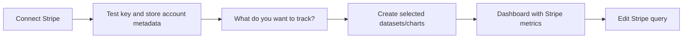

# Stripe Official Plugin

Status: draft

## Context
The current Stripe source is `id: "stripe"`, `type: "api"`, `subType: "stripe"` and reuses the generic API protocol. That made first Stripe templates possible, but the dataset UI still leaks API concepts such as routes, list pagination, request shape, and Stripe object paths.

Create a new Stripe Official source for `chartbrew-os` only. Use `stripeOfficial` as the internal source id/type/subType so JavaScript identifiers, registry keys, and persisted source matching stay simple. It must use a Stripe-specific protocol and builder where users start from business questions, templates, and resource metadata instead of configuring API requests. The existing `stripe` source remains available for backwards compatibility and should not be migrated in this spec.

Stripe docs checked for the v1 assumptions: balance transactions are the account-balance ledger and list newest first, PaymentIntents are Stripe's recommended modern payment collection object, subscriptions omit canceled records unless status is explicit, Search API can lag and is not for read-after-write flows, and v1 list APIs use `limit`, `starting_after`, and `ending_before` cursor pagination.

## Goals
- Add a separate source plugin: `server/sources/plugins/stripeOfficial/` and `client/src/sources/stripeOfficial/`.
- Follow the source plugin guide at `chartbrew-os/source-plugin-guide.md`.
- Store Stripe query intent in `DataRequest.configuration`, not as fake API routes.
- Make onboarding template-first: connect Stripe -> choose metrics -> create datasets/charts -> land on dashboard.
- Add a Stripe-specific dataset builder for chart metrics and raw tables.
- Reuse Chartbrew datasets, data requests, dataset conditions, variables, chart configs, chart-template creation, and source plugin registry.

## Non-goals
- Stripe OAuth or Stripe Connect review.
- Full Stripe Sigma replacement, warehouse sync, or exact accounting parity for every subscription edge case in v1.
- Editing existing API-backed Stripe datasets.
- Any `chartbrew-cloud` changes.

## User Flow


Connection fields:
- Secret or restricted key. Reject publishable keys client-side and server-side.
- Mode: auto-detect first; optional UI selector for live, test, or both.
- Currency: auto, account default, or explicit ISO currency.
- Timezone: account timezone or dashboard/project timezone.

After save, test by retrieving account metadata and a cheap read endpoint. Store detected `accountId`, `defaultCurrency`, `livemode` capability, and timezone hints in `Connection.schema` or `Connection.options`. The secret key remains in encrypted authentication data.

## Next Steps UI
Replace generic API next steps for this source with a Stripe screen: "What do you want to track?" Template cards are grouped by intent and each card explains what it creates.

Implementation status: the backend template packs exist and are registered (`starter-metrics`, `compiled-metrics`), but the dedicated post-connect "What do you want to track?" screen is still pending. Today, users can reach the same query concepts through the manual Stripe dataset builder. The next steps screen should use the registered template packs rather than hard-coded route/API concepts.

V1 starter template cards implemented in `starter-metrics`:
- Net revenue over time
- Gross revenue over time
- Stripe fees over time
- Refunds over time
- Successful payments over time
- Failed payments over time
- Latest payments table
- Active subscriptions
- New subscriptions over time
- Open invoices table

Compiled metric template cards implemented in `compiled-metrics`:
- MRR
- ARR
- ARPA
- Net cash flow
- Gross MRR churn rate
- Net MRR churn rate
- Subscriber churn rate
- Customer lifetime value

Actions:
- Create selected datasets
- Create dashboard from selected metrics

Card requirements:
- Group cards by intent: Revenue, Payments, Customers, Subscriptions, Invoices, Business metrics.
- Each card should show exactly what it creates: dataset count, chart type, resource or compiled metric, default filters, and any important caveat.
- Starter cards can be presented as default/recommended. Compiled metric cards need a visible "computed metric" note because they are first-pass direct-API estimates.
- Selecting multiple cards should create datasets and charts from template manifests in one flow.
- "Create dashboard from selected metrics" should create or select a project/dashboard, create all selected template datasets, create the charts, and land the user on that dashboard.
- If only datasets are created, route to the dataset list or dataset detail with the new Stripe datasets highlighted.

Compiled metric card caveats to show:
- MRR, ARR, ARPA: computed from subscription item recurring prices. Taxes, discounts, metered usage, multi-currency conversion, and historical price changes are not accounting-grade yet.
- Net cash flow: computed from balance transaction net amounts. This is a direct Stripe balance movement view, not a full accounting ledger.
- Gross MRR churn and subscriber churn: based on canceled subscriptions in the period.
- Net MRR churn: first pass currently uses canceled MRR only; expansion, contraction, and reactivation require historical subscription item changes.
- Customer lifetime value: estimated from paid invoices and subscriber churn; falls back to average revenue per paying customer when churn is unavailable.

Use the screenshots as structure reference, but implement in Chartbrew's look and feel: routed page, existing nav rhythm, HeroUI v3 components, compact cards, right-side summary/actions, and no visible API-route concepts.

## Dataset Builder
The manual builder starts from intent:
- Output: aggregated chart data or raw table rows.
- Category/resource: payments, revenue, customers, subscriptions, invoices, refunds, payouts, balance transactions.
- Resource variant where needed: PaymentIntents or Charges for payments.
- Metric: count, sum amount, average amount, success rate, sum net, sum fees, and compiled business metrics.
- Group by: created date, status, currency, country, customer, type, reporting category, payment method.
- Date field and date range.
- Basic filters: date range, currency, status, amount, customer, product/price for subscriptions.
- Advanced filters: metadata, livemode, expand fields, Stripe Search API, max records, raw object mode.

The UI should never show `/v1/payment_intents`, headers, auth, query strings, or pagination cursors.

Date range UX:
- Step 2 uses HeroUI date pickers for start and end dates.
- New manual datasets default to the last 30 days through concrete date picker values, not `{{startDate}}` / `{{endDate}}` placeholders.
- Each date picker has a variable icon that opens the shared variable settings modal. The modal supports editing the variable name before save and deleting an existing binding. Saving from that modal creates or updates a `VariableBinding` record and then stores the corresponding `{{variableName}}` placeholder in `DataRequest.configuration.dateRange`; deleting restores the date picker to a concrete date value.
- ChartDatasetConfigs created from Stripe Official datasets must set `dateField` to the returned date field so dashboard date filters work: `root[].period` for aggregate and compiled metric outputs, and `root[].<dateRange.field>` for raw outputs.

## Compiled Business Metrics
Some high-value Stripe metrics are not single Stripe fields. Treat these as compiled metrics: the Stripe protocol fetches the required Stripe objects, normalizes them into period snapshots or movements, and returns Chartbrew-ready rows. The dataset still owns the Stripe computation config; CDC only owns the chart binding to the computed output fields.

Planned compiled metrics:
- MRR: normalized monthly recurring revenue from subscription items and recurring prices, grouped by period. Support status rules such as active only, active plus trialing, and include/exclude past due.
- ARR: `MRR * 12`, using the same subscription snapshot and status rules as MRR.
- ARPA: MRR divided by active paying accounts/customers for the same period. The denominator must be explicit: customers, subscriptions, or accounts when future account grouping exists.
- Net cash flow: cash movement compiled from balance transactions, fees, refunds, disputes, adjustments, and payouts. The UI must explain whether the metric is before payouts, after fees, or after payouts.
- Gross MRR churn rate: churned or contraction MRR divided by starting MRR for the period.
- Net MRR churn rate: churned plus contraction MRR minus expansion and reactivation MRR, divided by starting MRR.
- Subscriber churn rate: canceled subscribers divided by starting subscribers for the period, with explicit handling for trial cancellations.
- Customer lifetime value: revenue or gross margin per customer divided by customer churn rate, with a simpler historical average revenue per customer fallback when churn-rate inputs are insufficient.

Compiled metric configs should declare their input resources, calculation version, status rules, currency handling, and caveats:

```json
{
  "source": "stripeOfficial",
  "mode": "compiled_metric",
  "compiledMetric": "mrr",
  "calculationVersion": 1,
  "inputs": ["subscriptions", "subscription_items", "prices", "invoices"],
  "dimension": { "field": "period", "interval": "month" },
  "currency": "usd",
  "subscriptionStatus": ["active", "trialing"],
  "dateRange": { "start": "last_30_days", "end": "now" },
  "pagination": { "limit": 100, "maxRecords": 10000 }
}
```

Because these metrics are opinionated, templates and previews must surface warnings such as excluded taxes, discounts, metered usage, multi-currency conversion, or incomplete historical subscription item data.

## Data Request Configuration
`DataRequest.configuration` owns the Stripe-specific request intent:

```json
{
  "source": "stripe-official",
  "resource": "balance_transactions",
  "mode": "aggregate",
  "metric": { "field": "net", "operation": "sum" },
  "dimension": { "field": "created", "interval": "day" },
  "dateRange": {
    "field": "created",
    "start": "last_30_days",
    "end": "now"
  },
  "filters": [
    { "field": "currency", "operator": "is", "value": "usd" },
    { "field": "type", "operator": "is", "value": "charge" }
  ],
  "expand": [],
  "pagination": { "limit": 100, "maxRecords": 5000 },
  "queryMode": "list"
}
```

The protocol converts this into Stripe SDK/API calls, applies variables before execution, handles cursor pagination automatically, and returns Chartbrew-ready rows. When results hit `maxRecords`, include a warning in response configuration so dashboards can surface: "Result capped at 5000 records. Narrow the date range for more complete data."

## Backend Requirements
- Register a new source plugin with `id: "stripeOfficial"` and `type: "stripeOfficial"`; do not reuse the shared API protocol.
- Add a Stripe protocol module with direct Stripe API calls for connection test, resource metadata, request validation, execution, aggregation, raw rows, pagination, and warnings.
- Prefer balance transactions for net revenue, fees, payouts, and financial reporting. Use PaymentIntents by default for modern payment metrics, with Charges available as a deliberate alternative.
- Keep Search API behind an advanced option and only allow it for supported resources.
- Normalize Stripe cents to numeric Chartbrew values through explicit template/formula behavior, not implicit hidden conversion.
- Add focused unit tests for configuration validation, pagination caps, aggregate grouping, raw row shape, subscription status defaults, Search API query restrictions, and compiled metric formulas.

## Templates And Metadata
Template manifests live under `server/sources/plugins/stripeOfficial/templates/`. They should declare dataset config, data request configuration, default chart config, default variables, required permissions, and warnings.

Resource metadata should drive the builder:
- `payment_intents`, `charges`
- `balance_transactions`
- `customers`
- `subscriptions`
- `subscription_items`, `prices`
- `invoices`
- `refunds`
- `payouts`

Each resource schema declares date fields, metrics, dimensions, filters, supported query modes, expandable fields, and default raw-table columns.

## AI Layer Checklist
- [x] Declare Stripe Official AI capabilities in `server/sources/plugins/stripeOfficial/stripeOfficial.plugin.js`, including source instructions, available tools, and whether the source can generate Stripe dataset configurations.
- [x] Add source-owned AI helper modules under `server/sources/plugins/stripeOfficial/ai/` instead of embedding Stripe-specific behavior directly in `server/modules/ai/orchestrator/orchestrator.js`.
- [x] Define compact Stripe AI instructions that teach the orchestrator the Stripe-specific concepts: resources, compiled metrics, cents/currency handling, live/test mode, date fields, pagination caps, template caveats, and Search API limits.
- [x] Expose read-only Stripe tools through a controlled orchestrator adapter:
  - [x] `source.getCapabilities` for supported Stripe modes, resources, metrics, dimensions, filters, compiled metrics, and caveats.
  - [x] `source.listResources` for payment intents, charges, balance transactions, customers, subscriptions, invoices, refunds, payouts, prices, and subscription items.
  - [x] `source.getSchema` for builder/resource metadata without dumping raw Stripe objects.
  - [x] `source.getSampleData` for small, capped previews using the existing Stripe protocol execution path.
  - [x] `source.listTemplates` for registered `starter-metrics` and `compiled-metrics` template packs.
  - [x] `source.recommendTemplates` to map user goals such as revenue, churn, payments, subscriptions, invoices, refunds, and cash flow to template ids.
- [x] Expose Stripe query-planning tools that return `DataRequest.configuration` objects, not API routes:
  - [x] `stripeOfficial.planDataset` to translate a natural-language metric request into a validated aggregate, raw table, or compiled metric configuration.
  - [x] `stripeOfficial.validateConfiguration` to reuse the Stripe protocol validator and return actionable errors/warnings.
  - [x] `stripeOfficial.previewConfiguration` to execute a capped preview and return rows, columns, warnings, and recommended chart bindings.
- [x] Add create helpers only behind explicit user intent:
  - [x] Create a reusable Stripe dataset from a planned configuration.
  - [x] Create a temporary chart from a planned or previewed Stripe dataset.
  - [x] Create or add selected Stripe template charts to a dashboard when the user explicitly requests dashboard placement.
- [x] Support orchestrator chart placement for Stripe Official datasets:
  - [x] Resolve the target dashboard/project from the user's explicit id or name and refuse ambiguous matches instead of guessing.
  - [x] Create the Stripe dataset/data request first, then create the chart with the correct ChartDatasetConfig bindings for the planned Stripe output fields.
  - [x] Place charts directly in the requested dashboard through `create_chart` when the user asks for placement.
  - [x] Use `create_temporary_chart` by default when the user asks to visualize data but does not name a target dashboard.
  - [x] Allow moving a temporary Stripe chart to a dashboard through the existing `move_chart_to_dashboard` flow when the user confirms placement later.
  - [x] Return the created chart id, dataset id, dashboard/project id, and dashboard URL so the user can open the result.
- [x] Update generic orchestrator tool schemas where needed so `create_dataset`, `suggest_chart`, `create_temporary_chart`, and `create_chart` can work with non-SQL Stripe Official configurations without requiring a fake query string.
- [x] Ensure `list_connections`, source support checks, capability responses, and entity-creation rules include `stripeOfficial` only when its AI capabilities are enabled.
- [x] Keep all Stripe AI execution team-scoped and connection-scoped; every tool must validate `team_id`, `connection_id`, plugin id/type/subType, source enablement, and user access before calling Stripe protocol code.
- [x] Keep Stripe tool outputs small and structured: no secret keys, no full raw objects by default, no unbounded lists, and warnings when previews hit `maxRecords`.
- [x] Add tests for Stripe AI capabilities, tool registration, team scoping, configuration planning, validation errors, template recommendation, preview caps, and non-SQL dataset/chart creation paths.
- [x] Add an anti-hallucination harness and repair path for compiled business metrics so MRR, ARR, churn, net cash flow, and LTV requests cannot be planned or persisted as generic revenue aggregates.
- [x] Add a KPI accumulation guard so compiled Stripe business metrics such as current MRR do not use `AddTimeseries`; KPI charts should display the latest computed value.
- [x] Add orchestrator prompt/response tests for representative user requests:
  - [x] Answer "What was net revenue last month?" from balance transactions.
  - [x] Create a revenue-over-time temporary chart.
  - [x] Create a revenue-over-time chart and place it in a named dashboard.
  - [x] Move a temporary Stripe chart into a dashboard after user confirmation.
  - [x] Recommend subscription/churn templates.
  - [x] Create a compiled MRR chart with caveats.
  - [x] Refuse unsupported/accounting-grade claims and explain limitations.
- [x] Add documentation or inline examples showing the expected Stripe AI tool call flow from question -> connection/resource discovery -> configuration plan -> preview -> dataset/chart creation.

Expected Stripe AI flow:
1. Discover context with `list_connections`, then `source.getCapabilities`/`source.listResources` for the selected `stripeOfficial` connection.
2. Plan with `stripeOfficial.planDataset`, producing a `DataRequest.configuration` such as `resource: "balance_transactions"`, `metric: { field: "net", operation: "sum" }`, and no API route/query string.
3. Optionally preview with `stripeOfficial.previewConfiguration`, capped to a small `pagination.maxRecords`, and surface returned warnings.
4. Create a default visual preview with `create_temporary_chart` using the planned configuration and chart bindings.
5. When the user explicitly names a dashboard, create the dataset first and call `create_chart` with the exact `project_id`; when they confirm later, call `move_chart_to_dashboard`.

## Wrap-up Checklist
- [x] Complete the manual Stripe builder filters. The current builder supports metadata filters, product/price subscription filters, expand fields, Search API controls, max records, and raw object mode. Livemode/test-mode filtering is intentionally excluded.
- [x] Make the builder filters resource-aware and operator-aware using Stripe resource metadata instead of hard-coded generic fields.
- [x] Make runtime dashboard/chart filters affect Stripe Official source refreshes. Runtime `filters` passed through Chartbrew refresh paths must be merged with `DataRequest.configuration.filters` before Stripe execution.
- [x] Push supported filters into Stripe list parameters where the Stripe API supports them, and only fall back to local post-fetch filtering when pushdown is unavailable. Avoid incomplete filtered results when `maxRecords` is reached before matching rows are fetched.
- [x] Add validation for Stripe filter fields/operators per resource, including AI validation paths and manual builder/server validation.
- [x] Add focused protocol tests for configuration validation, saved filters, runtime filters, pagination caps, aggregate grouping, raw row shape, subscription status defaults, Search API restrictions, and compiled metric formulas.
- [x] Document deferral for connection options. Mode, currency, and timezone selectors were removed until they are wired into runtime behavior; the connection still stores detected Stripe account metadata in `Connection.schema`/`Connection.options`.
- [x] Revisit Stripe template currency formatting. Decision: template and AI-generated currency formulas convert minor units to major numeric units with `{val / 100}` and do not hard-code `$`; row/account currency metadata remains available for labels and future currency-aware formatting.

## Acceptance Criteria
- A user can connect Stripe with a restricted key, test it, and see a Stripe-specific next-step screen.
- Selecting v1 templates creates reusable datasets and charts without exposing API request details.
- A user can manually create an aggregated Stripe dataset and a raw Stripe table dataset.
- The orchestrator can create Stripe Official datasets/charts and place charts in a requested dashboard when the target dashboard is explicit.
- Runtime refresh uses the `stripeOfficial` protocol and respects variables, filters, pagination caps, and warnings.
- Existing `stripe` API-backed connections and templates keep working unchanged.

## Implementation Progress
- [x] Decision: use `stripeOfficial` internally instead of dashed ids.
- [x] Decision: use direct Stripe API calls, not the official Stripe SDK.
- [x] Decision: keep compiled metrics in the spec for later implementation after the base resource pass.
- [x] Backend source plugin and protocol.
- [x] Backend resource metadata and registry tests.
- [x] Frontend source definition and connection form.
- [x] Frontend Stripe configuration builder.
- [x] Builder UI pass: stepped layout, chart/table mode cards, colored category cards, quick starts, advanced options, test preview, and right-side summary/action rail using HeroUI components.
- [x] First compiled metrics pass: MRR, ARR, ARPA, net cash flow, gross/net MRR churn, subscriber churn, and customer lifetime value through direct Stripe API computations with explicit caveats.
- [x] Compiled metrics template pack.
- [x] Template loader support for configuration-only data requests.
- [x] V1 base template pack.
- [x] Server lint.
- [x] Client lint and build.
- [x] Targeted unit tests: `sourceRegistry.test.js` and `chartTemplateLoader.test.js`.
- [x] Builder category mode fix: selecting another category after Business metrics exits `compiled_metric` mode correctly.
- [x] Builder test preview: run the saved Stripe request, keep runtime metadata/warnings, and render returned rows in a dynamic HeroUI table instead of a hard-coded preview.
- [x] Next Steps pack selector: post-connect UI can switch between the registered `starter-metrics` and `compiled-metrics` packs.
- [x] Dedicated post-connect Next Steps UI that consumes the registered Stripe template packs.
- [x] AI layer first pass: source-owned Stripe instructions/tools, dataset planning, configuration validation/preview, config-backed dataset creation, temporary chart flow, and explicit dashboard placement support.
- [x] AI anti-hallucination harness, runtime guardrails, and auto-repair path for Stripe compiled business metrics.
- [x] AI KPI accumulation guard for Stripe compiled business metrics.
- [x] Manual builder resource-aware filter first pass.
- [x] Runtime filter support for Stripe Official refreshes.
- [x] Manual builder filter completion for metadata, product/price, expand fields, Search API controls, and raw object mode.
- [x] Currency-aware template display formatting instead of hard-coded `$` formulas.
- [ ] Browser flow verification.

## References
- Stripe balance transactions: https://docs.stripe.com/api/balance_transactions/list
- Stripe PaymentIntents: https://docs.stripe.com/api/payment_intents
- Stripe subscriptions list behavior: https://docs.stripe.com/api/subscriptions/list
- Stripe Search API limitations: https://docs.stripe.com/search
- Stripe API pagination: https://docs.stripe.com/api/pagination
