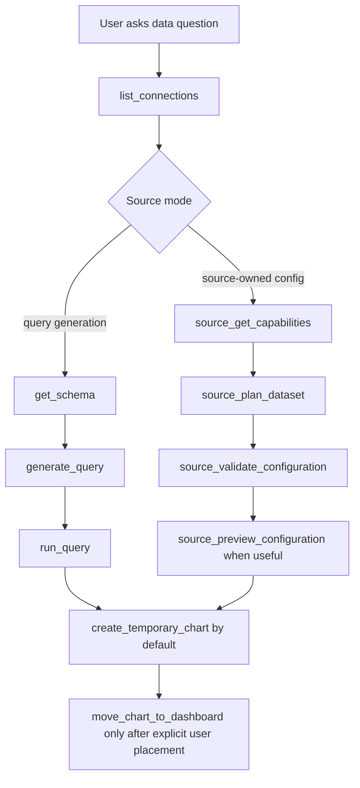

# Source AI Orchestrator Rollout

Status: draft

## Progress
- [x] Created rollout spec and source audit.
- [x] Added generic source-owned planning tool contract to the orchestrator: `source_plan_dataset`, `source_validate_configuration`, and `source_preview_configuration`.
- [x] Routed Stripe Official through the generic source-owned planning path while keeping existing `stripe_official_*` tool names as compatibility aliases.
- [x] Updated global orchestrator/entity instructions to describe source-owned configuration flows generically instead of hardcoding the Stripe workflow.
- [x] Added a regression for simple Stripe net MRR churn KPI creation and clarified chart tool results so missing snapshots are not treated as failed chart creation.
- [x] Add compact AI instruction hooks and harness coverage for current query-generation sources.
- [x] Added GA4 source-owned AI planning, validation, metadata-aware preview, and harness coverage for users over time, sessions by channel, page views by page, ambiguous properties, and invalid metrics.
- [x] Hardened GA4 property selection so the planner can resolve property IDs, quick-reply labels, and natural property names such as "Razvan Ilin website" without requiring `overrides.propertyId`.
- [x] Guarded GA4 runtime against missing `propertyId` before calling Google APIs and let creation tools auto-fill missing source-owned configuration through the planner.
- [x] Fixed the orchestrator response contract so source disambiguation and tool-only completions always return a non-empty `message` instead of surfacing "Invalid response from AI".
- [x] Passed original user request context into source planning and chart creation so GA4 can auto-select named properties even when the model shortens the tool-call question.
- [x] Added Customer.io source-owned AI planning, validation, preview, route/method creation support, and harness coverage for customers, segments, activities, campaign metrics, and campaign disambiguation.
- [x] Added Firestore and RealtimeDB source-owned AI planning, validation, preview, DataRequest query/route repair, and harness coverage for collection/path counts, filters, ordering, previews, and missing path context.
- [x] Added API connection free-form AI Context UI and generic API source-owned planning, validation, preview, and harness coverage for pasted endpoint/context notes.
- [x] Added API host/provider hints as guidance-only metadata plus direct `/connections/:id?tab=aiContext` links when more API context is required.
- [x] Relaxed generic API fallback behavior so recognizable provider hosts can use model/provider knowledge when AI Context is missing or incomplete, while unknown API hosts still require explicit context.
- [x] Hardened AI-created table charts so missing CDC `xAxis` bindings default to `root[]` and cannot crash table extraction.
- [x] Hardened AI-created KPI/avg/gauge charts so missing CDC `xAxis` bindings fall back to `yAxis` and cannot crash axis chart extraction.
- [x] Add a cross-source AI harness that covers count, table, breakdown, timeseries, follow-up chart-type changes, missing context, invalid fields, chart binding contracts, and forbidden tool paths across all AI-enabled sources.
- [x] Added the first token-free source-owned harness pass for GA4, Customer.io, Firestore, RealtimeDB, API, and Stripe Official, including the Firestore donut follow-up regression.
- [x] Added shared harness assertions for source-owned planner contracts, source/query tool-policy separation, and runtime-safe CDC bindings from temporary and saved chart creation.
- [x] Added generic `source_*` tool output caps and small no-LLM routing replay coverage for high-risk tool sequences.
- [x] Added compact query-generation instructions for SQL, ClickHouse, and MongoDB sources and harness coverage that verifies `get_schema` and `generate_query` receive them.

## Context
Stripe Official now has a source-owned AI layer in `server/sources/plugins/stripeOfficial/ai/stripeOfficial.ai.js`. That layer gives the orchestrator compact source instructions, source discovery tools, dataset planning, configuration validation, capped preview execution, template recommendation, and anti-hallucination guards without exposing raw API routes or large object dumps.

Replicate that model across the other source plugins, but keep the orchestrator token-efficient. The orchestrator should learn source behavior from registered source plugins instead of hardcoded Stripe-only branches or per-source prompt blocks.

Follow `source-plugin-guide.md` for any source runtime, source plugin, source template, source-specific frontend component, or source runtime behavior changes.

## Goals
- Audit all existing sources with AI enabled and identify whether they already use the correct source-owned contract.
- Update existing AI-enabled sources only where needed so they declare compact capabilities, source instructions, and harness coverage consistently.
- Add AI support for non-query/configuration sources: Google Analytics 4, Customer.io, Firestore, RealtimeDB, and generic API.
- Replace source-specific orchestrator tool growth with generic source-owned AI tools.
- Keep all execution team-scoped, connection-scoped, source-enabled, read-only, and capped.
- Keep prompt and tool output size bounded as more sources become AI-enabled.

## Non-goals
- Writing full product documentation for every third-party API inside the prompt.
- Letting the AI call arbitrary external docs at runtime.
- Adding write operations to any source.
- Replacing existing manual dataset builders.
- Migrating legacy Stripe API datasets to Stripe Official.
- Full API schema inference for arbitrary REST APIs without user-provided context or a successful sample request.

## Current Source AI Audit

AI-enabled today:

| Source | Current AI mode | Current state | Required update |
| --- | --- | --- | --- |
| Stripe Official | Source-owned tools, config planning | Complete first pass | Move Stripe-only top-level tools behind generic source tools, keep wrappers only as compatibility if needed |
| PostgreSQL | Query generation | `backend.ai.getSchema` and `generateQuery` | Add compact source instructions and query-generation harness cases |
| RDS Postgres | Query generation | Same family as Postgres | Reuse Postgres/shared SQL instructions, add variant metadata only if needed |
| Supabase DB | Query generation | Same family as Postgres | Reuse Postgres/shared SQL instructions, add Supabase caveats only if needed |
| Timescale | Query generation | Same family as Postgres | Add compact Timescale hints for time-series queries |
| MySQL | Query generation | `backend.ai.getSchema` and `generateQuery` | Add compact source instructions and query-generation harness cases |
| RDS MySQL | Query generation | Same family as MySQL | Reuse MySQL instructions, add variant metadata only if needed |
| ClickHouse | Query generation | `backend.ai.getSchema` and `generateQuery` | Add ClickHouse-specific syntax/cost guard hints |
| MongoDB | Query generation | `backend.ai.getSchema` and `generateQuery` | Add Mongo shell/query shape harness and output shape checks |

Not AI-enabled today:

| Source | Current runtime shape | Planned AI mode |
| --- | --- | --- |
| Google Analytics | `DataRequest.configuration` with `propertyId`, `startDate`, `endDate`, `metrics`, `dimensions` | Source-owned configuration planning and preview |
| Customer.io | Source-owned routes for customers, campaigns, and activities | Source-owned route/config planning with embedded compact API map |
| Firestore | Collection query plus conditions/configuration | Source-owned query/config planning over discovered collections |
| RealtimeDB | Path query plus ordering/limit configuration | Source-owned path/config planning over user-provided or sampled paths |
| API | Generic REST host, auth, headers, route, body, pagination | Source-owned API request planning from user-provided AI context plus samples |
| Stripe Legacy | Branded API source with templates | Keep disabled for new AI planning; prefer Stripe Official |
| Strapi | Branded API source | Defer or opt in through the generic API AI context path |

## Target Orchestrator Contract

Do not add new top-level tools for every source. Add a generic source-owned planning layer and migrate Stripe Official onto it:

```js
backend: {
  ...protocol,
  ai: {
    getCapabilities,
    listResources,
    getSchema,
    getSampleData,
    listTemplates,
    recommendTemplates,
    planDataset,
    validateConfiguration,
    previewConfiguration,
    generateQuery,
  },
}
```

Only implement methods a source needs.

Generic orchestrator tools:
- `source_get_capabilities`: existing, keep generic.
- `source_list_resources`: existing, keep generic.
- `source_get_sample_data`: existing, keep generic and capped.
- `source_list_templates`: existing, keep generic.
- `source_recommend_templates`: existing, keep generic.
- `source_plan_dataset`: new generic replacement for `stripe_official_plan_dataset`.
- `source_validate_configuration`: new generic replacement for `stripe_official_validate_configuration`.
- `source_preview_configuration`: new generic replacement for `stripe_official_preview_configuration`.

Stripe-specific tool names can remain temporarily as aliases for test and conversation compatibility, but new sources must not add their own top-level tool names.

## Source AI Capability Flags

Use capability flags to decide what the orchestrator can do:

```js
ai: {
  canGenerateDatasets: true,
  canGenerateQueries: false,
  hasSourceInstructions: true,
  hasTools: true,
}
```

Guidance:
- Queryable databases can keep `canGenerateQueries: true` and `hasTools: false` unless they need source-owned planning tools.
- Configuration-based sources should use `canGenerateQueries: false`, `hasTools: true`, and `canGenerateDatasets: true`.
- Sources with only templates but no safe planning path should not become orchestrator-supported.
- `hasSourceInstructions` should only be true when the source exposes compact instructions through `getCapabilities` or equivalent source AI context.

## Token Efficiency Rules

- Keep global prompt source-agnostic. It should say "use source_plan_dataset for source-owned configuration sources" rather than listing every source workflow.
- Fetch source instructions lazily with `source_get_capabilities` after a connection is selected.
- Tool descriptions must be generic and short. Avoid embedding large per-source metric lists in `orchestrator.js`.
- Source capability responses should return compact identifiers, labels, supported modes, caveats, and a short `instructions` string. Do not return raw API docs.
- `listResources` should page or summarize large catalogs. For GA4, return selected/common metrics first and fetch full property metadata only when planning needs it.
- `getSampleData` and previews must default to small limits, redact secrets, and return columns plus a few rows.
- API source context should be user-authored and bounded, for example max 8 KB stored and max 2 KB included in capability responses unless explicitly requested by a tool.
- Conversation repair and harness rules should live in source-owned modules, not in the global prompt.

## Existing AI-Enabled Source Updates

### SQL family
Applies to PostgreSQL, RDS Postgres, Supabase DB, Timescale, MySQL, and RDS MySQL.

Keep the current query-generation path, but add a small shared SQL AI layer:
- Compact source instructions by dialect: read-only SELECT, prefer explicit columns, use the dialect's date functions, respect schema names, avoid destructive statements.
- Variant hints:
  - Timescale: prefer time_bucket for time-series aggregation when appropriate.
  - Supabase DB: no special runtime behavior unless schema metadata indicates Postgres extensions.
  - RDS variants: no special prompt content unless connection metadata requires it.
- Harness prompts:
  - single KPI count
  - time-series aggregation
  - grouped breakdown
  - date range filter
  - join from obvious foreign keys
  - reject write requests

### ClickHouse
Keep query generation but add ClickHouse-specific instructions:
- Use ClickHouse syntax and functions.
- Prefer `LIMIT` for exploratory queries.
- Avoid unsupported Postgres/MySQL syntax.
- Harness date bucketing, grouped aggregation, and read-only validation.

### MongoDB
Keep query generation but strengthen source-owned shape checks:
- Generated query must be read-only.
- Prefer aggregation pipelines for grouped/time-series requests.
- Return array-shaped results compatible with Chartbrew bindings.
- Harness find, aggregate, date match, group, sort, and limit cases.

### Stripe Official
Keep the existing AI implementation behavior, but move orchestration to the generic source tools:
- `source_plan_dataset` calls `stripeOfficial.backend.ai.planDataset`.
- `source_validate_configuration` calls `stripeOfficial.backend.ai.validateConfiguration`.
- `source_preview_configuration` calls `stripeOfficial.backend.ai.previewConfiguration`.
- Preserve the existing anti-hallucination harness for MRR, ARR, ARPA, churn, net cash flow, and LTV.
- Remove Stripe-specific global prompt instructions once equivalent source-owned instructions are loaded through the generic tool flow.

## New Source AI Plans

### Google Analytics 4
Current Chartbrew configuration is:

```json
{
  "accountId": "accounts/123",
  "propertyId": "properties/456",
  "startDate": "30daysAgo",
  "endDate": "yesterday",
  "metrics": "activeUsers",
  "dimensions": "date"
}
```

Implement `server/sources/plugins/googleAnalytics/ai/googleAnalytics.ai.js`:
- `getCapabilities` returns compact GA4 instructions, date syntax, one-metric/one-dimension current limitation, and common Chartbrew chart bindings.
- `listResources` returns accounts/properties plus compact common metric/dimension aliases. Do not dump full GA metadata by default.
- `getSchema` uses `getBuilderMetadata({ propertyId })` when a property is selected and returns metric/dimension names as entities or fields.
- `planDataset` maps natural language to Chartbrew's GA configuration:
  - users -> `activeUsers`
  - sessions -> `sessions`
  - page views/views -> `screenPageViews`
  - conversions/key events -> currently ask for the metric name if metadata is ambiguous
  - by day -> `dimensions: "date"`
  - by page -> `pagePath` or `pageTitle`
  - by channel -> `sessionDefaultChannelGroup`
  - by country -> `country`
- `validateConfiguration` checks `propertyId`, date formats, selected metric, selected dimension, and metadata compatibility when available.
- `previewConfiguration` calls the existing GA protocol with a capped request and returns compact rows/columns.

If the selected connection has multiple GA properties and the user did not identify one, the orchestrator should use `disambiguate` instead of guessing.

### Customer.io
Current runtime supports:
- `customers`
- `campaigns`
- `campaigns/:campaignId/:requestRoute`
- `activities`

Implement `server/sources/plugins/customerio/ai/customerio.ai.js`:
- Start with a compact source-owned API map, not the full Customer.io docs.
- Include only routes currently supported by `customerio.protocol.js` and `customerio.connection.js`.
- `planDataset` should map:
  - people/customers/users -> `route: "customers"`, `method: "POST"`, plus `configuration.cioFilters`
  - activities/events -> `route: "activities"`, `method: "GET"`, plus activity filters
  - campaign metrics -> campaign route only when the campaign id/name is supplied or discovered through a safe helper
- If campaign-specific docs or route semantics are missing, return a structured "needs_more_context" result with a short explanation and a link to edit the connection or use the manual builder.
- Add source-owned API notes for pagination, period/date fields, event names, campaign id, activity type, and customer id/id type.

Recommended first implementation:
- Build `getCapabilities`, `listResources`, `planDataset`, `validateConfiguration`, and `previewConfiguration`.
- Keep the Customer.io API map in source-owned code and tests, not in the orchestrator prompt.
- Add harness prompts for customer list, filtered customer list, recent activities, specific event activities, and unsupported campaign ambiguity.

### Firestore
Current runtime uses `dataRequest.query` as the collection, `dataRequest.conditions`, and configuration such as:
- `limit`
- `orderBy`
- `orderByDirection`
- `showSubCollections`
- `selectedSubCollection`

Implement `server/sources/plugins/firestore/ai/firestore.ai.js`:
- `listResources` lists top-level collections using `listCollections`.
- `getSchema` uses saved schema, builder metadata, and cached samples from response configuration where available.
- `planDataset` maps natural language to collection, conditions, order, and limit.
- If a requested collection or field is unknown, ask the user to choose or run a small sample discovery tool.
- Firestore-specific guardrails:
  - Only read collection or collection group data.
  - Enforce small default limits.
  - Explain when Firestore may require an index for combined filters/order.
  - Do not invent nested field names unless sampled or user-provided.

Suggested chart defaults:
- Count documents by date field when a clear timestamp field exists.
- Table output when the user asks for latest records or when no metric/date field is known.

### RealtimeDB
Current runtime uses `dataRequest.route` as the database path and configuration such as:
- `orderBy`
- `key`
- `limitToFirst`
- `limitToLast`

Implement `server/sources/plugins/realtimedb/ai/realtimedb.ai.js`:
- Add connection-level optional AI context for known paths and field meanings, because RealtimeDB does not expose a cheap global schema.
- `planDataset` should only use paths from user context, previous samples, or an explicit user request.
- `previewConfiguration` reads capped data from the existing protocol.
- If the user asks for a path/field that is not known, return a "needs_more_context" result that asks for the path or directs them to edit the connection AI context.

Suggested chart defaults:
- Table output for arbitrary paths.
- Time series only when the context or sample identifies a timestamp/date field.

### Generic API
Generic API needs additional user-authored context because the orchestrator cannot reliably infer arbitrary API docs.

Add an "AI context" section to the API connection form:
- Purpose of this API.
- Base resources/endpoints the orchestrator may use.
- Example request paths.
- Response shape notes, including the array path.
- Pagination notes.
- Date filter parameter names and formats.
- Common metrics and dimensions.
- Fields safe for charting.
- Optional docs URL for the user's reference.

Store this as non-secret connection metadata, preferably under `Connection.schema.aiContext` or another source-owned metadata object, not in the encrypted header `options` array. Do not include auth headers, tokens, cookies, or secrets.

Implement `server/sources/plugins/api/ai/api.ai.js`:
- `getCapabilities` returns whether the connection has enough AI context.
- `planDataset` can produce a DataRequest with `route`, `method`, `headers`, `body`, `pagination`, `items`, `offset`, `itemsLimit`, and `paginationField`.
- `validateConfiguration` should reject unsafe methods, missing route context, unknown endpoints, private/unsafe host violations, and requests that require unavailable docs.
- `previewConfiguration` should call `api.protocol.previewDataRequest` with small limits.
- If context is missing, return a structured response:

```json
{
  "status": "needs_more_context",
  "message": "I need API endpoint details before I can safely build this request.",
  "editConnectionUrl": "/connections/123?tab=aiContext",
  "requiredContext": ["allowed endpoints", "response array path", "date filter params"],
  "contextInstructions": [
    "Open the API connection and go to the AI Context tab.",
    "Paste endpoints Chartbrew AI should prefer.",
    "Include request paths or curl examples, response samples, array path, date filters, pagination, and chartable fields."
  ]
}
```

The assistant should surface that message and link the user to edit the connection in Chartbrew when the host is unknown or the model/provider fallback is uncertain.

Host/provider recognition, such as detecting PostHog from the connection host, can be used as fallback permission for model/provider knowledge when AI Context is missing or incomplete. AI Context remains the preferred source of truth. When model fallback is used, the orchestrator must pass an explicit method, route, pagination/body/header assumptions, and chart bindings into the create tool. For unknown API hosts, the orchestrator must still ask for AI Context instead of inventing routes.

## Orchestrator Flow



Global workflow guidance should refer to "query-generation sources" and "source-owned configuration sources" instead of naming every implementation.

## Source-Owned Result Shapes

`planDataset` returns:

```json
{
  "status": "ok",
  "source": "googleAnalytics",
  "configuration": {},
  "query": null,
  "warnings": [],
  "chartSpec": {
    "type": "line",
    "xAxis": "root[].date",
    "yAxis": "root[].activeUsers",
    "yAxisOperation": "none",
    "dateField": "root[].date"
  }
}
```

Allowed statuses:
- `ok`
- `needs_disambiguation`
- `needs_more_context`
- `unsupported`
- `error`

Every source-owned planner must provide actionable errors and warnings. If a user can fix missing context in Chartbrew, include a relative edit URL and the fields that need attention.

## Tests And Harness

Add or update unit tests:
- Source registry exposes AI capabilities only for enabled sources.
- Generic source planning tools route to the selected source plugin and enforce team/connection scope.
- Disabled server sources are rejected before AI tools call protocol code.
- Tool outputs do not include credentials, auth headers, tokens, or full raw objects.
- `availableTools()` does not grow per source after this change.

Add source harness tests:
- SQL family: read-only query generation, date range, aggregation, grouped breakdown, reject writes.
- ClickHouse: dialect-specific date bucketing and limit behavior.
- MongoDB: read-only aggregation shape and reject writes.
- GA4: users over time, sessions by channel, page views by page, ambiguous property disambiguation, invalid metric validation.
- Customer.io: customers, filtered customers, activities by event, ambiguous campaign metric.
- Firestore: latest docs table, filtered collection query, ordered limited query, unknown field fallback.
- RealtimeDB: known path table, ordered limited path, unknown path needs context.
- API: missing AI context, valid endpoint plan, unsafe method rejection, preview cap.

### Cross-Source AI Harness
Add a deterministic, token-free harness for every AI-enabled source. This should exercise source-owned planners and chart creation contracts directly, without calling the LLM or replaying full model responses by default.

Harness goals:
- Prevent one-off debugging per source by asserting source, chart, tool, and token-efficiency invariants.
- Avoid trying to enumerate every possible user request. There can be thousands of valid scenarios; the harness should test contracts and invariants, not become a scenario catalog.
- Use only tiny representative fixtures when an invariant needs a concrete input. For example, a Firestore "donut by type" fixture is useful because it tests the invariant that breakdown intent produces categorical `xAxis` plus count `yAxis`, not because that exact phrase is special.
- Keep requests token-efficient by testing source-owned `planDataset`, `validateConfiguration`, preview row shape, and chart contract helpers directly. LLM transcript replay should be a small optional smoke layer, not the core regression suite.

Required invariant groups:
- Source contract: every AI-enabled source returns one of the known statuses, a valid DataRequest plan for `ok`, or an actionable missing-context response.
- Chart binding contract: chart specs and persisted CDCs are runtime-safe for their chart type.
- Tool policy: configuration-based sources must not use `generate_query`; query-generation sources must not use source-owned configuration tools unless they explicitly declare them.
- Token/size policy: capabilities, resources, samples, previews, and validation results remain bounded and free of secrets.
- Follow-up contract: changing chart type or grouping can reuse source intent only when the new chart bindings are valid.

Minimum shared assertions:
- `status` is one of the documented source-owned statuses.
- `dataRequest` has the required source fields: SQL/Mongo query, source-owned `configuration`, API/Customer.io route/method, Firestore query, RealtimeDB route.
- `chartSpec` bindings match the chart type:
  - table: `xAxis` may be omitted only if the creation tool defaults it to `root[]`.
  - KPI/avg/gauge: `yAxis` is required; `xAxis` may be omitted only if the creation/runtime path falls back to `yAxis`.
  - line/bar/pie/doughnut/radar/polar: `xAxis` and `yAxis` are required.
  - timeseries: `dateField` is required when dashboard date filtering is expected.
- Capability/tool outputs stay compact and never include secrets, auth headers, tokens, or large raw docs.
- Resource listing/sample APIs return capped summaries and a bounded row count.

Implementation shape:
- Add `tests/unit/sourceAiHarness.test.js` for the common source-owned planner contract.
- Keep per-source fixtures small: one or two collections/routes/properties/endpoints and a minimal sample response.
- Add per-source examples only for unusual parsing or domain rules, such as Stripe churn metrics, GA4 property selection, Customer.io campaigns, API provider fallback, or Firestore breakdown fields.
- Avoid real model calls. If transcript replay is added later, store tool-call expectations as JSON fixtures and assert only the allowed tool sequence and final creation payload.

Harness implementation checklist:
- [x] Add first source-owned planner harness for GA4, Customer.io, Firestore, RealtimeDB, API, and Stripe Official.
- [x] Refactor harness labels and docs around invariants rather than scenario classes.
- [x] Add shared chart-binding contract assertions for persisted CDC payloads from `create_temporary_chart` and `create_chart`.
- [x] Add tool-policy assertions for configuration-based versus query-generation source flows.
- [x] Add compact-output assertions for `source_get_capabilities`, `source_list_resources`, `source_get_sample_data`, preview, and validation.
- [x] Add a small transcript/tool-sequence replay only for high-risk orchestrator routing, without real model calls.
- [x] Keep per-source examples limited to custom domain rules that cannot be expressed as generic invariants.

Run focused verification:

```sh
cd server && npm run test:run -- tests/unit/sourceRegistry.test.js tests/unit/stripeOfficialAi.test.js
cd server && npm run test:run -- tests/unit/sourceAiTools.test.js
cd server && npm run lint
cd client && npm run lint
cd client && npm run build
```

Use the exact test filenames created during implementation; `sourceAiTools.test.js` is the proposed new generic tool coverage file.

## Implementation Plan

1. Add generic `source_plan_dataset`, `source_validate_configuration`, and `source_preview_configuration` tools.
2. Migrate Stripe Official to those generic tools while keeping existing behavior and tests green.
3. Add compact AI instruction hooks/harness coverage for current SQL, ClickHouse, and MongoDB query-generation sources.
4. Add GA4 source-owned AI planning and preview.
5. Add Customer.io source-owned AI planning and preview with a compact supported-route API map.
6. Add Firestore and RealtimeDB source-owned AI planning with schema/sample-driven guardrails.
7. Add API connection AI context UI and generic API AI planning.
8. Update global orchestrator prompt and entity creation rules to remove Stripe-only workflow text and keep source-specific detail lazy-loaded.
9. Add regression tests for token-efficiency boundaries and no per-source top-level tool growth.
10. Add the cross-source AI harness and use it as the first regression target when adding or changing any source AI layer.

## Acceptance Criteria
- The orchestrator still supports all currently AI-enabled database sources.
- Stripe Official behaves the same through generic source-owned tools.
- GA4, Customer.io, Firestore, RealtimeDB, and API can be listed as AI-supported only when their source plugins expose the required AI methods.
- GA4 plans Chartbrew-compatible configurations from common analytics questions without inventing request fields.
- Customer.io plans only supported routes and asks for missing campaign/API context when required.
- Firestore and RealtimeDB avoid invented schema paths and use samples/user context before planning.
- API planning refuses to proceed without sufficient user-provided AI context and returns an edit-connection link.
- The global orchestrator prompt does not include large per-source docs or source-specific route catalogs.
- Source AI previews are capped, scoped, read-only, and redact sensitive data.
- The cross-source harness passes for all AI-enabled sources and catches invalid chart binding contracts before runtime extraction can crash.
