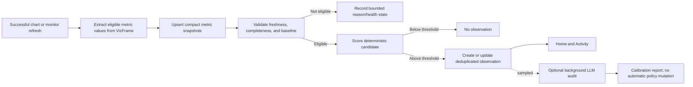

# Workspace Observations And Intelligence Home

Status: draft

## Summary

Turn Chartbrew's workspace landing experience into a decision-oriented Home that tells users what
changed, whether the underlying data is healthy, and where to continue working. Add a bounded
Observation Engine that evaluates explicit chart and metric definitions after successful refreshes,
stores compact metric history, and produces evidence-backed observations without issuing duplicate
source requests.

The first release is deliberately conservative. It monitors metrics whose meaning is already
explicit in a chart or user-created monitor, uses deterministic calculations for every published
fact, and represents missing data or insufficient history honestly. An optional, budgeted LLM audit
runs asynchronously in shadow mode to measure relevance and recommend scoring-policy changes. It
does not run after every refresh, invent evidence, or change production weights automatically.

Refactor **Ask your data** into reusable chat building blocks. Home can show an ephemeral composer
and inline result without a conversation browser, while the existing modal and observation
investigations can compose the same chat UI with persistent history where useful. The client stops
sending full conversation history; the server owns persistent and short-lived session context.

The screenshots that motivated this work define information hierarchy and user flow only. All
implementation uses the existing Chartbrew design system, HeroUI v3 components, theme tokens,
accessibility conventions, colors, and light/dark behavior.

## Personas

### Maya — product or growth operator

- Has viewer or editor access to one or more dashboards.
- Starts with business questions and expects Chartbrew to preserve metric definitions for her.
- Needs to scan important changes, verify freshness, investigate safely, and share a result.
- Should not need connection, query, dataset, schema, model, job, or scoring terminology.
- May ask questions and create temporary analysis, but permanent changes follow her project role.

### Benji — CTO and team owner

- Connects sources, creates datasets and dashboards, defines important metrics, and manages access.
- Wants both business observations and operational confidence in refreshes and database metrics.
- May begin with no dashboards, no historical data, or a source that cannot yet answer a desired
  question.
- Needs clear setup and baseline-collection states instead of empty feeds or fabricated insights.
- Needs bounded storage, visible maintenance health, and control over monitoring cost and cadence.

## Product Principles

- Deterministic facts first. LLM output may explain or audit facts but may not calculate or invent
  published values.
- Explicit meaning beats guessed meaning. Start with existing canonical chart encodings, active
  alerts, and user-created monitors before broader Dataset Intelligence candidates.
- No data is a real state. Never turn missing, stale, partial, or insufficient data into an
  observation.
- Refresh once, analyze once. Automatic observation processing reuses a successful runtime result
  and must not make another source request.
- Investigation is temporary by default. Supporting charts are not placed on visible dashboards
  without an explicit authorized action.
- Observations, alerts, and data-health issues are separate concepts with separate lifecycles.
- Viewers can ask and investigate within their project scope. Creating or changing Chartbrew
  entities remains permission-gated.
- Intelligence data is bounded, encrypted where it contains tenant semantics, and covered by an
  explicit retention policy.
- Internal metadata stays internal. Model names, score versions, confidence internals, fingerprints,
  queue state, source IDs, raw errors, and retention mechanics do not appear in normal product UI.

## Goals

- Add a personalized Home with attention items, data health, recent dashboards, and reusable Ask.
- Detect a narrow but trustworthy first set of metric changes.
- Store compact metric snapshots and deduplicated observations with enough evidence to reproduce
  every user-facing claim.
- Support chart-backed time series immediately and scalar metrics after enough successful samples.
- Give Benji an explicit path to monitor database record counts through a count metric rather than
  inferring totals from partial dataset results.
- Add observation detail and activity views with read, save, snooze, dismiss, feedback, and
  role-gated resolve actions.
- Reuse the AI orchestrator for observation-scoped follow-ups and session-scoped supporting charts.
- Decouple chat presentation, live session state, and persisted conversation history.
- Add explicitly configured weekly/daily observation digests without turning every observation into
  an immediate notification.
- Add cost-controlled, optional LLM relevance auditing and a human-reviewed calibration report.
- Harden and document UpdateRun retention and apply the same maintenance framework to new
  intelligence data.

## Non-Goals

- Copying the visual styling, colors, gradients, typography, or component treatment from the mocks.
- Monitoring every numeric dataset field automatically.
- Causal inference. Driver analysis describes contribution or concentration, not causation.
- Automatically rewriting scoring weights from LLM output.
- Running an LLM or a new source query after every refresh.
- Treating sampled row count as total database record count.
- A generic semantic-model editor or metric-definition language in the first release.
- Replacing existing alerts, snapshots, dashboard refresh schedules, Dataset Intelligence, or the
  canonical visualization specification.
- Exposing observations or AI investigation through public and embedded dashboard routes.
- A standalone cross-dashboard chart asset manager. Global search may surface charts; a dedicated
  Charts page requires a separate product decision.
- Automatically sending digests before Benji or Maya chooses recipients, scope, cadence, and
  channel.

## Domain Language

| Term | Meaning |
| --- | --- |
| Monitor | Explicit definition of a metric Chartbrew evaluates on a cadence or after chart refresh. |
| Metric snapshot | One compact, normalized metric value for a period and definition fingerprint. |
| Observation | Durable, ranked, evidence-backed change that passed publication rules. |
| Alert | User-configured notification rule and delivery configuration. |
| Investigation | A user's contextual Ask session and temporary supporting artifacts. |
| Digest | Scheduled summary of accessible observations and data-health changes. |
| Data-health issue | Refresh, freshness, connection, or result-completeness problem. |

User-facing copy should normally use **change**, **insight**, **activity**, **watch**, and
**data freshness**. `Observation` remains the implementation term. Do not show observation IDs.

## Experience And Information Architecture

### Routes

- `/` — Home.
- `/dashboards` — current DashboardList experience.
- `/dashboard/:projectId` — existing dashboard.
- `/activity` — Changes, Alerts, and Data health tabs.
- `/activity/:observationId` — change detail and investigation.
- Existing `/connections`, `/datasets`, `/integrations`, and settings routes remain role-gated.
- Keep a compatibility redirect from the previous root dashboard list behavior where necessary.

Sidebar visibility follows role:

- Maya: Home, Dashboards, Activity, and any existing viewer-safe destinations.
- Benji: the same, plus Datasets, Connections, Integrations, and Settings.

### Home

Home is a bounded aggregate, not a second dashboard:

1. Reusable Ask composer.
2. Up to three unread or high-priority observations.
3. At most one actionable data-health summary.
4. Recent or pinned dashboards.
5. One contextual next step only when it is genuinely relevant.

Do not show generic product promotion in the operational attention rail. Replace “overnight” with
“since your last visit” or an exact detection time because refresh schedules differ.

After eligible monitors exist, Home may recommend setting up a weekly summary. The card disappears
after setup or dismissal and never implies that a digest already exists.

### Dashboard list

Move the current DashboardList to `/dashboards` and retain its search, pinning, grid/table views,
freshness, schedule, member, and chart-count behavior. Replace the current generic discovery rail
with at most:

- One observation from dashboards the user can access.
- One relevant monitoring/setup action.
- One data-health issue.

The rail is useful to viewers as well as admins; each action remains permission-aware.

### Activity

Activity provides a searchable, filterable history without mixing domain semantics:

- **Changes:** published observations, with read/saved/snoozed state.
- **Alerts:** existing configured alerts and their trigger events.
- **Data health:** freshness and refresh failures in user language. Detailed diagnostics remain
  team-owner/admin only.

The sidebar badge counts unread changes plus unresolved data-health items visible to the user, not
every historical event.

### Observation detail

Show:

- Plain-language title without an internal ID.
- Current value, baseline, absolute delta, relative delta, period, and freshness.
- Correct unit language, including percentage points versus relative percent.
- The source chart or a canonical evidence chart with the change period marked.
- A short deterministic “What changed?” statement.
- Links to the source dashboard and chart.
- Watch, share, save, snooze, dismiss, feedback, and authorized resolve actions.
- Inline reusable Ask scoped to the observation, chart, dataset, comparison window, and allowed
  projects.

“Explore drivers” runs bounded contribution analysis. Copy uses “concentrated in,” “accounts for,”
or “associated with,” never “caused by” or “drove” unless a future causal method supports it.
Supporting charts appear only after the analysis succeeds and remain temporary until explicitly
placed.

## Persona Flows And Empty States

### Maya: review and investigate a change

1. Maya opens Home and sees only observations from projects she may access.
2. A card states the metric, exact change, period, source dashboard, and freshness.
3. She opens the observation and verifies the current value and comparison definition.
4. Ask is already scoped to the observation; no context picker is required for the first question.
5. She chooses a suggested follow-up such as “Compare mobile and desktop.”
6. Chartbrew reuses the existing dataset, performs a bounded breakdown, and shows evidence.
7. A useful supporting chart is returned as a session-scoped artifact without creating Chart or
   Dataset rows.
8. Maya may save her private investigation or share the observation link. Adding the chart or
   creating an alert is offered only if her role permits it. Promotion persists a real chart
   against the existing dataset; otherwise she can share the observation with an editor.
9. She marks the change read, saves it, snoozes it, or dismisses it with optional relevance feedback.

### Benji: new workspace or no usable history

1. With no connections, Home explains that reporting is not set up and offers **Connect data**.
2. With connections but no datasets/dashboard metrics, it offers **Create a dataset**, **Use a
   template**, or **Ask Chartbrew to create a metric** when the source supports it.
3. With metrics but insufficient history, each monitor says **Collecting a baseline** and shows
   successful samples collected versus required. No “all clear” claim is shown.
4. With no returned rows, the monitor says **Waiting for data** and links to the dataset/chart.
5. With a failed or stale refresh, Home shows a data-health issue and suppresses business
   observations for that result.
6. To watch database records, Benji creates or asks for an efficient query-backed count metric.
   Chartbrew never treats a bounded API page or sampled dataset result as a source-wide total.
7. Once the required history exists, the monitor becomes eligible for observations.

### Valid no-observation states

- **No monitors:** explain how to watch a metric.
- **Collecting baseline:** show progress and next expected refresh.
- **Waiting for data:** identify the affected metric and recovery destination.
- **Data needs attention:** show freshness/refresh recovery before business interpretation.
- **No important changes:** show this only when eligible monitors refreshed successfully and none
  crossed publication thresholds.

## Observation Processing



### Monitor eligibility

Version 1 prioritizes:

1. Explicit canonical chart layers with one quantitative value and a temporal field.
2. Existing active alerts and charts the team explicitly chooses to watch.
3. Scalar KPI/count metrics sampled across successful refreshes.
4. High-confidence Dataset Intelligence candidates only after Benji confirms the metric definition.

Exclude unsupported formulas, ambiguous multi-value layers, incomplete periods, high-cardinality
breakdowns, stale results, and any metric whose unit or aggregation cannot be reproduced.

### Sources of history

- A chart time series containing enough comparable periods may be evaluated on its first monitored
  refresh because its own result contains the history.
- Scalar/KPI metrics require accumulated successful snapshots.
- Explicit dataset-backed monitors may run on their own configured schedule in a later rollout.
  They use the existing dataset/source runtime and are never created silently.
- Automatic observation processing receives the already-produced renderer-neutral VizFrame. It does
  not parse presentation pixels or make a second source request.

### Baselines

The scoring policy is versioned in code/configuration and records its version internally.
Initial supported policies:

- Equal-window previous-period comparison.
- Same-weekday comparison for daily series when enough history exists.
- Latest scalar versus robust rolling median after the minimum sample count.
- Robust deviation using median absolute deviation when enough non-constant points exist.

Every observation stores the effective baseline, sample count, current/comparison periods,
absolute/relative deltas, completeness, and definition fingerprint. Deterministic evidence is
immutable for an observation revision.

### Candidate scoring and publication

Feature inputs are bounded and explainable:

- Relative and absolute magnitude.
- Robust deviation from baseline.
- Data completeness and freshness.
- Monitor importance selected by the team.
- Existing usage evidence such as pinned/frequently used dashboards.
- Novelty and deduplication cooldown.

Require a minimum history, completeness, magnitude, score, and confidence. Do not publish when a
relevant refresh failed or when the metric definition changed without a new baseline.

Use a stable deduplication key from team, monitor, direction, comparison policy, and contiguous
change window. Repeated detections update `last_detected_at` and evidence revision rather than
creating daily duplicates. Recovered metrics may resolve automatically only when the recovery rule
is deterministic; manual resolution remains available to authorized users.

### Driver/contribution analysis

- Runs on demand, not for every observation.
- Uses dimensions approved by the monitor or high-confidence dimensions from Dataset Intelligence.
- Caps dimensions, cardinality, rows, query time, output characters, and resulting chart series.
- Reuses the observation metric, filters, periods, and dataset.
- Requires segment totals to reconcile within a configured tolerance before describing contribution.
- Returns “not enough evidence” rather than selecting a plausible-looking segment.

Viewer-safe investigation needs a bounded `run_existing_dataset` orchestrator tool. It accepts an
authorized dataset ID plus observation-approved periods, filters, and breakdown fields. It executes
through the existing dataset/source runtime, never returns stored query/configuration details, and
cannot select a dataset outside the user's allowed projects.

## Optional LLM Audit And Calibration

LLM auditing is a separate asynchronous queue and is disabled by default.

Modes:

- `off` — no audit.
- `shadow_sample` — audit a small deterministic sample of published and rejected candidates.
- `shadow_published` — audit published observations only.
- `manual` — run for a selected observation from an admin/development surface.

The audit receives only a compact redacted evidence object: semantic labels, periods, units,
aggregates, deltas, completeness, deterministic feature values, and reason codes. It never receives
raw rows, source credentials, headers, request bodies, or full queries.

Validated audit output:

```javascript
{
  relevant: true,
  relevanceScore: 0.82,
  evidenceSupported: true,
  reasonCodes: ["material_change", "clear_baseline"],
  suggestedWeightChanges: [
    { feature: "relativeMagnitude", direction: "decrease", rationale: "..." },
  ],
}
```

Rules:

- The LLM cannot create, rewrite, suppress, or publish an observation in version 1.
- Suggested weight changes are aggregated into a calibration report and require human approval.
- Scoring weights are changed only through a new versioned policy/configuration.
- Audit failure never affects refresh or observation publication.
- Per-team daily audit count, token, and cost ceilings stop new audits when exhausted.
- Record usage with an `AiUsage.purpose` such as `observation_audit`; do not attach shadow audits to
  user conversations.
- Compare audit results with explicit user relevance feedback, opens, saves, snoozes, and dismissals.

Add `npm run observations:audit-report` to summarize deterministic outcomes, LLM disagreement, user
feedback, false-positive proxies, costs, and suggested policy changes without printing tenant
labels or evidence.

## Reusable Ask Architecture

### Client composition

Split the current `AiModal` responsibilities into:

- `AiComposer` — reusable input and context chips.
- `AiChat` — presentational message, progress, suggestion, and artifact surface.
- `AiConversationBrowser` — optional saved-conversation navigation.
- `AiContextPicker` — optional explicit context control.
- `useAiChat` — submission, streaming/progress, local messages, session identity, errors, and
  artifact callbacks.
- `AiModal` — composition of conversation browser, context picker, and chat.
- `HomeAsk` — composer plus expandable ephemeral result; no history browser.
- `ObservationInvestigation` — inline chat seeded with observation context.

`AiChat` does not fetch conversations or assume persistence. Conversation browsing, team usage,
deletion, context selection, and modal layout stay outside the presentational component.

Supporting visuals returned by read-only Ask are `AiArtifact` response objects with a bounded chart
specification and data payload stored in the ephemeral session/runtime cache. They are not
`Chart`, `Dataset`, or ghost-project rows. Users with edit permission may explicitly promote an
artifact to a persisted Chart that reuses the authorized existing dataset. The existing
`create_temporary_chart` flow remains available for creator-level prompts that genuinely require a
new dataset/query.

### Server conversation ownership

Replace the client contract that submits `conversationHistory` with:

```javascript
{
  teamId,
  message,
  conversationId, // optional persistent thread
  sessionId,      // optional short-lived thread
  context,
  persistence: "persistent" | "ephemeral",
}
```

- The server loads `AiMessage` history for a persistent conversation after checking user ownership.
- Ephemeral sessions use an opaque server-side session ID and a bounded Redis/runtime-cache
  transcript with a short TTL. They do not create `AiConversation` or `AiMessage` rows.
- A one-shot Home question may omit both IDs.
- Users can explicitly promote an ephemeral session to a persistent conversation.
- Persistent conversations store validated context bindings separately from message history so an
  observation, dashboard, chart, or dataset context can be resumed without the UI loading a
  conversation browser.
- Progress events use a request/session channel and do not require a persisted conversation ID.
- Keep `/ai/orchestrate` as a temporary compatibility endpoint; the new client uses
  `/ai/respond`, and the compatibility endpoint is removed after all callers migrate.

### Read versus write capabilities

- Project viewers may use read-only Ask against accessible dashboards and reusable datasets.
- Viewer requests may execute an existing accessible dataset through the bounded
  `run_existing_dataset` tool. They do not receive connection/schema discovery, arbitrary-query,
  or entity-creation tools.
- Project editors/admins receive creation tools only for projects they can edit.
- Team owners/admins retain connection/source planning capability.
- Tool availability is filtered on the server from the authenticated role and allowed project IDs;
  hiding UI controls is not authorization.
- Observation context is resolved from an authorized ID on the server. The client cannot inject
  arbitrary team, dataset, chart, or connection context.

## Domain Model

### `MetricMonitor`

- UUID `id`, `team_id`, optional `project_id`, `chart_id`, `dataset_id`, and binding/layer identity.
- `name`, `kind` (`timeseries`, `scalar`, `record_count`), encrypted `metric_spec`.
- Encrypted `baseline_policy`, cadence, importance, status, minimum samples, and active flag.
- Definition fingerprint, last successful sample time, and creator.

`metric_spec` stores semantic field roles, aggregation, unit, time field, filters, formula, and
approved breakdown dimensions. It does not store credentials, raw rows, or full query text.

### `MetricSnapshot`

- UUID `id`, `monitor_id`, `team_id`, period start/end, granularity, numeric value.
- Sample/completeness metadata, definition fingerprint, and optional `update_run_id`.
- Unique key on monitor, definition fingerprint, period, and granularity for idempotent refreshes.
- Indexes for monitor/time and retention cutoff.

### `Observation`

- UUID `id`, team/project/chart/dataset/monitor references.
- Type, lifecycle status, severity, confidence band, score, direction, and deduplication key.
- Current/baseline values, units, periods, absolute/relative deltas.
- Encrypted bounded evidence and deterministic summary.
- First/last detection, opened/resolved timestamps, definition fingerprint, and internal score
  version.

### `ObservationPreference`

- Observation/user unique relation.
- Read, saved, dismissed, and snoozed timestamps.
- Personal state never globally resolves an observation.

### `ObservationFeedback`

- Observation/user relation with `relevant`, `not_relevant`, or `unsure`.
- Optional bounded reason code, not free-form tenant data in version 1.

### `ObservationAudit`

- Optional observation ID or sampled candidate fingerprint.
- Team, audit mode, model, prompt/audit version, validated verdict, reason codes, and cost reference.
- Bounded feature vector only; no raw data.

### `ObservationDigestSubscription`

- UUID `id`, `team_id`, `user_id`, optional project/monitor scope.
- Cadence (`daily` or `weekly`), timezone, local delivery time, enabled flag, and last delivery.
- Delivery channels begin with email and may include an existing enabled Slack integration.
- Recipients are re-authorized at delivery time; the digest contains only observations and health
  items the recipient can currently access.
- Do not send an empty digest by default. Record the successful no-op and wait for the next cadence.

### `AiConversationContext`

- Conversation/entity unique relation for observation, dashboard, chart, dataset, or connection
  references.
- Created only after server-side authorization and rechecked whenever a conversation resumes.
- Ephemeral sessions hold the same bounded reference shape in runtime cache rather than SQL.

Data-health issues remain a projection over UpdateRun, dashboard/chart freshness, and connection
state. A later successful run for the same entity resolves the projected failure. Do not persist
copies unless a future notification lifecycle requires it.

## APIs

All responses are bounded and team/project scoped.

### Home and activity

- `GET /team/:team_id/home`
- `GET /team/:team_id/activity?type=&status=&project_id=&cursor=`
- `GET /team/:team_id/data-health`

### Observations

- `GET /team/:team_id/observations`
- `GET /team/:team_id/observations/:observation_id`
- `PUT /team/:team_id/observations/:observation_id/preference`
- `POST /team/:team_id/observations/:observation_id/feedback`
- `POST /team/:team_id/observations/:observation_id/resolve`
- `POST /team/:team_id/observations/:observation_id/reopen`
- `POST /team/:team_id/observations/:observation_id/investigate`

### Monitors

- `GET /team/:team_id/monitors`
- `POST /team/:team_id/monitors`
- `PUT /team/:team_id/monitors/:monitor_id`
- `DELETE /team/:team_id/monitors/:monitor_id`
- `POST /team/:team_id/monitors/:monitor_id/refresh`

### Digests

- `GET /team/:team_id/observation-digests`
- `POST /team/:team_id/observation-digests`
- `PUT /team/:team_id/observation-digests/:subscription_id`
- `DELETE /team/:team_id/observation-digests/:subscription_id`
- `POST /team/:team_id/observation-digests/:subscription_id/send-test`

### Ask

- `POST /ai/respond`
- `POST /ai/sessions/:session_id/promote`
- Existing conversation list/read/delete endpoints remain for persistent chat.

## Permissions

| Action | Viewer | Editor | Project admin | Team admin/owner |
| --- | --- | --- | --- | --- |
| View accessible observations/health | Yes | Yes | Yes | Yes |
| Ask read-only questions | Yes | Yes | Yes | Yes |
| Personal read/save/snooze/dismiss/feedback | Yes | Yes | Yes | Yes |
| Create session-scoped supporting analysis | Yes | Yes | Yes | Yes |
| Promote supporting artifact to a chart | No | Accessible projects | Accessible projects | Yes |
| Place chart or create/update monitor | No | Accessible projects | Accessible projects | Yes |
| Configure personal digest | Yes | Yes | Yes | Yes |
| Resolve/reopen observation | No | Accessible projects | Accessible projects | Yes |
| View raw update-run diagnostics | No | No | No | Yes |
| Configure connections/source AI | No | No | No | Yes |

Public/embed routes expose none of the new models or APIs.

## Data Maintenance And Retention

Chartbrew already calls `cleanupExpiredRuns()` daily with a default of 30 days through
`updateAuditRetention.js`. The setting is not documented in `.env-template`, deletion is not
batched, and the cleanup query loads every expired run ID before deletion. This work hardens the
existing path rather than adding a second UpdateRun cleanup system.

### Defaults

- Successful/cancelled UpdateRuns: 30 days.
- Failed UpdateRuns: 90 days.
- Raw/sub-daily MetricSnapshots: 90 days.
- Daily MetricSnapshot rollups: 730 days.
- Resolved observations and preferences: 365 days after resolution.
- Open or explicitly saved observations: retained until resolved/unsaved, subject to team deletion.
- Observation audits and rejected-candidate samples: 90 days.
- Ephemeral Ask sessions: 24 hours or less.

### Configuration

- `CB_UPDATE_AUDIT_RETENTION_DAYS=30`
- `CB_UPDATE_AUDIT_FAILED_RETENTION_DAYS=90`
- `CB_METRIC_SNAPSHOT_RETENTION_DAYS=90`
- `CB_METRIC_ROLLUP_RETENTION_DAYS=730`
- `CB_OBSERVATION_RESOLVED_RETENTION_DAYS=365`
- `CB_OBSERVATION_AUDIT_RETENTION_DAYS=90`
- `CB_OBSERVATIONS_LLM_AUDIT_MODEL=gpt-5.4-nano`
- `CB_DATA_RETENTION_BATCH_SIZE=1000`
- `CB_DATA_RETENTION_MAX_RUNTIME_SECONDS=300`

Document all values in `.env-template`. An explicit `0` disables that category's cleanup and logs a
startup warning.

### Cleanup behavior

- Add standalone retention indexes such as `UpdateRun.startedAt`,
  `MetricSnapshot.period_end`, `Observation.resolved_at`, and `ObservationAudit.createdAt`.
- Delete in stable primary-key batches; never load all expired IDs.
- Delete UpdateRunEvent children before their runs inside bounded transactions.
- Preserve failed runs for their longer retention window.
- Upsert daily snapshot rollups before deleting sub-daily/raw snapshots. If rollup fails, keep raw
  rows and retry later.
- Observation evidence is self-contained, so expired snapshots do not break historical detail.
- Cascade team, monitor, chart, dataset, and observation deletion intentionally and test orphans.
- Run one bounded cleanup pass after startup and daily on the existing main-cluster scheduler.
- Record counts, duration, oldest retained timestamp, and failures without logging tenant data.
- Cleanup failure never prevents server startup or chart refresh.

Add:

```bash
npm run retention:run -- --dry-run
npm run retention:run -- --category=update-runs --limit=5000
```

Dry-run reports counts and estimated age ranges only. The command supports repeatable production
cleanup without requiring the application cron to catch up in one transaction.

## Policy And Configuration

Extend the existing intelligence policy provider so Chartbrew Cloud can replace environment
defaults per team:

```javascript
{
  observations: {
    enabled: true,
    autoMonitorCharts: false,
    minimumSamples: 7,
    maximumMonitors: 100,
    maximumBreakdowns: 3,
    publishScore: 0.75,
    llmAuditMode: "off",
    llmAuditSampleRate: 0.05,
    llmAuditDailyLimit: 20,
    llmAuditDailyTokenLimit: 20000,
  },
}
```

`autoMonitorCharts` remains false in version 1. Benji explicitly watches a metric or accepts a
recommendation. Instance-wide limits remain ceilings over Cloud entitlements.

## Proposed Module Layout

```text
server/modules/observations/
  policy.js
  monitorSchema.js
  extractMetrics.js
  baseline.js
  scoreCandidate.js
  processChartResult.js
  driverAnalysis.js
  llmAudit.js
  auditQueue.js
  digestSchedule.js
  digestScheduler.js
  retention.js
server/controllers/
  MonitorController.js
  ObservationController.js
  HomeController.js
  DigestController.js
client/src/containers/Home/
client/src/containers/Activity/
client/src/containers/Observation/
client/src/containers/Ai/AiChat.jsx
client/src/containers/Ai/hooks/useAiChat.js
```

Source-specific metric planning remains source-owned and follows `source-plugin-guide.md`. Shared
observation code consumes canonical dataset/chart/runtime contracts and does not branch on source
type.

## Rollout

1. **Retention hardening:** document and batch UpdateRun cleanup, add indexes and manual tooling.
2. **Shadow metric capture:** add monitor/snapshot models and extract explicit chart metrics without
   publishing observations.
3. **Deterministic publication:** enable observations for explicitly watched eligible metrics,
   initially for team owners/admins.
4. **Maya read experience:** Home, Activity, detail, personal state, feedback, and viewer-safe APIs.
5. **Reusable Ask:** retain the persistent modal, add a decoupled chat surface, ephemeral sessions,
   HomeAsk, and scoped investigations.
6. **Supporting analysis:** bounded driver analysis and authorized session-artifact promotion.
7. **LLM shadow audit:** enable only for selected test teams with cost ceilings; review reports.
8. **Wider monitoring and delivery:** editor-created monitors, record-count paths, digest
   subscriptions, and tuned policy after real feedback.

Every phase has an independent kill switch. Disabling observations stops capture/publication jobs
without changing chart refresh success or hiding existing dashboards.

## Testing Strategy

### Unit

- Metric extraction from canonical line, bar, KPI, average, and count layers.
- Rejection of ambiguous, incomplete, stale, unsupported, and high-cardinality metrics.
- Previous-period, weekday, scalar rolling, robust deviation, and constant-series baselines.
- Percentage-point versus relative-percent calculations and unit formatting.
- Scoring, versioning, thresholds, deduplication, recovery, and cooldown.
- Driver reconciliation, caps, and non-causal wording.
- LLM audit schema validation, redaction, sampling, budgets, and no-policy-mutation invariant.
- Retention cutoffs, failed-run exceptions, batching, rollup-before-delete, and dry-run counts.
- Chat adapters, ephemeral TTL, persistent promotion, and no client-supplied history.
- Digest scheduling, timezone boundaries, re-authorization, empty-digest policy, and idempotent
  delivery.

### Integration

- Successful chart refresh upserts one idempotent snapshot without another source execution.
- Failed/stale refresh creates health state and suppresses business observations.
- Definition changes begin a new baseline and cannot compare incompatible values.
- Observation APIs enforce team and allowed-project scope.
- Viewers receive read tools only; editor/admin mutations remain project-scoped.
- Viewer analysis executes only existing accessible datasets and produces no Dataset/Chart rows.
- Public/embed routes contain no monitor, snapshot, observation, audit, or conversation data.
- Session artifacts do not appear in dashboard lists or SQL until explicitly promoted.
- UpdateRun/MetricSnapshot/ObservationAudit cleanup works on large seeded batches for MySQL,
  PostgreSQL, and SQLite test paths.
- Optional LLM failure and budget exhaustion do not affect refresh or deterministic publication.

### Client

- Maya can complete Home → observation → follow-up → save/dismiss using keyboard only.
- Benji sees correct empty, waiting-for-data, baseline, stale, failure, and success states.
- Home Ask renders without a history browser.
- Modal chat retains its persistent history while inline chat remains history-free.
- Observation context cannot be replaced with an unauthorized client-supplied ID.
- Accessible chart summaries, loading announcements, focus order, reduced motion, mobile adaptation,
  and light/dark themes use existing Chartbrew/HeroUI behavior.

## Acceptance Gates

- A published observation can be reproduced from stored deterministic evidence.
- Automatic processing issues zero additional source requests for chart-backed monitors.
- No observation is published from stale, failed, partial, or insufficient data.
- Benji can explicitly watch an eligible chart metric and see baseline progress.
- A total database record observation is backed by an explicit count metric, never a sampled page.
- Maya can view and investigate accessible observations without team-admin permission.
- Maya cannot discover connections, schemas, datasets, or observations outside her allowed projects.
- Viewer investigations can render a supporting chart without persisting a Chart or Dataset.
- Home Ask works without loading or displaying saved conversation history.
- The existing modal retains its persistent-history behavior while Home and observations use the
  reusable history-free chat surface.
- The client no longer submits authoritative conversation history.
- LLM auditing is off by default, bounded when enabled, and cannot mutate scoring automatically.
- A digest is sent only after explicit setup and is re-scoped to the recipient at delivery time.
- UpdateRun cleanup is documented, indexed, batched, observable, and manually runnable.
- Metric snapshots, observation audits, and resolved observations have tested retention.
- Existing refreshes, alerts, dashboards, filters, exports, snapshots, source plugins, and public
  sharing retain current behavior.

## Setup And Verification

Apply migrations:

```bash
cd server
npm run db:migrate
```

Audit existing production growth before deletion:

```bash
npm run retention:run -- --dry-run
```

Run a bounded UpdateRun cleanup:

```bash
npm run retention:run -- --category=update-runs --limit=5000
```

In a test team, watch one eligible time-series chart and refresh it. Verify one snapshot is written,
the refresh is not repeated, and the monitor either publishes a reproducible observation or shows a
specific baseline/ineligibility state. LLM audit remains off unless explicitly enabled.

## Implementation Checklist

### Retention foundation

- [x] Document current UpdateRun retention variables and defaults.
- [x] Add standalone retention indexes.
- [x] Replace unbounded UpdateRun cleanup with stable batched deletion.
- [x] Preserve failed runs under a separate longer policy.
- [x] Add bounded startup/daily maintenance reporting.
- [x] Add `retention:run` dry-run and category commands.

### Observation persistence and policy

- [x] Add `MetricMonitor`, `MetricSnapshot`, `Observation`, `ObservationPreference`,
  `ObservationFeedback`, `ObservationAudit`, `ObservationDigestSubscription`, and
  `AiConversationContext`.
- [x] Add policy-provider configuration and instance ceilings.
- [x] Add encryption, indexes, cascades, and bounded serializers.
- [x] Add snapshot rollups and retention.

### Runtime and detection

- [x] Extract explicit metrics from the successful VizFrame.
- [x] Upsert idempotent snapshots without another source request.
- [x] Implement eligibility, baseline, scoring, deduplication, revision, and recovery.
- [x] Gate business observations on freshness and refresh success.
- [x] Add driver/contribution analysis with reconciliation and caps.
- [x] Add bounded background audit dispatch, operational reporting, and kill switches.

### LLM auditing

- [x] Add validated redacted audit input/output contracts.
- [x] Add sampling modes, per-team budgets, token caps, and usage purpose.
- [x] Keep v1 audits shadow-only.
- [x] Add user feedback signals and the calibration report.

### APIs and permissions

- [x] Add Home, Activity, data-health, observation, preference, feedback, and monitor routes.
- [x] Add personal digest CRUD, test delivery, scheduler, and recipient re-authorization.
- [x] Enforce team and allowed-project scope on every route and background task.
- [x] Split read-only and mutating AI tool sets by authenticated role.
- [x] Add bounded `run_existing_dataset` and session-scoped artifact responses.
- [x] Add public/embed payload regression tests.

### Reusable Ask

- [x] Extract presentational `AiChat` independently from the conversation browser.
- [x] Move inline request, session, and message state to `useAiChat`.
- [x] Stop treating client-supplied conversation history as authoritative.
- [x] Add server-owned persistent history and ephemeral session TTL.
- [x] Store validated persistent context independently from conversation history.
- [x] Preserve request progress for persistent chat and add ephemeral-session promotion.
- [x] Add HomeAsk and ObservationInvestigation while retaining the modal's persistent-history UX.
- [x] Keep the compatibility response contract isolated to the persistent modal.

### Client experience

- [x] Move DashboardList to `/dashboards` and add Home at `/`.
- [x] Add role-aware sidebar and Activity badge.
- [x] Add bounded Home sections and all empty/baseline/health states.
- [x] Replace the generic dashboard discovery rail with contextual activity.
- [x] Add Activity tabs and observation detail.
- [x] Add watch, personal state, feedback, share, resolve, and investigation actions.
- [x] Add weekly/daily digest setup and Home recommendation states.
- [x] Add accessible evidence tables/summaries and responsive behavior.

## Iteration Two: Functionality Checklist

Iteration two turns the foundation into a workflow that Maya can trust day to day and that Benji can
configure and diagnose. Work should proceed in the order below. Broad environment work, exhaustive
test matrices, and visual redesign are explicitly secondary to completing the product loop.

### 1. Finish watched metric setup

- [x] Replace the hard-coded value-format list with a display contract that defaults to the chart's
  existing format.
- [ ] Separate the meaning of a value (`number`, `currency`, or `percentage`) from how it is
  displayed (currency, precision, compact notation, and percentage scale).
- [x] Explain in the setup flow what Chartbrew watches, when it evaluates the metric, and where
  detected changes appear.
- [x] Let the user specify whether higher values, lower values, or movement in either direction is
  meaningful so changes can be prioritized correctly.
- [x] Show a value preview before confirmation, including percentage-point language when applicable.
- [x] Remove percentage points as a source value type; calculate them as the absolute difference
  between percentage values.
- [x] Distinguish percentages stored as whole values (`12.4`) from ratios (`0.124`) without exposing
  implementation terminology to the user.
- [ ] Return an honest initial state after setup: ready when existing chart history was evaluated,
  otherwise collecting until enough successful refreshes exist.
- [ ] Prevent duplicate monitors and reactivate an existing monitor without silently discarding new
  settings.

### 2. Add watched metric management

- [x] Give Benji one place to see every watched metric, its chart, owner, status, freshness, and last
  evaluation.
- [x] Allow authorized users to rename, pause, resume, reformat, and remove a watched metric.
- [ ] Explain collecting, ready, unsupported, and failed states in user terms with a recovery action.
- [ ] Make it clear when a watched metric no longer matches its chart definition and needs review.

### 3. Improve deterministic signal quality

- [ ] Revisit eligibility and scoring against representative time-series, scalar, rate, and
  record-count scenarios.
- [ ] Make minimum sample requirements and comparison windows explicit per monitor kind.
- [ ] Suppress incomplete, stale, duplicated, and low-materiality candidates before publication.
- [ ] Add versioned scoring policies and an offline replay path for tuning thresholds against saved
  scenarios.
- [ ] Keep LLM review optional and sampled; use it to audit disagreements, not to mutate live weights
  automatically.

### 4. Align Home and Activity

- [x] Use the same publication and visibility rules for Home and Activity so a visible change never
  conflicts with a “nothing important changed” message.
- [ ] Define the Home attention ranking and cap, including what is displaced when data health is more
  urgent.
- [x] Make Activity the complete audit trail while Home remains a concise, prioritized view,
  separating open changes from resolved history.
- [ ] Add specific empty states for no monitors, collecting baselines, no material changes, stale
  data, and inaccessible projects.

### 5. Complete the observation workflow

- [ ] Make observation detail explain the metric, comparison, evidence, freshness, and confidence
  without exposing scoring internals.
- [ ] Implement driver exploration only when the available dimensions can reconcile with the
  observed change.
- [ ] Scope Ask to the selected observation, chart, dataset, period, and allowed projects without
  requiring conversation history.
- [ ] Let Maya save, dismiss, snooze, resolve, reopen, and share an observation with predictable
  effects on Home and Activity.

### 6. Make summaries a complete feature

- [ ] Replace the one-click “scheduled” state with a setup flow for cadence, timezone, recipient,
  scope, and delivery channel.
- [ ] Show the next delivery, included metrics, and last delivery result.
- [ ] Provide edit, pause, test, and delete actions from a discoverable management surface.
- [ ] Generate an in-product preview before the first external delivery.

### 7. Cover Benji's data-health workflow

- [ ] Surface connection, dataset, chart refresh, and monitor failures separately with a useful next
  action.
- [ ] Add record-count monitoring for databases where business metrics are not configured yet.
- [ ] Make the first-run Home useful when a workspace has connections or datasets but no eligible
  watched metrics.
- [ ] Show which setup step is missing without implying that “no changes” were evaluated.

### 8. Close the feedback loop

- [ ] Collect lightweight relevant/not-relevant feedback at the point where Maya reviews a change.
- [ ] Produce a calibration report that joins deterministic features, user feedback, and sampled LLM
  audit results.
- [ ] Require an explicit, versioned policy change before audited findings affect publication.
- [ ] Run a final copy and interaction pass across setup, Home, Activity, detail, management, and
  summaries so terminology and states remain consistent.

### Deliberately deferred

- [ ] Broad cross-browser and exhaustive performance matrices beyond focused regression coverage.
- [ ] Automatically watching every chart without an explicit owner decision.
- [ ] Automatic LLM-driven scoring changes or an LLM call after every refresh.
- [ ] Additional notification channels beyond the first complete digest workflow.
- [ ] A generic semantic layer or large observation-operations dashboard.
- [ ] A visual redesign unrelated to completing the workflows above.

### Rollout validation

- [ ] Run shadow capture before publishing observations.
- [ ] Compare deterministic observations with Benji/Maya feedback.
- [ ] Enable LLM shadow audit only for selected teams.
- [ ] Review audit cost/disagreement before changing a versioned scoring policy.
- [ ] Verify retention counts and database growth after one full retention window.
