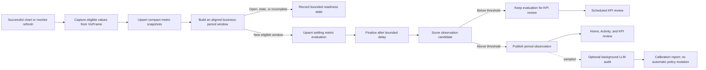

# Workspace Observations And Intelligence Home

Status: draft

Roadmap revision: 2026-08-09 — period-aware KPI evaluation replaces refresh-bound comparison.

## Summary

Turn Chartbrew's workspace landing experience into a decision-oriented Home that tells users what
changed, whether the underlying data is healthy, and where to continue working. Add a bounded
Observation Engine that captures explicit chart and metric values after successful refreshes,
evaluates them over stable business periods, stores compact metric history, and produces
evidence-backed observations without issuing duplicate source requests.

A successful refresh is evidence, not a user-facing event. The engine separates source refresh
cadence, metric comparison period, and delivery cadence. KPI-style monitors normally compare closed
calendar periods, such as July with June or last week with the week before it. They do not compare a
partial current day with a complete prior day. Each eligible period also produces a compact metric
evaluation, including stable results that did not cross an observation threshold, so a scheduled
KPI review can be useful without filling Activity after every refresh.

The first release is deliberately conservative. It monitors metrics whose meaning is already
explicit in a chart or user-created monitor, uses deterministic calculations for every published
fact, and represents missing data or insufficient history honestly. An optional, budgeted LLM audit
runs asynchronously in shadow mode to measure relevance and recommend scoring-policy changes. It
does not run after every refresh, invent evidence, or change production weights automatically.

Explicit monitoring is the trust-building foundation, not the final product identity. Once real
relevance feedback has calibrated publication quality, Chartbrew should proactively recommend
high-confidence metrics worth watching from existing chart definitions and Dataset Intelligence.
Benji approves the definition and healthy direction before a recommendation becomes a monitor.
Home remains the primary proactive surface: it should tell Maya what deserves attention now,
while Activity remains the denser audit trail and management surface.

Refactor **Ask your data** into reusable chat building blocks. Home can show an ephemeral composer
and inline result without a conversation browser, while the existing modal and observation
investigations can compose the same chat UI with persistent history where useful. The client stops
sending full conversation history; the server owns persistent and short-lived session context.

The screenshots that motivated this work define information hierarchy and user flow only. All
implementation uses the existing Chartbrew design system, HeroUI v3 components, theme tokens,
accessibility conventions, colors, and light/dark behavior.

## Personas

### Maya — product or growth operator

- Has viewer or editor access to one or more dashboards.
- Starts with business questions and expects Chartbrew to preserve metric definitions for her.
- Needs to scan important changes, verify freshness, investigate safely, and share a result.
- Should not need connection, query, dataset, schema, model, job, or scoring terminology.
- May ask questions and create temporary analysis, but permanent changes follow her project role.

### Benji — CTO and team owner

- Connects sources, creates datasets and dashboards, defines important metrics, and manages access.
- Wants both business observations and operational confidence in refreshes and database metrics.
- May begin with no dashboards, no historical data, or a source that cannot yet answer a desired
  question.
- Needs clear setup and baseline-collection states instead of empty feeds or fabricated insights.
- Needs bounded storage, visible maintenance health, and control over monitoring cost and cadence.

## Product Principles

- Deterministic facts first. LLM output may explain or audit facts but may not calculate or invent
  published values.
- Explicit meaning beats guessed meaning. Start with existing canonical chart encodings, active
  alerts, and user-created monitors before broader Dataset Intelligence candidates.
- Proactive, not presumptive. Recommend well-supported metrics and next actions, but require user
  confirmation before monitoring or persisting new reporting assets.
- No data is a real state. Never turn missing, stale, partial, or insufficient data into an
  observation.
- Refresh once, analyze once. Automatic observation processing reuses a successful runtime result
  and must not make another source request.
- Capture cadence, comparison period, and delivery cadence are independent settings. A refresh does
  not define a business period or require a published change.
- Closed periods first. The first KPI release evaluates complete calendar periods and aligned state
  checkpoints. Period-to-date comparison is added only when both windows use the same elapsed time.
- Metric behavior controls aggregation. Additive flows, point-in-time states, ratios, and
  distributions must not use the same rollup rule.
- Investigation is temporary by default. Supporting charts are not placed on visible dashboards
  without an explicit authorized action.
- Observations, alerts, and data-health issues are separate concepts with separate lifecycles.
- Viewers can ask and investigate within their project scope. Creating or changing Chartbrew
  entities remains permission-gated.
- Intelligence data is bounded, encrypted where it contains tenant semantics, and covered by an
  explicit retention policy.
- Internal metadata stays internal. Model names, score versions, confidence internals, fingerprints,
  queue state, source IDs, raw errors, and retention mechanics do not appear in normal product UI.

## Goals

- Add a personalized Home with attention items, data health, recent dashboards, and reusable Ask.
- Detect a narrow but trustworthy first set of metric changes over explicit business periods.
- Produce one reproducible metric evaluation per eligible comparison, even when no observation is
  published, so scheduled KPI reviews can report stable and changed metrics without refresh noise.
- Store compact metric snapshots and deduplicated observations with enough evidence to reproduce
  every user-facing claim.
- Support chart-backed time series immediately and scalar metrics after enough aligned state
  checkpoints.
- Give Benji an explicit path to monitor database record counts through a count metric rather than
  inferring totals from partial dataset results.
- Add observation detail and activity views with read, save, snooze, dismiss, feedback, and
  role-gated resolve actions.
- Reuse the AI orchestrator for observation-scoped follow-ups and session-scoped supporting charts.
- Decouple chat presentation, live session state, and persisted conversation history.
- Add explicitly configured daily, weekly, or monthly KPI reviews without turning every refresh into
  an Activity item or immediate notification.
- Add cost-controlled, optional LLM relevance auditing and a human-reviewed calibration report.
- Graduate from manual setup to bounded, explainable metric recommendations after relevance has
  been validated against real feedback.
- Keep Home concise and editorial: distinguish problems requiring action from positive or neutral
  changes worth knowing, and never repeat the same fact across a card title and supporting copy.
- Harden and document UpdateRun retention and apply the same maintenance framework to new
  intelligence data.

## Non-Goals

- Copying the visual styling, colors, gradients, typography, or component treatment from the mocks.
- Monitoring every numeric dataset field automatically.
- Causal inference. Driver analysis describes contribution or concentration, not causation.
- Automatically rewriting scoring weights from LLM output.
- Running an LLM or a new source query after every refresh.
- Treating each successful refresh as a meaningful KPI comparison boundary.
- Comparing an open period with a complete prior period, or adding daily averages and percentages
  into larger periods without the values needed to calculate them correctly.
- Treating sampled row count as total database record count.
- A generic semantic-model editor or metric-definition language in the first release.
- Replacing existing alerts, snapshots, dashboard refresh schedules, Dataset Intelligence, or the
  canonical visualization specification.
- Exposing observations or AI investigation through public and embedded dashboard routes.
- A standalone cross-dashboard chart asset manager. Global search may surface charts; a dedicated
  Charts page requires a separate product decision.
- Automatically sending digests before Benji or Maya chooses recipients, scope, cadence, and
  channel.

## Domain Language

| Term | Meaning |
| --- | --- |
| Monitor | Explicit definition of a metric Chartbrew captures and evaluates over a business period. |
| Metric snapshot | One compact, normalized metric value for a period and definition fingerprint. |
| Metric evaluation | One reproducible result for an aligned current and comparison period, whether or not it becomes an observation. |
| Observation | Durable, ranked, evidence-backed change that passed publication rules. |
| Alert | User-configured notification rule and delivery configuration. |
| Investigation | A user's contextual Ask session and temporary supporting artifacts. |
| Capture cadence | How often new metric evidence can arrive from successful refreshes. |
| Comparison period | The business period over which a metric is evaluated, independent of refresh and delivery cadence. |
| Comparison rule | How Chartbrew selects the comparison window, such as previous period or same period last year. |
| Period mode | Whether an evaluation uses completed periods or equivalent period-to-date windows. |
| Metric behavior | How values combine across time: flow, state, ratio, or distribution. |
| Digest | Scheduled KPI review of accessible evaluations, observations, and data-health changes. |
| Data-health issue | Refresh, freshness, connection, or result-completeness problem. |
| Metric recommendation | A bounded suggestion to watch an existing, reproducible metric; it is not active until approved. |

User-facing copy should normally use **change**, **insight**, **activity**, **watch**, and
**data freshness**. `Observation` remains the implementation term. Use **KPI review** for the
scheduled metric summary and **Changes only** for its observation-only mode. `Digest` remains the
implementation term. Do not show observation IDs.

## Experience And Information Architecture

### Routes

- `/` — Home.
- `/dashboards` — current DashboardList experience.
- `/dashboard/:projectId` — existing dashboard.
- `/activity` — Changes, Alerts, and Data health tabs.
- `/activity/:observationId` — change detail and investigation.
- Existing `/connections`, `/datasets`, `/integrations`, and settings routes remain role-gated.
- Keep a compatibility redirect from the previous root dashboard list behavior where necessary.

Sidebar visibility follows role:

- Maya: Home, Dashboards, Activity, and any existing viewer-safe destinations.
- Benji: the same, plus Datasets, Connections, Integrations, and Settings.

### Home

Home is a bounded aggregate, not a second dashboard:

1. Reusable Ask composer.
2. **Needs attention:** up to three total items, with at most one actionable data-health summary and
   the remaining slots used for unhealthy metric changes ranked by impact, severity, importance,
   and freshness.
3. **Notable changes:** at most two positive or neutral changes when they add useful awareness and
   do not displace a problem requiring action.
4. Recent or pinned dashboards.
5. One contextual next step only when it is genuinely relevant.

Do not show generic product promotion in the operational attention rail. Replace “overnight” with
“since your last visit” or an exact detection time because refresh schedules differ.

Home copy is editorial rather than mechanically generated:

- The title states one clear fact: `Revenue rose 30%` or `Failed sync rate rose 30 percentage
  points`.
- Supporting copy names the business comparison, such as `July compared with June`, and may add an
  unusual range, concentration, or configured healthy direction. It is omitted when it would merely
  repeat the title.
- Rate changes prefer percentage-point language when that is the clearest interpretation. A
  relative percentage may remain secondary evidence.
- Positive movement for a metric where higher is better does not appear as a problem. Neutral
  movement may be notable, but it is not labelled unhealthy.
- Empty copy says `No changes need attention` only after eligible monitors completed a business-
  period evaluation; a successful refresh alone cannot support this claim.

After eligible monitors exist, Home may recommend setting up a weekly KPI review. The
recommendation disappears after setup or dismissal and never implies that a digest already exists.

### Dashboard list

Move the current DashboardList to `/dashboards` and retain its search, pinning, grid/table views,
freshness, schedule, member, and chart-count behavior. Replace the current generic discovery rail
with at most:

- One observation from dashboards the user can access.
- One relevant monitoring/setup action.
- One data-health issue.

The rail is useful to viewers as well as admins; each action remains permission-aware.

### Activity

Activity provides a searchable, filterable history without mixing domain semantics:

- **Changes:** published observations, with read/saved/snoozed state. Show two or three open items
  requiring attention prominently, place positive or neutral open movement under **Notable
  changes**, and render **Past changes** as a chronological table rather than another card grid.
  The table shows ten changes per page and retains metric, dashboard, period, resolved time, and a
  full status chip.
- **Alerts:** existing configured alerts and their trigger events.
- **Data health:** freshness and refresh failures in user language. Detailed diagnostics remain
  team-owner/admin only.

Search and filters operate across open, notable, and past changes. Activity may remain one route,
but configuration tabs should be visually separated from the audit trail: **Changes**, **Alerts**,
and **Data health** are activity; **Watched metrics** and **KPI reviews** are management.

The sidebar badge counts unread changes plus unresolved data-health items visible to the user, not
every historical event.

### Observation detail

Show:

- Plain-language title without an internal ID.
- Current value, baseline, absolute delta, relative delta, period, and freshness.
- Correct unit language, including percentage points versus relative percent.
- The source chart or a canonical evidence chart with the change period marked.
- A short deterministic “What changed?” statement that adds context instead of restating the
  title.
- Links to the source dashboard and chart.
- A restrained action hierarchy: **Investigate**, **Open chart**, and **Save** may remain visible;
  share, snooze, dismiss, and authorized resolve actions move to an overflow menu.
- Relevance feedback after the user has seen the evidence, with the current selection visible and
  editable.
- Inline reusable Ask scoped to the observation, chart, dataset, comparison window, and allowed
  projects.

“Explore drivers” runs bounded contribution analysis. Copy uses “concentrated in,” “accounts for,”
or “associated with,” never “caused by” or “drove” unless a future causal method supports it.
Supporting charts appear only after the analysis succeeds and remain temporary until explicitly
placed.

Do not show scoring confidence, fingerprints, internal sample metadata, or completeness percentages
as product status. Translate reproducibility into user language such as `Compared with the latest
14 complete daily periods` and `Last checked 2 hours ago`. Put additional deterministic evidence
behind **How was this calculated?**. When the source chart does not clearly mark the comparison,
show a compact canonical evidence chart with the current and comparison windows highlighted.

## Persona Flows And Empty States

### Maya: review and investigate a change

1. Maya opens Home and sees only observations from projects she may access.
2. A card states the metric, exact change, period, source dashboard, and freshness.
3. She opens the observation and verifies the current value and comparison definition.
4. Ask is already scoped to the observation; no context picker is required for the first question.
5. She chooses a suggested follow-up such as “Compare mobile and desktop.”
6. Chartbrew reuses the existing dataset, performs a bounded breakdown, and shows evidence.
7. A useful supporting chart is returned as a session-scoped artifact without creating Chart or
   Dataset rows.
8. Maya may save her private investigation or share the observation link. Adding the chart or
   creating an alert is offered only if her role permits it. Promotion persists a real chart
   against the existing dataset; otherwise she can share the observation with an editor.
9. She marks the change read, saves it, snoozes it, or dismisses it. Separately, she can answer
   whether the change was useful; lifecycle actions do not submit feedback on her behalf.

### Benji: new workspace or no usable history

1. With no connections, Home explains that reporting is not set up and offers **Connect data**.
2. With connections but no datasets/dashboard metrics, it offers **Create a dataset**, **Use a
   template**, or **Ask Chartbrew to create a metric** when the source supports it.
3. With metrics but insufficient history, each monitor says **Collecting comparison data** and
   shows the periods or aligned checkpoints still required. No “all clear” claim is shown.
4. With no returned rows, the monitor says **Waiting for data** and links to the dataset/chart.
5. With a failed or stale refresh, Home shows a data-health issue and suppresses business
   observations for that result.
6. To watch database records, Benji creates or asks for an efficient query-backed count metric.
   Chartbrew never treats a bounded API page or sampled dataset result as a source-wide total.
7. Once the required history exists and the selected business period closes, the monitor becomes
   eligible for a metric evaluation and possible observation.

### Valid no-observation states

- **No monitors:** explain how to watch a metric.
- **Collecting comparison data:** show progress and the next expected period close or refresh.
- **Waiting for period close:** identify the period that is still open and do not score it as a
  complete result.
- **Waiting for data:** identify the affected metric and recovery destination.
- **Data needs attention:** show freshness/refresh recovery before business interpretation.
- **No important changes:** show this only when eligible monitors completed period evaluations and
  none crossed publication thresholds.

## Observation Processing



### Monitor eligibility

Version 1 prioritizes:

1. Explicit canonical chart layers with one quantitative value and a temporal field.
2. Existing active alerts and charts the team explicitly chooses to watch.
3. Scalar KPI/count metrics with an explicit period or point-in-time contract and enough aligned
   snapshots.
4. High-confidence Dataset Intelligence candidates only after Benji confirms the metric definition.

Exclude unsupported formulas, ambiguous multi-value layers, incomplete periods, high-cardinality
breakdowns, stale results, and any metric whose unit or aggregation cannot be reproduced.

### Metric recommendations

Recommendations are the bridge from explicit monitoring to a proactive platform. They are
generated only from reproducible definitions Chartbrew already understands:

- Eligible canonical chart layers used on accessible dashboards.
- Existing alerts, pinned dashboards, and repeated chart usage as bounded importance evidence.
- High-confidence Dataset Intelligence metric roles after ambiguity, unit, aggregation, and access
  checks pass.

Each recommendation explains why it appeared, names its source dashboard/chart or dataset, previews
the metric definition and value format, and asks the user to confirm what healthy movement means.
Accepting a recommendation creates a normal `MetricMonitor`; rejecting it stores a bounded dismissal
so the same suggestion does not immediately return. Recommendations expire when the underlying
chart or dataset definition changes.

Recommendations must not:

- Execute an additional source query merely to decide what to recommend.
- Automatically activate monitoring, infer business importance from a field name alone, or guess a
  healthy direction without confirmation.
- Occupy Home while a current metric regression or data-health problem needs attention.
- Expand beyond per-team candidate and monitor limits.

The first recommendation surface belongs in honest setup states and the watched-metric management
surface. Home may show one contextual recommendation only after signal relevance has been reviewed
against real feedback. Automatic monitoring remains disabled.

Version 1 derives at most five recommendations on demand from eligible chart layers. Active alerts,
team dashboard pins, automatic refreshes, recent chart data, and matching high-confidence Dataset
Intelligence are ranking evidence; Dataset Intelligence does not create a standalone monitor until
the dataset refresh pipeline can reproduce that metric directly. Recommendations are never stored.
A team-level dismissal stores one current definition fingerprint per chart metric slot, which keeps
the data bounded while allowing a materially changed chart definition to be suggested again.
Acceptance regenerates and authorizes the candidate on the server before using the normal
`MetricMonitor` creation path.

### Sources of history

- A chart time series containing enough comparable periods may be evaluated on its first monitored
  refresh because its own result contains the history.
- Scalar/KPI metrics require accumulated successful snapshots.
- Explicit dataset-backed monitors may run on their own configured schedule in a later rollout.
  They use the existing dataset/source runtime and are never created silently.
- Automatic observation processing receives the already-produced renderer-neutral VizFrame. It does
  not parse presentation pixels or make a second source request.

### Three independent clocks

The engine must keep these concepts separate:

```text
Capture cadence
How often a successful refresh can add or revise metric evidence

Comparison period
What business period the metric evaluates, such as day, week, or month

Delivery cadence
When a user receives a KPI review, such as every Monday morning
```

Processing may run after every successful refresh, but publication runs only when that refresh makes
a new comparison window eligible or materially revises a recent evaluation. A weekly digest may
contain a month-over-month evaluation. A monthly metric may refresh every hour without producing an
hourly observation.

Existing alerts remain the product for immediate threshold notification. Observations describe
important period changes. Data-health items describe refresh and freshness failures.

### Metric behavior and period aggregation

Before Chartbrew can compare larger periods, each monitor needs a reproducible metric behavior:

| Behavior | Period rule | Examples |
| --- | --- | --- |
| Flow | Sum complete source buckets inside the window. | Revenue, orders, sign-ups. |
| State | Use the last valid value at or before the aligned period boundary. | MRR, account balance, active subscriptions. |
| Ratio | Recalculate from an explicit numerator and denominator, or use a native period value. | Conversion rate, failure rate. |
| Distribution | Use a native period calculation; do not combine bucket percentiles or medians. | P95 latency, median order value. |

Chartbrew may infer behavior only from an explicit chart aggregation and fields that reproduce the
rule. It must not infer behavior from a metric name. The setup flow recommends a behavior and asks
the user to confirm it when the chart definition is ambiguous.

Version 1 period rollup supports additive `sum` and `count` flows plus aligned state checkpoints.
An average, ratio, percentile, median, distinct count, or formula can use a larger comparison period
only when the existing result contains the required native period value or the metric definition
contains the components needed to recalculate it. Otherwise, setup keeps the chart's native period
or marks the requested comparison unsupported.

A missing flow bucket can mean zero or missing data. Chartbrew fills it with zero only when the
canonical result states that the requested interval is complete and the aggregation has explicit
zero-fill behavior. If coverage is partial or unknown, the period is incomplete. Renderer warnings
alone are not a complete coverage contract.

The number of rows returned by a normal dataset refresh is a result-volume health signal, not a
business record-count KPI. It belongs in Data health and can detect an empty, truncated, or unusual
result. A business count monitor must use an explicit complete count definition and must declare
whether it is a flow, such as orders created in a month, or a state, such as total active accounts at
month end.

### Metric comparison periods

A monitor's comparison period is independent from source refresh and digest cadence. The target
periods are day, week, month, quarter, and year. The first period-aware release supports completed
day, week, and month comparisons. Quarter and year remain later extensions.

The initial comparison rule is **previous period**: yesterday compared with the complete day before
it, last complete week compared with the complete week before it, or last complete month compared
with the complete month before it. **Same period last year** is a later rule because it requires
longer retained history and leap-year rules.

The initial period mode is **completed**. **Period to date** is a later mode that compares the open
period with the same elapsed portion of the comparison period, such as August 1–9 with July 1–9.
State metrics use aligned checkpoints at the applicable window boundaries instead of summing values.

The engine must never compare an open current window with a complete prior window. It must also not
label the first hours of a day, week, or month as a fall from the complete prior period. For
period-to-date mode, both windows use the same elapsed cutoff in the monitor's calendar timezone.

Examples:

```text
Monthly flow
July revenue compared with June revenue

Weekly state
Subscription count at the end of last Sunday compared with the prior Sunday

Daily native rate
Yesterday's failed sync rate compared with the complete day before it

Monthly period to date
August 1–9 revenue compared with July 1–9 revenue
```

### Comparison defaults and calendar rules

The monitor setup always shows the comparison before confirmation. It can recommend a default with
these bounded rules:

1. Use a chart's explicit day, week, or month bucket when the metric behavior is also reproducible.
2. An hourly bucket does not determine business meaning. Ask the user to choose day, week, or month
   unless another explicit workspace setting supplies that choice.
3. For count or scalar metrics with an explicit point-in-time contract, ask the user to choose an
   aligned daily, weekly, or monthly checkpoint.
4. Do not use field names, LLM output, or source refresh cadence to select a period or metric
   behavior.

Users can change the recommended period to a supported option. The monitor stores its calendar
timezone and week start. The initial release uses normal calendar periods. Fiscal calendars and
custom comparison windows are deferred.

Existing monitors migrate to a bounded default without keeping refresh-to-refresh publication:

- Explicit daily, weekly, and monthly time-series buckets can keep their native calendar period when
  the metric behavior is reproducible.
- Hourly time series pause publication and ask the user to choose day, week, or month.
- Quarterly and yearly monitors pause until those periods are supported.
- Count and scalar monitors ask the user to confirm both behavior and daily, weekly, or monthly
  period.
- Existing dataset returned-row monitors stop business observation publication and remain result-
  volume signals in Data health.
- A count or scalar without an explicit point-in-time or period contract pauses publication and asks
  for review. The same rule applies to an ambiguous average, ratio, distribution, distinct count, or
  formula instead of applying an unsafe rollup.

The management UI labels any monitor without a complete safe contract as **Review comparison** until
an authorized user saves it. Capture can continue while publication is paused.

### Period eligibility and finality

An evaluation is eligible only when:

- The current and comparison windows align in the monitor timezone.
- Completed-period mode uses closed windows only.
- Each required source bucket or checkpoint is present and fresh enough.
- The metric definition and behavior are unchanged across both windows.
- Completeness meets the policy for both windows.
- A successful refresh after the current window closed supplied or confirmed the result.

The first successful refresh after period close can create a settling evaluation. A short
configurable delay allows late source data to arrive. During that delay, the same evaluation may
receive bounded revisions, but it does not create an observation. A bounded scheduler finalizes due
evaluations from stored snapshots without a new source request. Only a final evaluation can publish
an observation or enter a KPI review. After finalization, a late backfill creates an explicit
correction revision and preserves the prior evidence; it does not silently rewrite a delivered KPI
fact.

Use a unique evaluation key from team, monitor, definition fingerprint, comparison definition,
current window, and comparison window. This makes refresh retries idempotent and prevents a series
of refreshes from becoming duplicate KPI facts.

### Baselines

The selected business comparison is the primary baseline shown to the user. For example, June is
the baseline for a July-versus-June evaluation. A rolling median or median absolute deviation may be
secondary historical context for materiality scoring, but it must not replace the named KPI period
in user-facing evidence.

Initial primary policies are equal-window previous completed period and aligned state checkpoint.
Same-weekday, rolling-median anomaly, period-to-date, and prior-year comparison remain separate
comparison modes. They must not be silently mixed into a `previous period` label.

Every metric evaluation stores the effective baseline, current and comparison periods, values,
absolute and relative deltas, completeness, sample or bucket counts, finality, and definition
fingerprint. An observation references the exact evaluation that caused publication. Deterministic
evidence is immutable per evaluation revision.

### Candidate scoring and publication

Every monitor has one explicit minimum meaningful change:

- Relative, such as `10%`.
- Absolute, such as `$5,000` or `1,000 accounts`.
- Percentage points for a percentage metric, such as `2 percentage points`.

The setup flow recommends a threshold and requires confirmation. An existing monitor without a safe
threshold pauses publication. The threshold controls observation publication only. Every complete
period still creates a metric evaluation.

Data completeness, freshness, finality, definition consistency, and the selected threshold are hard
publication gates. Monitor importance, dashboard usage, historical rarity, and robust deviation may
rank published observations, but they must not silently replace the configured threshold. Do not
publish when a relevant refresh failed, the current business period is open, the evaluation is
settling, or the metric definition changed without comparable evidence.

Use the referenced metric-evaluation key as the observation deduplication source. Repeated refreshes
can revise the settling evaluation but cannot publish an observation until finalization. Reprocessing
a final evaluation is idempotent. A later business period creates a new historical fact. A positive
or neutral period change becomes past activity when a newer evaluation supersedes it. An unhealthy
change may remain in **Needs attention** until a later aligned evaluation shows deterministic
recovery or an authorized user resolves it.

### KPI reviews and digest delivery

Digest cadence does not determine metric comparison periods. A weekly digest may summarize a new
month-over-month or weekly evaluation.

Chartbrew may recommend delivery cadence from the selected monitor scope: weekly when the scope
contains weekly comparisons, and monthly when all comparisons are monthly. Existing daily delivery
remains available for changes-only subscriptions and is always an explicit user choice. The
recommendation is visible and editable before setup.

The digest reads final metric-evaluation revisions that have not been delivered to that
subscription. It does not select content from successful refreshes, a timestamp alone, or only
observations whose `last_detected_at` changed. It has two content modes:

- **KPI review:** show each selected metric's latest eligible evaluation for the delivery window,
  rank unhealthy and material changes first, and summarize stable metrics compactly.
- **Changes only:** show published observations and current data-health issues. Do not send when
  there is no new content.

A KPI review is not empty when selected metrics completed valid evaluations but did not cross their
configured change threshold. It shows the exact comparison. It says **within its normal range** only
when enough historical periods support that statement. It must not claim that metrics were stable
when a period is incomplete, stale, or not evaluated.

Each evaluation revision is delivered once per subscription. A bounded delivery window can hold a
scheduled review while an expected evaluation is settling. If the evaluation is still not final at
the end of that window, the review reports that the metric is waiting for complete data and delivers
one late KPI update when the evaluation becomes final. It does not wait for the next monthly cycle.
An unresolved attention item may appear again in a separate carry-over section.

### Driver/contribution analysis

- Runs on demand, not for every observation.
- Uses dimensions approved by the monitor or high-confidence dimensions from Dataset Intelligence.
- Caps dimensions, cardinality, rows, query time, output characters, and resulting chart series.
- Reuses the observation metric, filters, periods, and dataset.
- Requires segment totals to reconcile within a configured tolerance before describing contribution.
- Returns “not enough evidence” rather than selecting a plausible-looking segment.

Viewer-safe investigation needs a bounded `run_existing_dataset` orchestrator tool. It accepts an
authorized dataset ID plus observation-approved periods, filters, and breakdown fields. It executes
through the existing dataset/source runtime, never returns stored query/configuration details, and
cannot select a dataset outside the user's allowed projects.

## Optional LLM Audit And Calibration

### User relevance feedback

The existing feedback model and endpoint are the storage foundation, but the product loop is not
complete until feedback is explicit, reversible, and analytically useful:

- Ask `Was this change useful?` after Maya has reviewed the evidence. Relevance remains the internal
  calibration term, not required user vocabulary.
- **Useful** is a one-tap response. **Not useful** reveals a short reason selector with bounded
  options such as `Expected change`, `Too small`, `Wrong comparison or context`, `Already knew
  this`, and `Not actionable`.
- Return the current user's verdict and reason with observation detail so the selected state survives
  reload and can be changed.
- Feedback is separate from dismissing, resolving, saving, or snoozing. None of those actions imply
  a relevance verdict.
- Do not collect free-form tenant text in version 1.

The calibration report joins feedback to the deterministic inputs that produced the observation:
monitor kind, configured healthy direction, observed direction and impact, severity, magnitude,
baseline type, completeness, sample count, policy version, and whether a sampled LLM audit agreed.
It reports cohort counts and low-sample warnings before rates, preserves team privacy, and does not
print metric names or evidence. The initial aggregate-only operational report remains useful for
smoke checks but is not sufficient for threshold decisions.

LLM auditing is a separate asynchronous queue and is disabled by default.

Modes:

- `off` — no audit.
- `shadow_sample` — audit a small deterministic sample of final published and rejected metric
  evaluations.
- `shadow_published` — audit published observations only.
- `manual` — run for a selected observation from an admin/development surface.

The audit receives only a compact redacted evidence object: semantic labels, periods, units,
aggregates, deltas, completeness, deterministic feature values, and reason codes. It never receives
raw rows, source credentials, headers, request bodies, or full queries.

Validated audit output:

```javascript
{
  relevant: true,
  relevanceScore: 0.82,
  evidenceSupported: true,
  reasonCodes: ["material_change", "clear_baseline"],
  suggestedWeightChanges: [
    { feature: "relativeMagnitude", direction: "decrease", rationale: "..." },
  ],
}
```

Rules:

- The LLM cannot create, rewrite, suppress, or publish an observation in version 1.
- Suggested weight changes are aggregated into a calibration report and require human approval.
- Scoring weights are changed only through a new versioned policy/configuration.
- Audit failure never affects refresh or observation publication.
- A settling evaluation and an ordinary refresh are never LLM audit inputs.
- Per-team daily audit count, token, and cost ceilings stop new audits when exhausted.
- Record usage with an `AiUsage.purpose` such as `observation_audit`; do not attach shadow audits to
  user conversations.
- Compare audit results with explicit user relevance feedback, opens, saves, snoozes, and dismissals.

Use `npm run observations:audit-report` to summarize deterministic outcomes, joined user feedback,
LLM disagreement, false-positive proxies, costs, and suggested policy changes without printing
tenant labels or evidence.

## Reusable Ask Architecture

### Client composition

Split the current `AiModal` responsibilities into:

- `AiComposer` — reusable input and context chips.
- `AiChat` — presentational message, progress, suggestion, and artifact surface.
- `AiConversationBrowser` — optional saved-conversation navigation.
- `AiContextPicker` — optional explicit context control.
- `useAiChat` — submission, streaming/progress, local messages, session identity, errors, and
  artifact callbacks.
- `AiModal` — composition of conversation browser, context picker, and chat.
- `HomeAsk` — composer plus expandable ephemeral result; no history browser.
- `ObservationInvestigation` — inline chat seeded with observation context.

`AiChat` does not fetch conversations or assume persistence. Conversation browsing, team usage,
deletion, context selection, and modal layout stay outside the presentational component.

Supporting visuals returned by read-only Ask are `AiArtifact` response objects with a bounded chart
specification and data payload stored in the ephemeral session/runtime cache. They are not
`Chart`, `Dataset`, or ghost-project rows. Users with edit permission may explicitly promote an
artifact to a persisted Chart that reuses the authorized existing dataset. The existing
`create_temporary_chart` flow remains available for creator-level prompts that genuinely require a
new dataset/query.

### Server conversation ownership

Replace the client contract that submits `conversationHistory` with:

```javascript
{
  teamId,
  message,
  conversationId, // optional persistent thread
  sessionId,      // optional short-lived thread
  context,
  persistence: "persistent" | "ephemeral",
}
```

- The server loads `AiMessage` history for a persistent conversation after checking user ownership.
- Ephemeral sessions use an opaque server-side session ID and a bounded Redis/runtime-cache
  transcript with a short TTL. They do not create `AiConversation` or `AiMessage` rows.
- A one-shot Home question may omit both IDs.
- Users can explicitly promote an ephemeral session to a persistent conversation.
- Persistent conversations store validated context bindings separately from message history so an
  observation, dashboard, chart, or dataset context can be resumed without the UI loading a
  conversation browser.
- Progress events use a request/session channel and do not require a persisted conversation ID.
- Keep `/ai/orchestrate` as a temporary compatibility endpoint; the new client uses
  `/ai/respond`, and the compatibility endpoint is removed after all callers migrate.

### Read versus write capabilities

- Project viewers may use read-only Ask against accessible dashboards and reusable datasets.
- Viewer requests may execute an existing accessible dataset through the bounded
  `run_existing_dataset` tool. They do not receive connection/schema discovery, arbitrary-query,
  or entity-creation tools.
- Project editors/admins receive creation tools only for projects they can edit.
- Team owners/admins retain connection/source planning capability.
- Tool availability is filtered on the server from the authenticated role and allowed project IDs;
  hiding UI controls is not authorization.
- Observation context is resolved from an authorized ID on the server. The client cannot inject
  arbitrary team, dataset, chart, or connection context.

## Domain Model

### `MetricMonitor`

- UUID `id`, `team_id`, optional `project_id`, `chart_id`, `dataset_id`, and binding/layer identity.
- `name`, `kind` (`timeseries`, `scalar`, `record_count`), encrypted `metric_spec`.
- Encrypted `baseline_policy` and `publication_policy`, capture trigger, importance, status, minimum
  periods, and active flag.
- Definition fingerprint, last successful sample time, last evaluated period, next expected
  evaluation, and creator.

`metric_spec` stores semantic field roles, aggregation, metric behavior (`flow`, `state`, `ratio`, or
`distribution`), unit, time field, filters, formula, later ratio components when available, and
approved breakdown dimensions. It does not store credentials, raw rows, or full query text.

`baseline_policy` stores an explicit period contract, for example:

```javascript
{
  calendarTimezone: "Asia/Bangkok",
  checkpointToleranceMinutes: 1440,
  comparison: "previous_period",
  comparisonPeriod: "month",
  periodMode: "completed",
  settlingDelayMinutes: 360,
  weekStartsOn: 1,
}
```

Changing metric behavior, comparison period, period mode, timezone, week start, or checkpoint
tolerance changes the definition fingerprint and starts new comparable history. Changing only
digest cadence does not.

`publication_policy` stores one user-confirmed threshold, for example:

```javascript
{
  thresholdType: "relative",
  thresholdValue: 0.1,
}
```

Supported threshold types are `relative`, `absolute`, and `percentage_points`. Changing the
threshold changes future publication but does not make existing metric history incomparable. It
does not republish old evaluations.

### `MetricRecommendationDismissal`

- Team, project, chart, binding identity, current definition fingerprint, dismissing user, and type.
- `later` dismissals expire after 30 days; `definition` dismissals remain until the chart definition
  changes or the chart is deleted.
- One row per team/chart/binding keeps historical definition changes from growing the table.

### `MetricSnapshot`

- UUID `id`, `monitor_id`, `team_id`, period start/end, granularity, numeric value.
- Sample, completeness, interval-coverage, and result-as-of metadata; definition fingerprint;
  and optional `update_run_id`.
- Unique key on monitor, definition fingerprint, period, and granularity for idempotent refreshes.
- Indexes for monitor/time and retention cutoff.

A later ratio-reconstruction release may add numerator and denominator components. They are not part
of the first period-aware release.

### `MetricEvaluation`

- UUID `id`, monitor/team references, definition fingerprint, policy version, and unique evaluation
  key.
- Comparison definition, calendar timezone, current and comparison period start/end.
- Current, baseline, absolute delta, relative delta, completeness, source bucket/checkpoint counts,
  metric behavior, and the effective publication threshold.
- Readiness (`eligible`, `waiting`, `incomplete`, or `stale`), finality (`settling`, `final`, or
  `revised`), evaluated time, finalized time, and revision number.
- Encrypted bounded evidence sufficient to reproduce the evaluation without retained raw snapshots.
- Unique key on monitor, definition fingerprint, comparison definition, and both period windows.
- Indexes for monitor/current period, team/evaluated time, and retention cutoff.

Store completed eligible evaluations even when they do not pass observation publication rules.
Waiting readiness can remain monitor state unless a durable row is needed for one bounded recent
window.

### `Observation`

- UUID `id`, team/project/chart/dataset/monitor references and `metric_evaluation_id`. The evaluation
  reference is required for new period observations and nullable only for legacy history.
- Type, lifecycle status, severity, confidence band, score, direction, and deduplication key.
- Current/baseline values, units, periods, absolute/relative deltas.
- Encrypted bounded evidence and deterministic summary.
- First/last detection, superseded/resolved timestamps, definition fingerprint, and internal score
  version.

### `ObservationPreference`

- Observation/user unique relation.
- Read, saved, dismissed, and snoozed timestamps.
- Personal state never globally resolves an observation.

### `ObservationFeedback`

- Observation/user relation with `relevant`, `not_relevant`, or `unsure`.
- Optional bounded reason code (`expected_change`, `too_small`, `incorrect_context`,
  `already_known`, `not_actionable`, or `clear_and_useful`), not free-form tenant data in version 1.
- The observation detail response includes only the authenticated user's current feedback.

### `ObservationAudit`

- Optional observation ID, metric-evaluation ID, or sampled final-evaluation fingerprint.
- Team, audit mode, model, prompt/audit version, validated verdict, reason codes, and cost reference.
- Bounded feature vector only; no raw data.

The first period-aware release leaves this model and audit flow unchanged because LLM audit remains
off. Metric-evaluation audit references belong to the later audit adaptation.

### `ObservationDigestSubscription`

- UUID `id`, `team_id`, `user_id`, optional project/monitor scope.
- Cadence (`daily`, `weekly`, or `monthly`), timezone, local delivery time, delivery day rule,
  bounded evaluation-wait window, enabled flag, and last delivery.
- Content mode (`kpi_review` or `changes_only`). KPI review is the default for new watched-metric
  summaries.
- Delivery channels begin with email and may include an existing enabled Slack integration.
- Recipients are re-authorized at delivery time; the digest contains only observations and health
  items the recipient can currently access.
- A changes-only digest does not send when empty. A KPI review can send when valid evaluations exist
  even if none became observations. Record a successful no-op when no scoped metric completed an
  evaluation and no health item needs attention.

### `ObservationDigestDeliveryItem`

- Subscription, metric-evaluation ID, evaluation revision, delivery attempt, and delivered time.
- Unique key on subscription, metric evaluation, and revision.
- A correction revision has a new revision number and can be delivered once with a clear
  **Corrected** label.
- Retention follows the related KPI review and metric-evaluation retention policy.

### `AiConversationContext`

- Conversation/entity unique relation for observation, dashboard, chart, dataset, or connection
  references.
- Created only after server-side authorization and rechecked whenever a conversation resumes.
- Ephemeral sessions hold the same bounded reference shape in runtime cache rather than SQL.

Data-health issues remain a projection over UpdateRun, dashboard/chart freshness, and connection
state. A later successful run for the same entity resolves the projected failure. Do not persist
copies unless a future notification lifecycle requires it.

## APIs

All responses are bounded and team/project scoped.

### Home and activity

- `GET /team/:team_id/home`
- `GET /team/:team_id/activity?type=&status=&project_id=&cursor=`
- `GET /team/:team_id/data-health`

### Observations

- `GET /team/:team_id/observations`
- `GET /team/:team_id/observations/:observation_id`
- `PUT /team/:team_id/observations/:observation_id/preference`
- `POST /team/:team_id/observations/:observation_id/feedback`
- `POST /team/:team_id/observations/:observation_id/resolve`
- `POST /team/:team_id/observations/:observation_id/reopen`
- `POST /team/:team_id/observations/:observation_id/investigate`

### Metric evaluations — deferred standalone API

- `GET /team/:team_id/metric-evaluations?monitor_id=&project_id=&cursor=`
- `GET /team/:team_id/metric-evaluations/:evaluation_id`

The first period-aware release returns the latest evaluation through monitor, observation, Home,
and KPI-review responses. It does not add these standalone endpoints. A later history surface may
add them with bounded user-facing evidence and without internal scores, fingerprints, or raw
snapshots.

### Monitors

- `GET /team/:team_id/monitors`
- `POST /team/:team_id/monitors`
- `PUT /team/:team_id/monitors/:monitor_id`
- `DELETE /team/:team_id/monitors/:monitor_id`
- `POST /team/:team_id/monitors/:monitor_id/refresh`

### Digests

- `GET /team/:team_id/observation-digests`
- `POST /team/:team_id/observation-digests`
- `PUT /team/:team_id/observation-digests/:subscription_id`
- `DELETE /team/:team_id/observation-digests/:subscription_id`
- `POST /team/:team_id/observation-digests/:subscription_id/send-test`

### Ask

- `POST /ai/respond`
- `POST /ai/sessions/:session_id/promote`
- Existing conversation list/read/delete endpoints remain for persistent chat.

## Permissions

| Action | Viewer | Editor | Project admin | Team admin/owner |
| --- | --- | --- | --- | --- |
| View accessible observations/health | Yes | Yes | Yes | Yes |
| Ask read-only questions | Yes | Yes | Yes | Yes |
| Personal read/save/snooze/dismiss/feedback | Yes | Yes | Yes | Yes |
| Create session-scoped supporting analysis | Yes | Yes | Yes | Yes |
| Promote supporting artifact to a chart | No | Accessible projects | Accessible projects | Yes |
| Place chart or create/update monitor | No | Accessible projects | Accessible projects | Yes |
| Configure personal digest | Yes | Yes | Yes | Yes |
| Resolve/reopen observation | No | Accessible projects | Accessible projects | Yes |
| View raw update-run diagnostics | No | No | No | Yes |
| Configure connections/source AI | No | No | No | Yes |

Public/embed routes expose none of the new models or APIs.

## Data Maintenance And Retention

Chartbrew already calls `cleanupExpiredRuns()` daily with a default of 30 days through
`updateAuditRetention.js`. The setting is not documented in `.env-template`, deletion is not
batched, and the cleanup query loads every expired run ID before deletion. This work hardens the
existing path rather than adding a second UpdateRun cleanup system.

### Defaults

- Successful/cancelled UpdateRuns: 30 days.
- Failed UpdateRuns: 90 days.
- Raw/sub-daily MetricSnapshots: 90 days.
- Daily MetricSnapshot rollups: 730 days.
- Final MetricEvaluations: 730 days.
- ObservationDigestDeliveryItems: follow the related MetricEvaluation, or delete with the
  subscription.
- Resolved observations and preferences: 365 days after resolution.
- Open or explicitly saved observations: retained until resolved/unsaved, subject to team deletion.
- Observation audits and rejected-candidate samples: 90 days.
- Ephemeral Ask sessions: 24 hours or less.

### Configuration

- `CB_UPDATE_AUDIT_RETENTION_DAYS=30`
- `CB_UPDATE_AUDIT_FAILED_RETENTION_DAYS=90`
- `CB_METRIC_SNAPSHOT_RETENTION_DAYS=90`
- `CB_METRIC_ROLLUP_RETENTION_DAYS=730`
- `CB_METRIC_EVALUATION_RETENTION_DAYS=730`
- `CB_OBSERVATION_RESOLVED_RETENTION_DAYS=365`
- `CB_OBSERVATION_AUDIT_RETENTION_DAYS=90`
- `CB_OBSERVATIONS_LLM_AUDIT_MODEL=gpt-5.4-nano`
- `CB_DATA_RETENTION_BATCH_SIZE=1000`
- `CB_DATA_RETENTION_MAX_RUNTIME_SECONDS=300`

Document all values in `.env-template`. An explicit `0` disables that category's cleanup and logs a
startup warning.

### Cleanup behavior

- Add standalone retention indexes such as `UpdateRun.startedAt`,
  `MetricSnapshot.period_end`, `MetricEvaluation.current_period_end`, `Observation.resolved_at`, and
  `ObservationAudit.createdAt`.
- Delete in stable primary-key batches; never load all expired IDs.
- Delete UpdateRunEvent children before their runs inside bounded transactions.
- Preserve failed runs for their longer retention window.
- The first period-aware release does not depend on long-term snapshot rollups. Final evaluations
  are self-contained. A later extension must replace behavior-neutral daily rollups before it uses
  them for long-range comparison: sum flows, use the last aligned state, preserve ratio components,
  and keep native distributions.
- MetricEvaluation and observation evidence are self-contained, so expired snapshots do not break
  historical detail.
- Cascade team, monitor, chart, dataset, metric-evaluation, digest-subscription, delivery-item, and
  observation deletion intentionally and test orphans.
- Run one bounded cleanup pass after startup and daily on the existing main-cluster scheduler.
- Record counts, duration, oldest retained timestamp, and failures without logging tenant data.
- Cleanup failure never prevents server startup or chart refresh.

Add:

```bash
npm run retention:run -- --dry-run
npm run retention:run -- --category=update-runs --limit=5000
```

Dry-run reports counts and estimated age ranges only. The command supports repeatable production
cleanup without requiring the application cron to catch up in one transaction.

## Policy And Configuration

Extend the existing intelligence policy provider so Chartbrew Cloud can replace environment
defaults per team:

```javascript
{
  observations: {
    enabled: true,
    autoMonitorCharts: false,
    minimumComparablePeriods: 2,
    minimumHistoryPeriodsForDeviation: 8,
    defaultComparisonPeriod: null,
    defaultPeriodMode: "completed",
    defaultRelativeChangeThreshold: 0.1,
    defaultPercentagePointThreshold: 1,
    minimumPeriodCompleteness: 1,
    periodSettlingDelayMinutes: 360,
    reviewEvaluationWaitMinutes: 1440,
    stateCheckpointToleranceMinutes: 1440,
    maximumMonitors: 100,
    maximumBreakdowns: 3,
    llmAuditMode: "off",
    llmAuditSampleRate: 0.05,
    llmAuditDailyLimit: 20,
    llmAuditDailyTokenLimit: 20000,
  },
}
```

`autoMonitorCharts` remains false in version 1. Benji explicitly watches a metric or accepts a
recommendation. A null `defaultComparisonPeriod` requires a user choice unless an explicit safe week
or month bucket already supplies the period. Threshold defaults are visible recommendations, not
hidden publication rules. Instance-wide limits remain ceilings over Cloud entitlements.

## Proposed Module Layout

```text
server/modules/observations/
  policy.js
  monitorSchema.js
  extractMetrics.js
  periodWindows.js
  aggregatePeriods.js
  baseline.js
  evaluateMetric.js
  evaluationScheduler.js
  scoreCandidate.js
  processChartResult.js
  driverAnalysis.js
  llmAudit.js
  auditQueue.js
  digestSchedule.js
  digestScheduler.js
  retention.js
server/controllers/
  MonitorController.js
  ObservationController.js
  HomeController.js
  DigestController.js
client/src/containers/Home/
client/src/containers/Activity/
client/src/containers/Observation/
client/src/containers/Ai/AiChat.jsx
client/src/containers/Ai/hooks/useAiChat.js
```

Source-specific metric planning remains source-owned and follows `source-plugin-guide.md`. Shared
observation code consumes canonical dataset/chart/runtime contracts and does not branch on source
type.

## First Period-Aware Release Scope

This section is the binding implementation boundary for Iteration Four. The broader sections in
this specification describe the target architecture, but they do not add work to this release.

### In scope

- Previous completed period only.
- Completed day-over-day, week-over-week, and month-over-month comparisons only.
- Normal calendar periods in the team timezone, with an editable week start and timezone.
- An explicit user choice when hourly data does not state daily, weekly, or monthly business meaning.
- Native complete daily, weekly, or monthly metric values.
- Additive rollup for explicit `sum` and `count` flows with complete interval coverage.
- Aligned checkpoints for explicit point-in-time state metrics.
- One user-confirmed relative, absolute, or percentage-point publication threshold per monitor.
- One settling and final `MetricEvaluation` per period pair, with bounded correction revisions.
- Observation publication from final evaluations only.
- Daily, weekly, and monthly KPI reviews. Existing daily changes-only delivery can remain available.
- One delivery record per subscription, metric evaluation, and revision.
- Safe migration that pauses every monitor without a complete reproducible period contract.
- Exact period and readiness copy in setup, watched metrics, Home, Activity, detail, Ask context, and
  email.
- Offline and production-like replay with publication off before release.

### Deferred from this release

- Quarterly and yearly comparison periods.
- Period-to-date and same-period-last-year comparisons.
- Fiscal calendars and custom windows.
- Ratio reconstruction from numerator and denominator.
- Rollup of averages, ratios, percentiles, medians, distributions, distinct counts, or formulas.
- Metric-aware long-term snapshot rollups. Final metric evaluations remain self-contained.
- Changes to LLM auditing for the new evaluator. LLM audit stays off.
- A standalone metric-evaluation history browser and dedicated list/detail APIs.
- Automatic period inference from hourly chart data, metric names, source refresh cadence,
  or LLM output.
- Additional delivery channels.

### First-release acceptance scenario

1. Benji watches Revenue and confirms monthly flow, previous completed period, timezone, healthy
   direction, and a meaningful-change threshold.
2. Hourly refreshes capture evidence but create no Activity items while July is open.
3. After July closes, a complete result enters the settling window and becomes one final
   July-versus-June evaluation without another source request.
4. A result that crosses the monitor threshold creates at most one observation. A result below the
   threshold remains available for the KPI review without entering Activity.
5. Maya sees exact June and July evidence and receives each evaluation revision once.
6. Missing, partial, stale, or ambiguous data creates no business conclusion.
7. A late correction preserves prior evidence, is labelled **Corrected**, and is not silently
   repeated.

## Rollout

The implementation foundation includes retention, explicit monitors, refresh-based snapshot
capture, deterministic publication, Home and Activity, scoped Ask, supporting analysis,
record-count monitoring, data health, digests, feedback, and metric recommendations. Its current
refresh-bound comparison model is not ready for broad proactive rollout because it can produce
correct calculations at unhelpful business boundaries.

The revised rollout order is:

1. **Stop refresh noise:** keep snapshot capture, but replace refresh-to-refresh publication with
   explicit completed-week or completed-month eligibility.
2. **Add period contracts:** store metric behavior, comparison period, period mode, calendar rules,
   and safe migration defaults on each monitor.
3. **Persist metric evaluations:** create one reproducible result per comparison window, including
   stable results, and make observations a filtered result of those evaluations.
4. **Make reviews KPI-style:** update monitor setup, Home, Activity, detail, and email so they name
   exact calendar comparisons and scheduled KPI reviews can include stable metrics.
5. **Calibrate completed periods:** replay representative flow, state, native-period,
   incomplete-period, delayed-data, and timezone cases before releasing the replacement engine.
6. **Expand carefully:** add period-to-date, prior-year, and non-additive metric support only after
   the completed-period path has strong relevance feedback.
7. **Controlled proactivity:** after the replacement engine is released, optionally sample LLM
   audits and review publication precision, KPI-review engagement, and recommendation acceptance
   before expanding other proactive features.

The prior controlled-rollout phase is blocked by steps one through five. The LLM audit machinery
remains off by default. Implementation completion is not permission to enable it for every team.

The existing observation-engine control remains the emergency kill switch. The completed-period
path does not add a second engine or a team feature flag. Disabling observations stops capture and
publication jobs without changing chart refresh success or hiding existing dashboards.

## Testing Strategy

### Unit

- Metric extraction from canonical line, bar, KPI, average, and count layers.
- Rejection of ambiguous, incomplete, stale, unsupported, and high-cardinality metrics.
- Calendar windows for week and month across timezone, daylight-saving, month-length, and week-start
  boundaries.
- Completed-period and aligned-state comparison, plus explicit rejection of partial-current versus
  complete-prior windows.
- Flow summation, state checkpoint selection, native-period values, and rejection of unsafe average,
  ratio, percentile, median, distinct-count, and formula rollups.
- Complete, partial, and unknown interval coverage, including explicit zero-fill and rejection of an
  unexplained missing bucket.
- Previous completed period, plus explicit rejection of period-to-date and prior-year modes in this
  release.
- Percentage-point versus relative-percent calculations and unit formatting.
- Relative, absolute, and percentage-point monitor thresholds; ranking; versioning; deduplication;
  correction; and recovery.
- Driver reconciliation, caps, and non-causal wording.
- LLM audit remains off and receives no new period-evaluation path in this release.
- Retention cutoffs, failed-run exceptions, batching, rollup-before-delete, and dry-run counts.
- Chat adapters, ephemeral TTL, persistent promotion, and no client-supplied history.
- Daily, weekly, and monthly digest scheduling, timezone boundaries, re-authorization, empty-digest
  policy, and idempotent delivery.
- KPI-review selection from finalized evaluations, stable-metric summaries, and one-delivery-per-
  evaluation behavior independent of refresh count.
- Unique delivery records for evaluation revisions, bounded review waiting, and correction labels.
- Feedback reason validation, user-scoped serialization, cohort grouping, and low-sample reporting.
- Recommendation eligibility, ranking, fingerprint expiry, dismissal, and explicit monitor
  creation.

### Integration

- Successful chart refresh upserts one idempotent snapshot without another source execution.
- Several successful refreshes in one open period create no period observation.
- The first eligible refresh after period close creates one metric evaluation and at most one
  observation after finalization; later identical refreshes create neither.
- The finalization scheduler uses stored snapshots and issues no source request.
- Late data revises the same settling evaluation, while a finalized backfill preserves revision
  history.
- A July-versus-June evaluation remains July-versus-June in a weekly digest sent in August.
- Failed/stale refresh creates health state and suppresses business observations.
- Definition changes begin new comparison history and cannot compare incompatible values.
- Observation APIs enforce team and allowed-project scope.
- Viewers receive read tools only; editor/admin mutations remain project-scoped.
- Viewer analysis executes only existing accessible datasets and produces no Dataset/Chart rows.
- Public/embed routes contain no monitor, snapshot, observation, audit, or conversation data.
- Session artifacts do not appear in dashboard lists or SQL until explicitly promoted.
- UpdateRun/MetricSnapshot/MetricEvaluation/ObservationDigestDeliveryItem/ObservationAudit cleanup
  works on large seeded batches for MySQL, PostgreSQL, and SQLite test paths.
- Optional LLM failure and budget exhaustion do not affect refresh or deterministic publication.
- Feedback from one user is not exposed as another user's selected state.
- Calibration joins feedback and audits to the exact policy/features that produced an observation.
- Recommendation generation issues no source query and cannot activate a monitor without an
  authorized confirmation.

### Client

- Maya can complete Home → observation → follow-up → save/dismiss using keyboard only.
- Benji sees correct empty, waiting-for-data, comparison-data, period-close, stale, failure, and
  success states.
- Benji can choose or confirm daily, weekly, or monthly comparison independently from chart refresh and
  digest settings.
- Benji confirms a relative, absolute, or percentage-point meaningful-change threshold.
- Maya sees exact period labels such as `July compared with June`; no UI describes a scalar metric
  as compared after each refresh.
- Home Ask renders without a history browser.
- Modal chat retains its persistent history while inline chat remains history-free.
- Observation context cannot be replaced with an unauthorized client-supplied ID.
- Relevance feedback restores its selected state, can be changed, and requests a reason only when
  the answer needs diagnostic context.
- Healthy positive movement does not appear under **Needs attention**, and Past changes remain
  scannable at audit-trail volume.
- Accessible chart summaries, loading announcements, focus order, reduced motion, mobile adaptation,
  and light/dark themes use existing Chartbrew/HeroUI behavior.

## Acceptance Gates

- A published observation can be reproduced from stored deterministic evidence.
- Every observation references one stored metric evaluation with aligned current and comparison
  windows.
- Automatic processing issues zero additional source requests for chart-backed monitors.
- No observation is published from stale, failed, partial, or insufficient data.
- No completed-period monitor publishes before its current period closes.
- Repeated refreshes inside one business period do not create repeated Activity items.
- Flow metrics sum complete buckets, state metrics use aligned checkpoints, and unsupported
  non-additive rollups fail closed.
- A monitor publishes only after its user-confirmed relative, absolute, or percentage-point
  threshold is crossed.
- A scheduled KPI review can report valid stable evaluations without creating observations for each
  metric.
- Each final evaluation revision is delivered at most once per KPI-review subscription.
- Digest cadence does not change the metric comparison period.
- Benji can explicitly watch an eligible chart metric and see comparison-data progress.
- A total database record observation is backed by an explicit count metric, never a sampled page.
- Maya can view and investigate accessible observations without team-admin permission.
- Maya cannot discover connections, schemas, datasets, or observations outside her allowed projects.
- Viewer investigations can render a supporting chart without persisting a Chart or Dataset.
- Home Ask works without loading or displaying saved conversation history.
- The existing modal retains its persistent-history behavior while Home and observations use the
  reusable history-free chat surface.
- The client no longer submits authoritative conversation history.
- LLM auditing is off by default, bounded when enabled, and cannot mutate scoring automatically.
- A digest is sent only after explicit setup, uses eligible evaluations rather than refresh events,
  and is re-scoped to the recipient at delivery time.
- UpdateRun cleanup is documented, indexed, batched, observable, and manually runnable.
- Metric snapshots, observation audits, and resolved observations have tested retention.
- Feedback can be analyzed by deterministic policy/features without exposing tenant labels.
- A metric recommendation explains its source and rationale, and accepting it creates the same
  explicit monitor contract as manual setup.
- Existing refreshes, alerts, dashboards, filters, exports, snapshots, source plugins, and public
  sharing retain current behavior.

## Setup And Verification

Apply migrations:

```bash
cd server
npm run db:migrate
```

Audit existing production growth before deletion:

```bash
npm run retention:run -- --dry-run
```

Run a bounded UpdateRun cleanup:

```bash
npm run retention:run -- --category=update-runs --limit=5000
```

In a test team, watch one eligible time-series chart with a completed-week comparison and refresh it
during the open week. Verify snapshots are written, no source request is repeated, and no period
observation is published. Then use a closed-period fixture or wait for the next eligible refresh
after period close. Verify one metric evaluation is written and the monitor either publishes at
most one reproducible observation or shows a specific readiness state. LLM audit remains off unless
the later audit-adaptation phase explicitly enables it.

## Implementation Checklist

### Retention foundation

- [x] Document current UpdateRun retention variables and defaults.
- [x] Add standalone retention indexes.
- [x] Replace unbounded UpdateRun cleanup with stable batched deletion.
- [x] Preserve failed runs under a separate longer policy.
- [x] Add bounded startup/daily maintenance reporting.
- [x] Add `retention:run` dry-run and category commands.

### Observation persistence and policy

- [x] Add `MetricMonitor`, `MetricSnapshot`, `Observation`, `ObservationPreference`,
  `ObservationFeedback`, `ObservationAudit`, `ObservationDigestSubscription`, and
  `AiConversationContext`.
- [x] Add policy-provider configuration and instance ceilings.
- [x] Add encryption, indexes, cascades, and bounded serializers.
- [x] Add snapshot rollups and retention.

### Runtime and detection

- [x] Extract explicit metrics from the successful VizFrame.
- [x] Upsert idempotent snapshots without another source request.
- [x] Implement eligibility, baseline, scoring, deduplication, revision, and recovery.
- [x] Gate business observations on freshness and refresh success.
- [x] Add driver/contribution analysis with reconciliation and caps.
- [x] Add bounded background audit dispatch, operational reporting, and kill switches.

### LLM auditing

- [x] Add validated redacted audit input/output contracts.
- [x] Add sampling modes, per-team budgets, token caps, and usage purpose.
- [x] Keep v1 audits shadow-only.
- [x] Add bounded feedback storage, an authorized endpoint, and an initial aggregate audit report.
- [x] Complete the user-facing feedback loop and joined calibration report in Iteration Three.

### APIs and permissions

- [x] Add Home, Activity, data-health, observation, preference, feedback, and monitor routes.
- [x] Add personal digest CRUD, test delivery, scheduler, and recipient re-authorization.
- [x] Enforce team and allowed-project scope on every route and background task.
- [x] Split read-only and mutating AI tool sets by authenticated role.
- [x] Add bounded `run_existing_dataset` and session-scoped artifact responses.
- [x] Add public/embed payload regression tests.

### Reusable Ask

- [x] Extract presentational `AiChat` independently from the conversation browser.
- [x] Move inline request, session, and message state to `useAiChat`.
- [x] Stop treating client-supplied conversation history as authoritative.
- [x] Add server-owned persistent history and ephemeral session TTL.
- [x] Store validated persistent context independently from conversation history.
- [x] Preserve request progress for persistent chat and add ephemeral-session promotion.
- [x] Add HomeAsk and ObservationInvestigation while retaining the modal's persistent-history UX.
- [x] Keep the compatibility response contract isolated to the persistent modal.

### Client experience

- [x] Move DashboardList to `/dashboards` and add Home at `/`.
- [x] Add role-aware sidebar and Activity badge.
- [x] Add bounded Home sections and all empty/baseline/health states.
- [x] Replace the generic dashboard discovery rail with contextual activity.
- [x] Add Activity tabs and observation detail.
- [x] Add watch, personal state, basic feedback, share, resolve, and investigation actions.
- [x] Add weekly/daily digest setup and contextual digest recommendation states.
- [x] Add accessible evidence tables/summaries and responsive behavior.

## Iteration Two: Functionality Checklist

Iteration two turns the foundation into a workflow that Maya can trust day to day and that Benji can
configure and diagnose. Work should proceed in the order below. Broad environment work, exhaustive
test matrices, and visual redesign are explicitly secondary to completing the product loop.

This checklist records completed foundation work. Iteration Four supersedes its refresh-bound
comparison wording and renames the scheduled Activity digest to KPI review in user-facing copy.

### 1. Finish watched metric setup

- [x] Replace the hard-coded value-format list with a display contract that defaults to the chart's
  existing format.
- [x] Separate the meaning of a value (`number`, `currency`, or `percentage`) from how it is
  displayed (currency, precision, compact notation, and percentage scale).
- [x] Explain in the setup flow what Chartbrew watches, when it evaluates the metric, and where
  detected changes appear.
- [x] Let the user specify whether higher values, lower values, or movement in either direction is
  meaningful so changes can be prioritized correctly.
- [x] Show a value preview before confirmation, including percentage-point language when applicable.
- [x] Remove percentage points as a source value type; calculate them as the absolute difference
  between percentage values.
- [x] Distinguish percentages stored as whole values (`12.4`) from ratios (`0.124`) without exposing
  implementation terminology to the user.
- [x] Return an honest initial state after setup: ready when existing chart history was evaluated,
  otherwise collecting until enough successful refreshes exist.
- [x] Prevent duplicate monitors and reactivate an existing monitor without silently discarding new
  settings.

### 2. Add watched metric management

- [x] Give Benji one place to see every watched metric, its chart, owner, status, freshness, and last
  evaluation.
- [x] Allow authorized users to rename, pause, resume, reformat, and remove a watched metric.
- [x] Explain collecting, ready, unsupported, and failed states in user terms with a recovery action.
- [x] Make it clear when a watched metric no longer matches its chart definition and needs review.

### 3. Improve deterministic signal quality

- [x] Revisit eligibility and scoring against representative time-series, scalar, rate, and
  record-count scenarios.
- [x] Make minimum sample requirements and comparison windows explicit per monitor kind.
- [x] Suppress incomplete, stale, duplicated, and low-materiality candidates before publication.
- [x] Add versioned scoring policies and an offline replay path for tuning thresholds against saved
  scenarios.
- [x] Keep LLM review optional and sampled; use it to audit disagreements, not to mutate live weights
  automatically.

### 4. Align Home and Activity

- [x] Use the same publication and visibility rules for Home and Activity so a visible change never
  conflicts with a “nothing important changed” message.
- [x] Define the Home attention ranking and cap, including what is displaced when data health is more
  urgent.
- [x] Make Activity the complete audit trail while Home remains a concise, prioritized view,
  separating open changes from resolved history.
- [x] Add specific empty states for no monitors, collecting baselines, no material changes, stale
  data, and inaccessible projects.
- [x] Separate unhealthy **Needs attention** items from positive or neutral **Notable changes**.
- [x] Replace the Past changes card grid with a paginated chronological table.
- [x] Remove mechanically repetitive card copy and apply percentage-point language where clearer.

### 5. Complete the observation workflow

- [x] Finish observation detail with a canonical evidence visual and user-facing comparison language
  instead of confidence, score, and completeness internals.
- [x] Implement driver exploration only when the available dimensions can reconcile with the
  observed change.
- [x] Scope Ask to the selected observation, chart, dataset, period, and allowed projects without
  requiring conversation history.
- [x] Let Maya save, dismiss, snooze, resolve, reopen, and share an observation with predictable
  effects on Home and Activity.

### 6. Make Activity digests a complete feature

- [x] Replace the one-click “scheduled” state with a setup flow for cadence, timezone, recipient,
  scope, and delivery channel.
- [x] Show the next delivery, included metrics, and last delivery result.
- [x] Provide edit, pause, test, and delete actions from a discoverable management surface.
- [x] Generate an in-product preview before the first external delivery, using the same rendered
  email content as delivery without sending a message.

### 7. Cover Benji's data-health workflow

- [x] Surface connection, dataset, chart refresh, and monitor failures separately with a useful next
  action.
- [x] Separate current failures from recently recovered refreshes so historical problems do not look
  active.
- [x] Add dataset result-volume monitoring where business metrics are not configured yet, using the
  rows returned by normal dataset refreshes as samples in the deterministic observation pipeline.
  Iteration Four keeps this signal in Data health and removes it from business observations.
- [x] Make the first-run Home useful when a workspace has connections or datasets but no eligible
  watched metrics.
- [x] Show which setup step is missing without implying that “no changes” were evaluated.

### 8. Close the feedback loop

- [x] Persist bounded relevant/not-relevant feedback through the authorized observation endpoint.
- [x] Return the current user's feedback and make the selected state visible, reversible, and stable
  across reloads.
- [x] Ask for a bounded diagnostic reason after **Not relevant** instead of submitting one fixed
  reason from the button.
- [x] Produce a calibration report that joins deterministic features, user feedback, and sampled LLM
  audit results.
- [x] Require an explicit, versioned policy change before audited findings affect publication.
- [x] Run a final copy and interaction pass across setup, Home, Activity, detail, management, and
  summaries so terminology and states remain consistent.

## Iteration Three: From Monitoring To Proactive Intelligence

The current system is the conservative trust foundation. The remaining work must move Chartbrew
from `users configure monitors and inspect a feed` toward `Chartbrew tells users what matters and
recommends what to watch next`. The order below is intentional: recommending more metrics before
measuring relevance would only amplify false positives.

### Phase 1 — Complete relevance calibration

- [x] Finish the Maya feedback interaction and bounded reason selection described above.
- [x] Join feedback to monitor kind, healthy direction, impact, magnitude, baseline, samples,
  completeness, policy version, and sampled LLM verdicts.
- [x] Report cohort counts, relevance rates, disagreement, false-positive reasons, audit cost, and
  low-sample warnings without tenant labels or metric names.
- [x] Add focused tests proving feedback is user-scoped, editable, and included in calibration.
- [x] Keep live scoring unchanged until a human reviews the report and ships a new policy version.

**Exit condition:** a published change can be traced from deterministic features to user feedback
and optional audit agreement, making threshold decisions evidence-based rather than intuitive.

### Phase 2 — Make the intelligence surfaces editorial and scannable

- [x] Make Home distinguish **Needs attention** from **Notable changes**, with healthy direction
  affecting placement and priority.
- [x] Rewrite change cards so the supporting line adds context instead of repeating the headline.
- [x] Use percentage-point headlines for rate changes when they are easier to interpret.
- [x] Render Past changes as a chronological table with ten changes per page.
- [x] Visually separate Activity tabs from watched-metric and digest management.
- [x] Add a compact evidence visual to change detail, translate comparison quality into user
  language, and move secondary lifecycle actions into an overflow menu.
- [x] Finish the value contract so metric meaning and display formatting are independent and
  consistent across Home, Activity, detail, and email.
- [x] Use **Activity digest** consistently in the legacy user-facing copy while retaining `digest` as
  the implementation term. Iteration Four replaces the user-facing name with **KPI review**.

**Exit condition:** Maya can scan Home, understand why each item matters, and review history without
every event looking current or equally urgent.

### Phase 3 — Recommend metrics worth watching

- [x] Generate bounded chart-backed candidates from eligible layers, using active alerts, dashboard
  pins, refresh evidence, and high-confidence Dataset Intelligence without another source request.
- [x] Rank candidates by reproducibility and explicit workspace evidence, not field-name plausibility.
- [x] Show why each metric is recommended and let Benji confirm its definition, value format,
  importance, and healthy direction.
- [x] Make acceptance create the same explicit `MetricMonitor` used today; add bounded dismissal and
  expiry when the source definition changes.
- [x] Introduce recommendations first in setup and monitoring management, then allow at most one
  contextual Home recommendation after relevance quality is acceptable.
**Exit condition:** Benji no longer has to discover every monitor manually, but Chartbrew still
never watches a guessed metric without approval.

### Phase 4 — Make Ask feel like an agent workspace

- [x] Replace alternating chat bubbles with a focused conversation canvas that reads like an
  analytical document.
- [x] Present agent work as concise, collapsible user-facing activities without exposing raw tool
  names, arguments, results, chain-of-thought, or model internals.
- [x] Treat generated charts and analytical results as first-class artifacts with clear source,
  state, and next actions.
- [x] Give the composer a stable multi-line layout, visible context scope, and useful follow-up
  suggestions without overwhelming the primary question.
- [ ] Provide quiet answer actions for copy and retry, plus honest loading, empty, and error states.
- [x] Use the same transcript, activity, artifact, and composer primitives in Home, observation
  investigation, and the persistent Ask experience.

**Exit condition:** asking a question feels like watching Chartbrew investigate and produce a
trustworthy analytical result, rather than waiting for a text chatbot to reply.

### Phase 5 — Controlled proactive rollout

**Blocked by Iteration Four.** Do not use refresh-bound observations as the quality baseline for a
broad rollout.

- [ ] Run shadow capture on selected real workspaces before broad publication.
- [ ] Compare deterministic outcomes with Maya/Benji feedback and enable sampled LLM auditing only
  for selected teams with existing cost ceilings.
- [ ] Review publication precision, recommendation acceptance, dismissals, and audit disagreement
  before each versioned policy change.
- [ ] Verify snapshot, audit, feedback, observation, and UpdateRun retention after a full production
  retention window.
- [ ] Promote Home—not Activity—as the primary proof of value in rollout review.

**Exit condition:** the system proactively surfaces and recommends useful intelligence at a
measured quality level, with Activity serving as evidence and history rather than the product's
center of gravity.

## Iteration Four: Period-Aware KPI Engine

Iteration four replaces refresh-bound comparison with explicit business-period evaluation. It is
the next implementation priority. Work proceeds in this order.

### 1. Establish the period contract and regression corpus

- [x] Add saved cases for an open day, open week, open month, partial daily bucket inside an open
  period, closed day, closed week, closed month, delayed source data, late backfill, timezone
  boundaries, month length, and daylight-saving changes.
- [x] Add separate cases for additive flow, point-in-time state, native daily/weekly/monthly values,
  ambiguous scalar/count metrics, and unsupported non-additive rollups.
- [x] Add relative, absolute, and percentage-point threshold cases.
- [x] Record current engine results for refresh-bound false-positive cases and the required new
  outcome for every corpus case.
- [x] Make refresh processing capture-only so it cannot publish refresh-bound observations.

**Exit condition:** tests reproduce the known refresh noise and prove that an open week, open month,
or partial source bucket cannot become a completed-period result before runtime code changes.

### 2. Extend monitor and evaluation persistence

- [x] Add encrypted monitor storage for the period contract, publication threshold, last evaluated
  period, and next expected evaluation.
- [x] Validate and write metric behavior, comparison period, comparison rule, period mode, calendar
  timezone, week start, state-checkpoint tolerance, and settling delay through monitor APIs.
- [x] Validate and write one user-confirmed threshold type and value through monitor APIs.
- [x] Include all calculation-affecting period settings in the definition fingerprint.
- [x] Add bounded interval-coverage and result-as-of evidence to captured snapshots.
- [x] Add `MetricEvaluation` storage with idempotent window keys, readiness, finality, and bounded
  revision evidence.
- [x] Add `MetricEvaluation` retention cleanup.
- [ ] Add `ObservationDigestDeliveryItem` with a unique subscription/evaluation/revision key.
- [ ] Add a required evaluation reference to new observations while retaining old observation
  history during migration.
- [x] Return user-facing comparison settings, last evaluated period, and next expected evaluation
  from monitor APIs.

**Exit condition:** Chartbrew can store a valid period definition and one bounded result for every
eligible comparison without publishing an observation.

### 3. Implement completed-period evaluation

- [x] Build timezone-aware calendar windows for day, week, and month.
- [x] Reject quarter, year, period-to-date, and prior-year comparison settings in this release.
- [x] Implement complete-window flow summation for explicit `sum` and `count` metrics.
- [x] Accept a native complete daily, weekly, or monthly value without rolling up its internal
  calculation.
- [ ] Preserve canonical interval coverage and zero-fill evidence; reject partial or unknown flow
  windows instead of treating missing buckets as zero.
- [x] Implement aligned boundary checkpoints for explicit state scalar and count metrics.
- [x] Reject open periods, missing buckets, stale checkpoints, changed definitions, and unsupported
  non-additive rollups.
- [ ] Use the user-confirmed threshold as the publication gate. Use importance and robust history
  only as optional ranking context.
- [x] Upsert one evaluation per period pair, apply the settling delay, and preserve bounded revisions
  for late data.
- [x] Finalize due evaluations from stored snapshots without a source request.
- [ ] Publish only from final evaluations.
- [x] Keep LLM audit off and do not add a new period-evaluation audit path in this release.
- [ ] Publish observations from evaluations and replace direction/cooldown deduplication with the
  evaluation window identity.
- [ ] Supersede positive and neutral period changes when a newer evaluation arrives; keep unhealthy
  attention open until a later aligned evaluation shows recovery or an authorized user resolves it.

**Exit condition:** many refreshes during July can produce at most one final July-versus-June
evaluation and at most one observation, after July closes.

### 4. Migrate existing watched metrics safely

- [ ] Keep explicit daily, weekly, and monthly time-series periods only when metric behavior and coverage
  are reproducible.
- [ ] Pause hourly monitors until the user chooses day, week, or month.
- [ ] Pause quarterly and yearly monitors until those periods are supported.
- [ ] Ask users to confirm behavior, period, and threshold for count and scalar metrics.
- [ ] Move dataset returned-row monitoring to Data health and stop publishing it as a business
  record-count observation.
- [ ] Pause count or scalar metrics without a period contract, plus ambiguous average, ratio,
  distribution, distinct-count, and formula monitors, with **Review comparison** instead of applying
  an unsafe rule.
- [ ] Backfill only from retained snapshots that fully satisfy the new period contract. Do not issue
  a source request for migration and do not treat uneven scalar samples as aligned checkpoints.
- [ ] Preserve old observations as history and stop revising them with new refresh-bound evidence.

**Exit condition:** existing users stop receiving refresh-based changes, and every active monitor
either has a safe explicit period contract or asks for review.

### 5. Update setup, management, and evidence UI

- [x] Let the user choose how Chartbrew compares the metric independently from chart refresh and
  digest cadence.
- [ ] Show a recommended period and metric behavior, with an exact example such as `July compared
  with June` before confirmation.
- [x] Ask for one relative, absolute, or percentage-point meaningful-change threshold.
- [ ] Preview the threshold effect before confirmation.
- [x] Require recommendation acceptance to confirm the same behavior, period, and threshold contract
  as manual setup.
- [ ] Remove `Compared after each refresh` from scalar and record-count UI.
- [x] Show the last completed evaluation, the next expected evaluation, and missing comparison data in
  watched-metric management.
- [ ] Warn when the current refresh schedule cannot supply complete flow windows or a fresh state
  checkpoint near the selected period boundary.
- [ ] Update Home, Activity, detail, email, and Ask context to use exact current and comparison period
  labels.
- [ ] Replace baseline sample progress with period or aligned-checkpoint progress.

**Exit condition:** Benji can predict when the next evaluation will happen and Maya can identify the
two compared business windows without opening calculation details.

### 6. Make Activity digests into KPI reviews

- [ ] Add `kpi_review` and `changes_only` content modes plus monthly cadence to digest setup and
  persistence.
- [ ] Recommend daily delivery when the scope contains daily comparisons, weekly delivery when it
  contains weekly comparisons, and monthly delivery when all comparisons are monthly; require user
  confirmation.
- [ ] Select undelivered final metric-evaluation revisions, independent of source refresh count,
  observation `last_detected_at`, or a last-delivery timestamp alone.
- [ ] Rank unhealthy and material results first, then show stable scoped metrics in a compact group.
- [ ] Deliver each evaluation once per subscription, with unresolved attention as an explicit carry-
  over section.
- [ ] Hold a scheduled review for a bounded window when an expected evaluation is settling, then
  report its waiting state and deliver one late KPI update after finalization without waiting for the
  next monthly cycle.
- [ ] Label late correction revisions as **Corrected** and deliver each revision once.
- [ ] Explain stale, incomplete, and not-yet-closed metrics without calling them stable.
- [ ] Use the same evaluation selection and rendering for preview and external delivery.

**Exit condition:** a Monday weekly review can include one new July-versus-June KPI result, can show
valid stable metrics, and does not repeat facts because charts refreshed many times.

### 7. Calibrate and release completed periods

- [ ] Run policy replay on the new period corpus and representative real-workspace snapshots with
  publication off.
- [ ] Measure useful/not-useful feedback by metric behavior, comparison period, threshold type,
  completion state, and observation impact.
- [ ] Keep LLM auditing off during this release calibration.
- [ ] Review KPI-review opens, observation detail opens, dismissals, and incorrect-comparison reasons.
- [ ] Release completed-period publication as the only observation publication path after all
  acceptance gates pass.
- [ ] Resume Iteration Three Phase 5 only after completed-period precision is acceptable.

**Exit condition:** eligible workspaces receive a low-volume, reproducible stream of business-period
changes and scheduled KPI reviews from the replacement engine.

### 8. Expand comparison rules and modes only after completed periods

- [ ] Add quarterly and yearly completed-period comparisons.
- [ ] Add aligned period-to-date evaluation with equal elapsed cutoffs and explicit maturity rules.
- [ ] Add prior-year comparison with retained-history, leap-year, and missing-period rules.
- [ ] Add ratio rollup only when numerator and denominator are explicit and reproducible.
- [ ] Add native distribution comparisons without averaging percentiles or medians.
- [ ] Replace behavior-neutral long-term snapshot rollups before long-range comparisons depend on
  them.
- [ ] Add standalone metric-evaluation history APIs only with a user-facing history surface.
- [ ] Adapt optional LLM auditing only after deterministic completed-period quality is acceptable.
- [ ] Evaluate fiscal calendars and custom windows as a separate product decision.

**Exit condition:** each added mode passes its own replay corpus and does not weaken the completed-
period path.

### Deliberately deferred

- [ ] Broad cross-browser and exhaustive performance matrices beyond focused regression coverage.
- [ ] Automatically watching every chart without an explicit owner decision.
- [ ] Automatic LLM-driven scoring changes or an LLM call after every refresh.
- [ ] Additional notification channels beyond the first complete digest workflow.
- [ ] A generic semantic layer or large observation-operations dashboard.
- [ ] A visual redesign unrelated to completing the workflows above.
