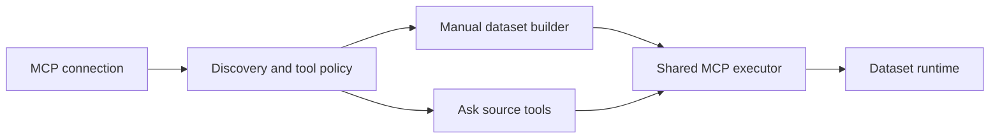

# MCP Connections

Status: implemented

## Summary

Add MCP as one Chartbrew source type. A connection points to one remote MCP server. Chartbrew
discovers its identity and tools. An approved tool can then serve two flows:

- A user configures and saves the tool as a normal dataset request.
- Ask selects, validates, and previews the same tool through the existing source-owned AI flow.

For Chartbrew, an MCP tool is similar to an API operation. `tools/list` provides the catalog and
input schemas. `tools/call` runs one operation. MCP also permits write actions, changing catalogs,
interactive input, and non-data results. Chartbrew must add a read-only approval and result
normalization layer before it treats a tool as a data source.

The target is any remote MCP server that supports standard Streamable HTTP and a supported
authorization method. Chartbrew will not run user-supplied MCP commands on the Chartbrew host.

Follow `source-plugin-guide.md` during implementation.

## Goals

- Add one generic `mcp` source plugin, not one plugin for each MCP server.
- Discover a safe server name, description, website, logo, capabilities, and tool catalog.
- Show a searchable tool preview and approval controls in the connection UI.
- Generate a manual argument form from a tool input schema, with an advanced JSON fallback.
- Turn compatible tool results into normal Chartbrew dataset data.
- Give Ask bounded access to the same approved tools and shared executor.
- Keep scheduled calls scoped, read-only, non-interactive, capped, and auditable.
- Keep credentials and result data out of connection metadata and AI tool catalogs.

## Non-Goals

- Local `stdio` servers or arbitrary command execution.
- Write-capable MCP actions.
- One top-level Ask tool for every remote MCP tool.
- MCP prompts, roots, sampling, resources, Apps, elicitation, or long-running Tasks.
- Following resource links returned by tools.
- Guaranteeing chart-ready data from every tool.
- Replacing the current API source.

## Recommended Product Fit

MCP becomes one source plugin and one execution family:

```javascript
{
  id: "mcp",
  type: "mcp",
  subType: "mcp",
}
```



The plugin supports connection tests, schema and resource discovery, variables, joins, source-owned
AI planning, and normal dataset runtime. MCP pagination stays inside each tool's arguments.
Chartbrew does not add a second pagination layer.

## User Journey

### Connect and review

1. The user selects **MCP server**, then enters a name and remote endpoint.
2. The user selects no auth, static token or headers, or **Connect with OAuth**.
3. Chartbrew connects from the server, negotiates the protocol, and lists all tool pages.
4. The connection page shows the safe server identity and a **Tools** tab.
5. Chartbrew allows tools the server marks as read-only. The user can turn Datasets or Ask off.
   Tools without that mark stay off and show a warning until the user allows them.
6. Chartbrew saves safe discovery metadata and approval fingerprints.

The Tools tab shows the server logo, display name, short description, sanitized website link, last
successful refresh, and tool count. Each tool row shows its title, description, required inputs,
known output shape, and approval state. An expanded row shows its input and output schema. The UI
does not show protocol versions, cache data, fingerprints, or raw discovery records.

Tool annotations are untrusted hints. Chartbrew can show **Read-only** and allow those tools by
default. An owner or admin can still turn Datasets or Ask off. A tool that the server marks as
destructive cannot be approved in version 1. If a server omits annotations, Chartbrew shows a
warning and leaves the tool off until an owner or admin allows it.

The source picker uses a Chartbrew MCP logo. A saved connection can use the discovered server logo.
If no safe logo exists, it uses the MCP logo and server initials.

### Build a dataset manually

1. The user selects an MCP connection and one tool approved for datasets.
2. Chartbrew renders primitives, enums, arrays, nested objects, defaults, descriptions, and required
   fields from `inputSchema`.
3. Complex schemas use an advanced JSON editor, so the normal form does not limit compatibility.
4. The user can insert Chartbrew variables in supported fields.
5. **Preview** validates the arguments, calls the tool, and shows normalized data.
6. The user selects a nested result path when needed, applies existing transforms, and saves the
   DataRequest.

Structured JSON can become normal rows and fields. Valid JSON in a text block is also accepted.
Pipe, tab, CSV, and single-column newline tables in text blocks become object rows. Other plain text
becomes one row with a `content` field. Image, audio, HTML, and resource-link-only results cannot be
saved as datasets.

### Use the connection through Ask

Ask uses the current generic source-owned tools. `source_list_resources` returns a compact
approved-tool index, a ranked search when `query` is set, or full schemas when `names` lists up to
three tools. Ask must search and describe before calling a tool. It must not load the whole catalog
into context. `source_plan_dataset` selects one tool and creates the same configuration as the
manual builder. Validation and preview use the shared executor.

If a question names pages, events, properties, or product features, Ask should first run a
list/search/schema tool and read the real values. It must not invent path or event strings from the
question wording. Empty rows or a zero metric usually mean the filter missed.

SQL-style MCP results such as `{ columns, results }` tuples are normalized into object rows before
charting. Ask must bind bar and timeseries charts to those preview column names. A single total
cannot draw a timeline; the query needs one row per category or day. Preview returns
`suggestedBindings` when columns can be inferred. Chart creation remaps guessed field names such as
`page` onto the real columns when they differ.

Ask can preview a tool to answer a one-time question. It can also save the validated DataRequest for
a chart or dashboard. The model cannot invent a tool name, bypass approval, or pass arguments that
fail the tool schema.

## Protocol And Discovery

Use the official MCP TypeScript SDK with automatic era negotiation:

- Prefer revision `2026-07-28` and `server/discover`.
- Fall back to the 2025 initialization-based era over Streamable HTTP.
- Do not support deprecated HTTP+SSE or `stdio` in version 1.

Every request uses a Chartbrew transport adapter that applies the current outbound target policy,
DNS pinning, redirect checks, private-network policy, timeout, cancellation, and response limits.
The browser never calls the MCP server directly. Do not share a client or transport instance across
teams or connections.

Discovery reads all `tools/list` pages within central limits. It stores only bounded names,
descriptions, safe icons, input and output schemas, annotations, and timestamps. It also stores:

- A contract fingerprint over the tool name and input/output schemas.
- A risk fingerprint over the description and risk annotations.

Approval binds to both fingerprints. A title or icon change does not stop a dataset. A schema,
description, or risk change moves the tool to **Needs review**. Removed tools also fail closed.

Use `ttlMs` and `cacheScope` when the server provides them, within Chartbrew cache limits. Legacy
catalogs use a short private cache. Refresh discovery on a connection test, explicit refresh, stale
Tools tab open, and before a call when the private cache has expired.

## Persistence And Runtime

Use the existing `Connection` fields:

- `host`: encrypted MCP endpoint.
- `authentication`: encrypted auth type, tokens, expiry, issuer, scopes, and client credentials.
- `options`: encrypted custom headers.
- `schema.mcp`: safe server metadata, bounded tool catalog, approvals, and discovery timestamps.

`schema.mcp` never contains credentials, tool results, raw OAuth documents, or user data. Connection
API responses return only the auth type and safe `has...` flags. Empty secret fields on edit preserve
the current secret.

Store a tool call in `DataRequest.configuration`:

```javascript
{
  source: "mcp",
  tool: {
    name: "list_orders",
    contractFingerprint: "sha256:...",
  },
  arguments: {
    status: "paid",
    startDate: "{{start_date}}",
    endDate: "{{end_date}}",
  },
  output: {
    mode: "auto",
    path: ["orders"],
  },
}
```

The shared executor checks team and project scope, use approval, current fingerprints, and input
schema. It applies variables without changing unbound types, calls `tools/call`, validates
`structuredContent` against `outputSchema` when present, selects the safe result path, and returns
data through the current cache, transform, field detection, and Dataset runtime.

Normalization order is `structuredContent`, embedded JSON, JSON text, then bounded plain text. Wrap
scalar JSON in a `value` field. Reject protocol errors, `isError: true`, interactive input, task
results, media, HTML, resource links, and oversized output. Do not pass raw MCP envelopes, hidden
metadata, server logs, or auth errors into a dataset or the LLM.

## Authorization And Security

Support no auth, static bearer tokens, custom headers, and MCP OAuth for HTTP transports. OAuth must
use protected resource discovery, authorization server discovery, PKCE with `S256`, state and issuer
validation, the resource parameter, least-privilege scopes, encrypted tokens, and refresh locking.

Use an inactive connection during OAuth setup. Activate it only after callback validation and
successful discovery. Expire incomplete setup records. Prefer client ID metadata when Chartbrew has
a public HTTPS URL. Allow instance-level pre-registered credentials. Use dynamic registration only
as a compatibility fallback.

A scheduled dataset cannot open a browser or request more scopes. It fails with a clear
**Reconnect MCP server** or **Approve access** action.

Security rules:

- Reuse source availability, connection access, and outbound target checks.
- Validate every MCP, redirect, OAuth, and icon URL. Keep metadata and private targets blocked by
  default.
- Block user overrides of transport, auth, host, origin, and MCP routing headers.
- Fetch icons without credentials. Allow public HTTP(S) icon URLs that pass outbound
  policy, plus bounded PNG, JPEG, WebP, and sanitized SVG. Same-origin is not required.
  If the server omits icons, try the website origin (including `/favicon.svg`) and icon
  links in the website HTML.
- Treat identity, descriptions, schemas, annotations, results, and errors as untrusted.
- Keep tool count, schema depth and size, call time, response bytes, rows, and audit data bounded in
  one MCP policy module.
- Team owners and admins approve tools. Project editors use approved tools only within current
  connection and dataset access. Project viewers cannot execute MCP tools through Ask.
- Audit tool name, connection, use type, duration, outcome, and policy failures. Do not audit secret
  arguments or result values.

## Delivery And Verification

1. Add the MCP plugin, isolated HTTP client, modern and legacy-era negotiation, discovery, static
   auth, policy, and deterministic fake-server tests.
2. Add the connection UI, tool review, safe icons, manual builder, normalization, and scheduled
   runtime.
3. Add MCP OAuth and secret redaction.
4. Add the source-owned AI layer. Enable Ask only after the manual executor and policy tests pass.

Tests use local MCP fixtures and no real LLM. Cover registry resolution, both protocol eras,
paginated discovery, cache scope, schema changes, SSRF and redirects, icon validation, secret
redaction, OAuth state/PKCE/issuer/resource/refresh behavior, approvals, input schemas, variables,
all result types, limits, cancellation, team/project scope, manual and scheduled parity, and Ask tool
policy. Extend the cross-source AI harness to prove that MCP uses only generic `source_*` tools.

## Acceptance Criteria

- A user can connect to a remote MCP endpoint with no auth, static auth, or MCP OAuth.
- The connection page shows safe server metadata and a searchable, bounded tool catalog.
- An owner or admin can approve a read-only tool separately for datasets and Ask.
- A user can configure, preview, save, refresh, transform, join, and chart compatible tool data.
- Ask can answer from an approved preview and create a normal dataset or chart from it.
- Manual and Ask flows persist the same configuration and call the same executor.
- Scheduled calls never run tools that need input, tasks, write access, or renewed scopes.
- Tool contract or risk changes fail closed and show a clear review action.
- Credentials, raw metadata, and result content do not leak through UI, logs, audits, or LLM context.
- Existing source behavior does not change.

## Review Points

Recommended decisions for the first release:

- Remote Streamable HTTP only. Add deprecated HTTP+SSE only if real demand appears.
- Allow tools marked `readOnlyHint` by default. Warn, do not block, when the server omits that mark.
- Allow plain text as a one-row dataset, but mark it as poor chart input.
- Ship manual datasets before Ask, but include OAuth before public release.
- Keep write tools in a separate future design with exact preview and confirmation.

## Protocol References

- [MCP versioning](https://modelcontextprotocol.io/specification/2026-07-28/basic/versioning)
- [Server discovery](https://modelcontextprotocol.io/specification/2026-07-28/server/discover)
- [Tools](https://modelcontextprotocol.io/specification/2026-07-28/server/tools)
- [Streamable HTTP](https://modelcontextprotocol.io/specification/2026-07-28/basic/transports/streamable-http)
- [Authorization](https://modelcontextprotocol.io/specification/2026-07-28/basic/authorization)
- [Official SDK protocol versions](https://github.com/modelcontextprotocol/typescript-sdk/blob/main/docs/protocol-versions.md)
