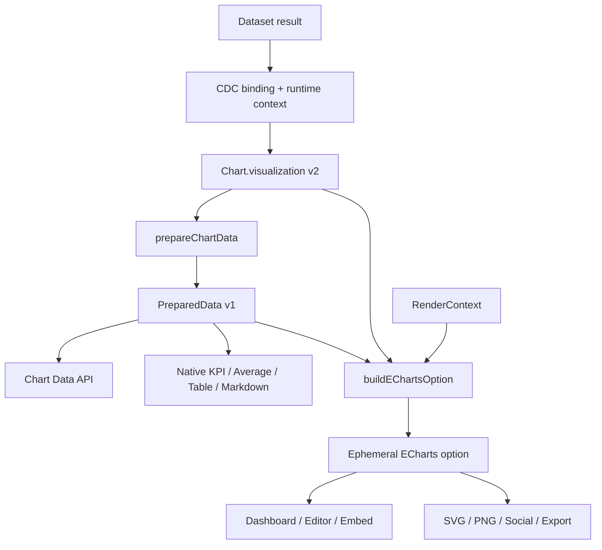

# ECharts Rendering And Data API

Status: implemented

Implementation note (2026-08-28): The cleanup phase now removes the Chart.js runtime,
client components, dependencies, and `chartData` response alias. Graphical presets compile directly
to ECharts. KPI, average, table, and markdown compile to native runtime data. The prepared snapshot
backfill first converts stored `chartData` to a renderer-neutral compatibility snapshot without a
source request. It supports `--dry-run` so release audits can find unresolved or oversized charts
without writes. An authorized read returns this snapshot immediately and then refreshes it in the
background through the canonical source path.

Related: [Next-Generation Visualization Engine](FS-20260719-next-generation-visualization-engine.md)

Detailed deliveries:

- [Versioned Data API](FS-20260825-versioned-data-api.md)
- [ECharts SSR And Chart Image Sharing](FS-20260826-echarts-ssr-image-sharing.md)

> Visualization must be a core Chartbrew power. It must not limit v6.

## Summary

The v2 visualization engine already separates reusable dataset results, chart bindings, semantic
visualization layers, and renderer output. It builds a renderer-neutral `VizFrame`, but the last
step still compiles and persists Chart.js configuration in `Chart.chartData`.

This change completes that separation. The existing `VizFrame` becomes the base of a versioned
`PreparedData` contract. Chartbrew generates ECharts options at runtime from `PreparedData`,
`Chart.visualization`, and a `RenderContext`. It stores a renderer-neutral last-known data snapshot
for fast and reliable chart reads. It also exposes dataset data and chart `PreparedData` through a
versioned Data API.

There is no renderer picker and no second visualization grammar. The current preset-first builder
stays the main workflow. A future AI or custom designer can use the same contracts, but it is not
part of this delivery.

## Goals

- Use ECharts 6 as the primary renderer for graphical chart presets.
- Never store generated Chart.js or ECharts options as chart source of truth.
- Keep `Chart.visualization` v2 as the persisted semantic and presentation contract.
- Make the existing `VizFrame` a stable internal `PreparedData` boundary.
- Store one durable, renderer-neutral snapshot for the default chart state.
- Keep KPI, average, table, and markdown as native Chartbrew views when this gives a better result.
- Add authenticated dataset and chart Data API endpoints with stable JSON contracts.
- Preserve filters, variables, caching, alerts, observations, exports, reports, snapshots, embeds,
  templates, shares, and automated updates.
- Support later social rendering and custom visualization work without another data rewrite.

## Non-Goals

- An AI chart designer or blank canvas.
- Arbitrary AI-generated JavaScript, ECharts callbacks, or user code.
- A universal visualization language that models every ECharts option.
- Support for D3, Vega, Plotly, or other renderers in this rollout.
- Removing the legacy database columns in this cleanup. They remain available for rollback until a
  later schema migration.
- A rewrite of connections, DataRequests, dataset joins, or runtime filtering.

## API Documentation Ground Rule

Every Chartbrew API change in this delivery must update
`../chartbrew-docs/api-reference/openapi.json` on the `v6` branch. This rule applies to new or
changed routes, authentication, permissions, parameters, request bodies, response bodies, status
codes, error contracts, examples, and deprecations. Update the OpenAPI contract in the same phase
as the server change. A separate cross-repository commit or pull request is acceptable, but it must
land before the related v6 API change is complete or released. Validate the JSON and OpenAPI
document after each update. No API phase is complete while its OpenAPI contract is missing or
outdated.

## Current Baseline

| Current contract | Current role | Target change |
| --- | --- | --- |
| `Dataset` | Reusable query, joins, schema, and access | No ownership change |
| `ChartDatasetConfig` | Dataset binding, variables, conditions, and compatibility | No new presentation fields |
| `Chart.visualization` v2 | Semantic encodings, transforms, styles, and settings | Remains the source of truth |
| `VizFrame` v1 | Renderer-neutral normalized and aggregated rows | Becomes the internal `PreparedData` kernel |
| `Chart.chartData` | Durable Chart.js payload | Replaced by renderer-neutral prepared data |
| `VisualizationEngine` | Frame builder and Chart.js compiler selector | Split into prepare and render stages |

## Target Architecture



The renderer accepts data. It does not decide what the data means. `PreparedData` contains the
result after field selection, filters, transforms, aggregation, missing-value policy, ordering,
limits, and stable series generation. It contains no renderer option.

## Core Contracts

### Visualization

`Chart.visualization` v2 remains canonical. Do not move semantic encodings back to CDC and do not
add an ECharts option field to `Chart`. `Chart.type` and old chart/CDC presentation fields remain
compatibility fields until the cleanup phase.

One shared, serializable preset manifest defines each supported preset, required field roles,
default settings, supported capabilities, browser support, SSR support, and release state. It does
not contain React components, compiler functions, or other runtime code. The server maps manifest
IDs to validators and compilers. The client maps the same IDs to icons, controls, and renderer
components. Contract tests require each ready preset to have all required client and server
implementations. The editor only shows ready presets. A mark in
`server/visualization/registry.js` is not by itself proof that a preset is ready.

Reserve `visualization.settings.extensions.echarts` for future JSON-only advanced overrides. Do not
use this field in the first ECharts release. Before use, define allowed paths, depth and size limits,
safe merge rules, and blocked keys. It must not accept data, executable callbacks, or functions.

### PreparedData v1

The internal contract is the existing `VizFrame` plus stable field metadata and generation data.
The public chart response is a safe serializer of that contract:

```json
{
  "version": 1,
  "generatedAt": "2026-08-19T12:00:00.000Z",
  "resource": { "kind": "chart", "id": 42 },
  "results": [{
    "id": "revenue",
    "name": "Revenue",
    "fields": [
      { "key": "time", "type": "temporal", "role": "dimension" },
      { "key": "value", "type": "quantitative", "role": "measure" },
      { "key": "breakdown", "type": "nominal", "role": "dimension" }
    ],
    "series": [{ "id": "series-pro", "label": "Pro" }],
    "rows": [{
      "time": "2026-08-01T00:00:00.000Z",
      "value": 21400,
      "breakdown": "Pro",
      "seriesId": "series-pro"
    }]
  }]
}
```

Public serialization rules:

- Use JSON values only. Convert dates to ISO 8601 and non-finite numbers to `null`.
- Preserve meaningful `null` values. Do not silently convert them to zero.
- Keep stable layer and series IDs, labels, semantic field roles, and deterministic row order.
- Remove internal `bindingId`, `__seriesId`, query text, credentials, cache keys, and renderer data.
- Version the public envelope separately from `Chart.visualization` and the internal frame.

The dataset endpoint returns a separate `DatasetData` v1 envelope with dataset identity, detected
field metadata, and the joined JSON result. It does not apply chart encodings or presentation.

The source-rows export remains on the filtered dataset contract because its purpose is to return
rows before chart aggregation. It must not be placed inside `PreparedData`. The chart-as-shown
export consumes `PreparedData` and must not parse a renderer payload.

#### Identity And Determinism

Assign each layer ID once and persist it in `Chart.visualization`. Do not derive a ready layer ID
from its array position. Migration and creation code must assign an ID before a specification
becomes ready.

Generate a series ID from the persisted layer ID and the typed, canonical breakdown value. The v1
identity algorithm is the current implementation:

```text
identity = layerId + "|" + serializeTypedValue(breakdownValue)
seriesId = "series-" + first16Hex(sha256(identity))
```

`serializeTypedValue()` includes the value type, represents dates as ISO 8601, preserves array
order, and sorts object keys recursively. The default series uses the canonical typed value
`string:__default__`. Never use the series array index or source row position. The Data API, ECharts
`series.id`, caches, alerts, observations, browser rendering, and SSR must use this same identity.
Changing the algorithm requires a new identity-contract version and a migration for stored
references.

Given the same canonical dataset result, visualization, runtime context, timezone, and contract
version, `PreparedData` serialization must be byte-equivalent except for `generatedAt`. Canonical
serialization fixes object-key, result, field, series, row, and warning order. Source row order is
part of the input for passthrough tables. Exclude `generatedAt` from content fingerprints and
`ETag` values.

### RenderContext

`RenderContext` is runtime-only and contains `surface`, width, height, theme, locale, timezone,
pixel ratio, and reduced-motion state. Supported surfaces start with `dashboard`, `editor`,
`embed`, `export`, and `social`. Surface defaults live in code and are not separate charts.

`buildEChartsOption({ preparedData, visualization, renderContext })` returns pure JSON. It uses
ECharts `dataset` and `series.encode` where the preset permits it. Browser events are registered in
the React renderer, not serialized as option callbacks. The client registers Chartbrew light and
dark ECharts themes and resizes and disposes each chart instance correctly.

### Persistence And Cache

Add a versioned `Chart.preparedData` long-text field and `preparedDataUpdatedAt`. Store only the last
successful default variant: no runtime filters and no runtime variable overrides. Store a
fingerprint of the visualization, CDCs, dataset/source versions, and timezone with the snapshot.
Exclude `preparedData` from the default Chart model scope and ordinary list/detail queries. Load it
through an explicit scope or loader only when a renderer, Data API request, or refresh needs it.

Set a configurable maximum serialized snapshot size. Never truncate a snapshot. If a new snapshot
exceeds the limit, keep the previous valid snapshot when possible, continue through the runtime
cache or source path, and record an internal size metric. The cold-start guarantee applies to
snapshots within this limit. Move snapshots to a `ChartPreparedSnapshot` table or object storage
only if production size and query measurements show that the main Chart row remains too costly.
The Phase 2 implementation uses `CB_PREPARED_SNAPSHOT_MAX_BYTES` with a default of 5 MiB. The
canonical, resumable backfill runs with `npm run viz:prepared-backfill` from `server/`; reruns skip
charts that already have a prepared snapshot unless `--force` is set. Use `--dry-run` first to run
the local conversion, compilation, and size checks without database, queue, or source writes. Print
progress for each chart. Charts without usable `chartData` are unresolved. Do not contact their
connections unless the operator adds `--refresh-unresolved`. This mode only selects charts that
have no prepared snapshot and no stored `chartData`, so it does not repeat the inference tier. Its
`--limit` applies only to live-refresh candidates. The opt-in source path stops an attempt after two
minutes by default. The `--timeout-ms` option changes this limit. The backfill is an audit and
pre-warming tool. It is not required for users to open an old dashboard.

When an authorized dashboard or chart read finds no prepared snapshot, first infer and save a
compatibility snapshot from stored `chartData`. Return it in the same response and start the
canonical source refresh in the background. Mark the compatibility snapshot as stale so a
successful refresh replaces it. Deduplicate concurrent work per chart. If the source is
unavailable, keep and serve the compatibility snapshot. If no legacy data exists, return that chart
as unavailable while the background refresh runs. Keep the other dashboard charts working. Retry
the chart on a later read and include it in dry-run reports.

Runtime variants remain in Redis. Change the cache layers to:

```text
source-cache    raw or joined dataset result
prepared-cache PreparedData by chart version and runtime variant
render-cache   optional fixed-surface image or SVG output
```

ECharts options are cheap runtime artifacts and are not durable data. A cold process with empty
Redis must still render the last successful default chart from `Chart.preparedData` when its
visualization fingerprint matches. If the source fingerprint is stale, return the last-known
result with its update time and start the normal refresh path. If the visualization fingerprint
does not match, refresh before compilation and return an unavailable render if refresh fails.

Keep the legacy database columns during migration. Read `chartData` only through the compatibility
migration path. Do not write it. The inferred snapshot preserves the visible legacy output but is
not canonical because the renderer payload has lost some semantic information. Replace it with the
canonical preparation result after a successful background source refresh.

## Data API

Add these versioned routes:

```text
GET  /api/v1/teams/:team_id/datasets/:dataset_id/data
POST /api/v1/teams/:team_id/datasets/:dataset_id/data
GET  /api/v1/projects/:project_id/charts/:chart_id/data
POST /api/v1/projects/:project_id/charts/:chart_id/data
```

`GET` returns the default cached or last-known variant. `POST` accepts `variables`, `filters`, and
`refresh` and returns the same response contract. The chart route returns `PreparedData`; the
dataset route returns `DatasetData`. The first release supports JSON only.

Use bearer API keys, not public chart or dashboard share tokens. Before release, add an API-key
identity check that binds each key to its `Apikey.team_id`, database record, and scopes. The current
team key is a long-lived user JWT and `verifyToken` does not bind it to one team, so it is not a
sufficient Data API boundary. Enforce project and dataset access after key validation.

Add per-key rate limits, response-size and execution-time limits, request audit data, stable error
codes, and `ETag` support for default responses. Do not return stack traces, SQL, source requests,
or internal cache state.

## Phased Delivery

### Phase 1: Formalize PreparedData

- Add `VisualizationEngine.prepare()` and a versioned `PreparedData` serializer around `VizFrame`.
- Make persisted layer IDs and the current typed, hashed series identity part of the contract.
- Add byte-equivalent deterministic serialization tests that exclude only `generatedAt`.
- Make graphical compilers, native views, chart-as-shown exports, alerts, and observations consume this
  boundary. Keep source-rows export on the filtered dataset contract.
- Add golden tests for every current chart type, long/wide/nested/scalar data, filters, variables,
  timezones, sparse values, formulas, goals, breakdowns, and multiple bindings.
- Complete when current charts have the same output and no consumer must parse another renderer's
  payload to get values or series identity.

### Phase 2: Remove Renderer Output From Durable State

- Add the prepared snapshot fields and an idempotent backfill.
- Exclude prepared snapshots from default Chart queries and enforce the configured size limit.
- Return a runtime `render` envelope without a renderer-specific response alias.
- Generate ECharts options or native view data from prepared snapshots at read time.
- Move default and runtime cache writes to `PreparedData`.
- Complete when dashboard, public, report, snapshot, embed, export, alert, and update workers do not
  require persisted Chart.js options.

### Phase 3: Add ECharts And The Preset Registry

- Add the locked ECharts 6 dependency to the client.
- Add the shared serializable preset manifest, client/server implementation maps, and a pure-JSON
  ECharts compiler.
- Use `render.configuration` for ECharts or native view data and keep shared series, metric, category,
  warning, and time-range information in `render.metadata`.
- Add a central React `ChartRenderer` and an ECharts error boundary.
- First reach parity for line, bar, pie, doughnut, radar, polar, matrix, and gauge. Keep area fill as
  a line display option. Keep KPI, average, table, and markdown native unless a measured benefit
  supports a move.
- Run prepared-data and ECharts golden tests for every ready preset.
- Keep reports and snapshots on the current Playwright browser-capture path during this phase.
- Complete when supported presets render in the dashboard, editor, embed, current reports and
  snapshots, and fixed-size browser tests.

### Phase 4: Move The Builder To ECharts Presets

- Keep the current chart-type toolbar and semantic Build panel.
- Make controls preset-aware through the shared preset capabilities. Line exposes smoothing, points,
  area fill, missing-value gaps, axes, legend, and reference lines. Vertical bar exposes stacking,
  data labels, fill, missing-value handling, axes, legend, and reference lines.
- Keep bar width, spacing, and corner radius as standardized renderer-owned values. Do not expose
  controls for these details. Keep `horizontalBar` as a separate comparison preset instead of an
  orientation control on vertical bar.
- Keep gauge range colors in the range editor. Gauge datasets use Build and Automation without a
  Display tab. Keep the metric formula available in Build.
- Add new presets only after data binding, validation, responsive, theme, export, and accessibility
  checks pass. Scatter and broader heatmap presets are the first candidates.
- Do not show renderer names, migration state, contract versions, or engine controls in product UI.
- Complete when ECharts is the default for every ready graphical preset and tests cover the
  preset-aware builder control rules.

### Phase 5: Release The Data API

The detailed Data API contract and delivery plan are defined in
[Versioned Data API](FS-20260825-versioned-data-api.md). This phase is a separate feature delivery
that depends on `PreparedData`; it does not depend on ECharts compilation.

- Add scoped API-key validation and the four dataset/chart routes.
- Reuse the exact runtime filter, variable, timezone, access, and prepared-cache paths used by charts.
- Publish request, response, authentication, error, cache, and limit documentation with JavaScript
  examples for ECharts and another library.
- Complete when API rows match the chart's prepared rows for default and runtime variants and no
  response contains renderer configuration.

### Phase 6: Cut Over, Clean Up, And Add Sharing

- Deliver server-side chart images through
  [ECharts SSR And Chart Image Sharing](FS-20260826-echarts-ssr-image-sharing.md). This is a
  separate feature delivery that depends on `PreparedData` and the ECharts compiler.
- In the first image release, add an immediate local preview with background PNG reconciliation,
  copy PNG, download PNG, `1200 × 630`, square, and bounded original-size output. Keep public-link
  actions in the links tab.
- Produce the server PNG from the final composed SVG. Do not add a second server Canvas rendering
  path.
- Remove `Chart.chartData` reads and writes, Chart.js compilers, client components, and dependencies
  after the prepared snapshot and ECharts parity gates pass.
- Keep future AI/custom design on `PreparedData + Chart.visualization + RenderContext`. Do not add a
  separate data model or execute generated JavaScript in the main application.

## Migration And Rollback

- Add fields and backfill in a new resumable migration. Do not edit the July visualization
  migrations.
- Backfill in batches by first converting stored legacy output without source requests. Report
  unresolved charts. Use the canonical source path only when `--refresh-unresolved` is explicit.
- On an authorized read, serve inferred data first and run the canonical refresh in the background.
  Keep inferred data when the refresh fails.
- Use the preset registry release state for rollback. Do not persist a renderer selection per chart.
- Audit prepared-snapshot coverage with the dry run before each external release. Fix failed or
  oversized charts before removing the old database columns in a later schema migration.
- Remove compatibility fields only in a later contract migration with a corpus audit.

## Acceptance Gates

- No generated Chart.js or ECharts option is a persisted chart source of truth.
- A chart with a matching visualization fingerprint renders its last successful default state after
  Redis is empty and sources are unavailable when its snapshot is within the configured size limit.
- The same canonical inputs produce byte-equivalent `PreparedData` except for `generatedAt`.
- ECharts matches current values, order, labels, colors, formats, goals, growth, filters, and nulls.
- Stable series IDs survive refresh, row reordering, cache use, API use, browser render, and SSR.
- Ready preset metadata has matching client and server implementations.
- Every ready preset has field validation, contextual controls, responsive behavior, light/dark
  themes, accessible output, export behavior, and tests for each surface that its manifest declares.
- Data API access is team- and project-scoped and cannot use a public share token.
- Data API chart rows match the internal prepared frame and contain no renderer or source secrets.
- Every changed API contract is present and validated in the v6
  `../chartbrew-docs/api-reference/openapi.json` document.
- Existing dashboards, embeds, reports, alerts, observations, exports, snapshots, templates,
  shares, and automated refreshes retain behavior.
- The dry-run backfill reports no unexplained failures before external release.

## Repository Validation

- `server/visualization/frameBuilder.js` already provides the renderer-neutral frame to extend.
- `server/visualization/VisualizationEngine.js` is the correct prepare/render split point.
- `server/controllers/ChartController.js` owns prepared snapshot refresh and runtime compilation.
- `server/modules/runtimeCache.js` already fingerprints `Chart.visualization` and can add a prepared
  cache without a new runtime filter model.
- `server/modules/alerts/alertSeries.js` consumes prepared series data.
- `server/modules/observations/processChartResult.js` already reads frames and proves the boundary.
- `server/modules/snapshots.js` uses Playwright browser capture, so dedicated ECharts SSR can wait
  until the sharing and export phase.
- `client/src/containers/Chart/Chart.jsx` and
  `client/src/containers/AddChart/components/ChartPreview.jsx` switch on `Chart.type`; replace these
  branches with the central renderer without changing user-facing chart controls.
- `server/modules/verifyToken.js` accepts user JWTs, while `Apikey.team_id` is not checked there.
  Scoped API-key verification is therefore a Data API release gate.
- `../chartbrew-docs/api-reference/openapi.json` exists on the `v6` branch and is the required
  documentation contract for all API work in this specification.

## References

- [ECharts dataset and encode](https://echarts.apache.org/handbook/en/concepts/dataset/)
- [ECharts 6 features](https://echarts.apache.org/handbook/en/basics/release-note/v6-feature/)
- [ECharts Canvas and SVG renderers](https://echarts.apache.org/handbook/en/best-practices/canvas-vs-svg/)
- [ECharts server-side rendering](https://echarts.apache.org/handbook/en/how-to/cross-platform/server/)
