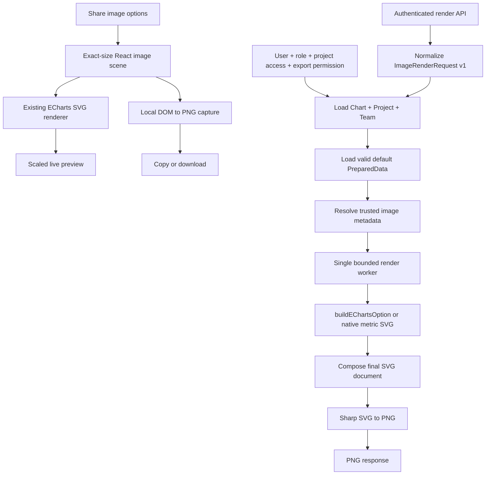

# ECharts SSR And Chart Image Sharing

Status: accepted

Related:

- [ECharts Rendering And Data API](FS-20260819-echarts-rendering-data-api.md)
- [Next-Generation Visualization Engine](FS-20260719-next-generation-visualization-engine.md)
- [Responsive Visualization Compositions](FS-20260821-responsive-visualization-compositions.md)

> A shared image must use the same chart renderer, fonts, data, and visual rules as the chart that
> the user sees. Server rendering remains available for API and automation use.

## Summary

Add deterministic server-side SVG composition and PNG rendering for Chartbrew charts. The renderer
consumes the existing `PreparedData`, `Chart.visualization`, preset registry, and `RenderContext`.
It does not run a browser and it does not parse Chart.js output.

Add a **Share image** tab to the chart sharing modal. The tab builds the final image scene in the
browser with React, the current Chartbrew components, and the ECharts SVG renderer. The scene is
both the live preview and the source for local PNG copy and download. An authorized user can change
size, theme, background, and visible card content without a server request. Layout is always share
card. Image settings are temporary in the first release. Chartbrew does not save the settings or
generated images.

The current public-sharing switch moves from the modal header into **Links & embed**. Public sharing
controls links and embeds only. It never controls authenticated image generation. **Share image**
works for a private chart and does not contain a copy-link action.

The first release supports every ready graphical ECharts preset plus the native KPI and average
presets. It does not support table or markdown images.

## Confirmed Product Decisions

- Image settings use defaults and remain local to the open modal.
- Closing the modal discards every image-setting change.
- The server does not store generated SVG or PNG files.
- The render endpoint returns PNG only. SVG remains an internal server format.
- Preview controls update the final local scene directly.
- Copy and download capture the same local scene that appears in the preview.
- The authenticated server render endpoint remains available for API and automation clients. It is
  not part of the interactive Share image flow.
- Safe limits are fixed product constants. There are no image-render environment variables or
  feature flags.
- **Share image** has no copy-link action.
- Public sharing remains entirely in **Links & embed**.
- Landscape size is `1280 × 720` pixels.
- Mobile size is `1080 × 2340` pixels (9:19.5).
- Original size preserves the current chart aspect ratio and renders at 2× density within limits.
- Mobile share cards keep a 4:3 chart card in the center of the 1080 × 2340 canvas.
- Table and markdown are not supported in the first release.
- The logo comes from the project dashboard logo.
- The company name is the team name.
- The dashboard name is `Project.dashboardTitle`, with `Project.name` as fallback.
- The date range comes from the resolved chart date range.
- Last updated comes from the prepared snapshot update time.
- White-label is always available in chartbrew-os. It does not follow `Team.showBranding`.

## Goals

- Render ready ECharts presets to SVG without a browser or DOM implementation.
- Render KPI and average presets with a small native SVG metric renderer.
- Produce PNG from one deterministic internal SVG document.
- Keep the local browser scene and server renderer on the same image layout, theme, and content
  contract where both support the same option.
- Render the interactive preview, copy action, and download action from one local scene.
- Keep image generation independent from chart public-sharing state.
- Reuse the current chart, project, team, role, export, branding, date, and prepared-snapshot rules.
- Bound CPU, memory, queue length, request size, image dimensions, output size, and execution time.
- Keep private chart data out of files, logs, and share URLs.
- Preserve current links, embeds, legacy share links, reports, and Playwright dashboard snapshots.
- Add contract, visual, integration, security, accessibility, and Docker smoke tests.

## Non-Goals

- Saving image settings as chart defaults or named presets.
- Storing image history or generated files.
- Public image URLs, image CDN delivery, or automatically refreshed social images.
- Copying or creating a public link from **Share image**.
- Enabling chart sharing when an image is generated.
- Table or markdown image output.
- SVG response or download in the first release. SVG is an internal PNG source format.
- JPEG, WebP, PDF, GIF, animated image, or video output.
- Dashboard-level image composition.
- Replacing the current Playwright report and scheduled-dashboard snapshot paths.
- Runtime variables, dashboard filters, or a source-refresh control in the first release.
- Accepting client-supplied data, Chart.js configuration, HTML, CSS, JavaScript, or ECharts options
  in the server render endpoint.
- Arbitrary fonts, remote logos, remote images, or user-supplied SVG markup.
- Changing `Team.showBranding` team settings. Share image white-label is independent in chartbrew-os.
- Chart.js fallback removal.
- Data API key, public share token, or MCP access to the render endpoint.

## Current Repository Baseline

| Component | Current responsibility | Required change |
| --- | --- | --- |
| `server/visualization/preparedData.js` | Validates and fingerprints renderer-neutral chart data | Use as the only image data boundary |
| `server/visualization/compilers/echarts.js` | Builds pure JSON ECharts options | Reuse it with an image `RenderContext` |
| `server/visualization/renderContext.js` | Defines dashboard, editor, embed, export, and social sizes | Add explicit image compositions and normalized sizes |
| `shared/visualization/presetManifest.json` | Declares ready presets and supported surfaces | Mark tested image and SSR support per preset |
| `server/modules/preparedSnapshot.js` | Loads and stores the last successful default `PreparedData` | Load the image data source without using `chartData` |
| `client/src/containers/Chart/components/EChartsRenderer.jsx` | Renders the compiled browser ECharts option | Add a non-interactive preview mode and explicit image-theme override |
| `server/modules/snapshots.js` | Uses Playwright and writes page screenshots to local files | Keep unchanged; do not reuse for Share image |
| `client/src/containers/Chart/components/ChartSharing.jsx` | Manages links, embeds, and share policies in one large modal | Split the modal shell, links tab, and image tab |
| `client/src/components/ColorPickerControl.jsx` | Provides the current HeroUI color picker | Reuse for the image background |
| `Project.logo` | Stores the dashboard logo path | Load as a bounded local image only |
| `Team.showBranding` | Controls branding in other product surfaces | Do not use it to restrict Share image white-label output |
| `TeamRole.canExport` | Controls export permission | Require it for image generation for non-team roles |

The server currently lists ECharts as a development dependency for compiler tests. Move the locked
ECharts version to production dependencies. Add `sharp` as a production dependency for bounded SVG
to PNG conversion. The standard Docker image uses Node.js 22 on Debian slim, which is compatible
with the supported Sharp prebuilt Linux binaries. Add a Docker smoke test so this remains true.

## User Experience

### Entry And Modal Shell

Rename the current modal heading to **Share chart**. Keep the chart name and dashboard name as a
compact secondary line. Show the existing chart action menu entry when the user can manage sharing
or export the chart. Show only the tabs that the user can use.

Use HeroUI v3 compound components and current Chartbrew theme tokens:

- `Modal` with `Modal.Container size="cover"` and inside scrolling.
- `Modal.CloseTrigger`, `Modal.Header`, `Modal.Body`, and `Modal.Footer`.
- `Tabs` for **Links & embed** and **Share image**.
- `RadioGroup` and `Radio` styled as segmented choices for layout, size, theme, and branding.
- `Switch` for content visibility.
- `TextField`, `Label`, and `Input` for title and subtitle.
- The existing `ColorPickerControl` for a custom background.
- `Button` with `onPress` for copy, download, retry, and close actions.

Do not reproduce the Figma component styling. Preserve the information layout and use Chartbrew
spacing, colors, radii, shadows, typography, and semantic button variants.

On desktop, the image tab uses a preview column and a scrollable control column. On a narrow
viewport, the preview appears first and controls follow it. The modal must not create horizontal
page scrolling. Scale the exact-size image scene to fit the preview pane without changing its
internal layout.

The default tab is **Links & embed**. A future direct image action may open the modal with
**Share image** selected, but it is not required for the first release.

### Links And Embed

Move the current **Enable sharing** switch from the modal header into the **Links & embed** tab.
Rename it **Public sharing**. It continues to update `Chart.shareable` and to control link and embed
access. It does not gate the image tab.

Keep existing share-policy behavior:

- Multiple links.
- Fixed and allowed URL parameters.
- Appearance theme.
- Expiration.
- Link regeneration.
- Legacy-link warnings and migration behavior.

Do not change share-token validation or make image options part of `SharePolicy`.

When sharing is off, show the current recovery action in the links tab. Do not state that images
are unavailable because image generation is independent.

### Share Image

The image tab contains:

1. A preview heading with the final output dimensions.
2. An exact-size local image scene, scaled down only for display in the preview pane.
3. Layout, size, theme, background, content, and branding controls.

The modal footer on this tab shows **Close**, **Download image**, and **Copy image**. There is no
save action. Closing the modal clears local state and restores defaults the next time the modal
opens.

Build the final scene from local React components and reuse the chart's current compiled render
configuration. Initialize the existing ECharts browser renderer with `renderer: "svg"`, the chosen
image theme, disabled animation, and the resolved detail scale. Reuse the current native KPI,
average, and KPI-overlay components. The preview must not fall back to Chart.js when a compatible
ECharts render exists.

Every control updates the local preview synchronously:

- Content switches add or remove local card elements.
- Title and subtitle changes update local text.
- Layout and size changes rebuild the exact-size scene and resize the chart.
- Theme changes reinitialize the preview renderer with the selected image theme.
- Background changes update shared preview color tokens.

After changes stop for a short debounce, capture the current scene to one in-memory PNG blob. Keep
only the blob whose option fingerprint matches the current controls. Copy and download can reuse
that blob or capture the current scene on demand. Do not send chart data or image options to the
server from this flow.

Keep image dimensions, spacing, colors, typography, and content placement in pure JavaScript
helpers. Test the client layout against the server compositor layout so that later API output does
not drift without notice. The local scene is authoritative for interactive image sharing.

If the chart type is table or markdown, replace the controls with a concise unavailable state. Do
not offer copy or download actions.

### Copy And Download

**Copy image** uses the latest local PNG when its option fingerprint matches the current controls.
If no matching PNG is ready, reuse the active capture or start one capture and show a loading state
only on the action. Write the blob with the browser Clipboard API. Feature-detect
`navigator.clipboard.write` and `ClipboardItem`. The browser must be in a secure context. If
clipboard image writes are not available or permission is denied, show a concise error and keep
**Download image** available. Do not silently download instead.

**Download image** uses the same local PNG and downloads it with a safe filename:

```text
<sanitized-chart-name>-<width>x<height>.png
```

The client creates the download from a blob URL and revokes the URL afterward. It does not store
the image in Redux, local storage, or IndexedDB.

## Roles And Permissions

Image generation is an export operation. It does not inherit permission from public chart state.

| Role | Manage links and embeds | Use Share image |
| --- | --- | --- |
| `teamOwner` | Yes | Yes |
| `teamAdmin` | Yes | Yes |
| `projectAdmin` with project access | Yes | Yes when `canExport` is true |
| `projectEditor` with project access | Yes | Yes when `canExport` is true |
| `projectViewer` with project access | No | Yes when `canExport` is true |
| Authenticated user without project access | No | No |
| Public viewer or share-token bearer | No | No |
| Data API key or legacy API key | No | No |

The server is authoritative. Hiding a tab is not access control. The render route must verify the
user token, the current team role, project assignment, chart-to-project relationship, and export
permission before it loads a prepared snapshot or project logo.

For non-team roles, require `TeamRole.canExport === true`. Team owners and team admins can export
without that flag, consistent with the current export policy. Link-management permission and image
export permission are independent. If an export-only user opens the modal, open **Share image** and
do not show **Links & embed**.

## Defaults And Control Rules

### Default Request

Each modal opening starts from these defaults:

| Setting | Default |
| --- | --- |
| Layout | Share card |
| Size | Landscape 1280 × 720 |
| Theme | Current, resolved by the client to light or dark |
| Background | Beige solid `#E8DCC8` |
| Title | Shown, using `Chart.name` |
| Subtitle | Hidden, with an empty value |
| Logo | Shown when a project logo exists |
| Company name | Shown, using `Team.name` |
| Dashboard name | Shown, using `Project.dashboardTitle` or `Project.name` |
| Branding | Chartbrew |

The client can override only title and subtitle text. Company name, dashboard name, logo, and
branding authority are loaded by the server. The client can only show or hide the permitted values.

### Layout

`shareCard` includes the selected identity, title, subtitle, chart, and branding content. The card
sits on a larger themed, solid, or gradient canvas. Team name, project name, and logo sit on that
outer canvas above the card. Chartbrew branding is drawn on the outer canvas, below the card, and is
not part of the card footer. Date range and last-updated time are not shown on the image.

Landscape and original landscape images fill the canvas with that card. Portrait outputs, including
mobile `1080 × 2340`, keep a centered **4:3** share card. Identity stays above the card and branding
stays below it. The compositor must not stretch the chart to fill the tall canvas.

Chart typography, axis labels, symbols, strokes, metric values, identity text, titles, subtitles,
logos, and branding use scales based on the final output. Identity rows, card padding, title rows,
and branding rows reserve space from the same scale. Portrait images keep the centered 4:3 card and
use the extra canvas height for clear separation between identity, card, and branding. Card chrome
continues to use the layout scale.

The product UI always uses `shareCard`. `chartOnly` remains accepted by the render contract for
compatibility, but it is not offered as a control.

### Size

| Preset | Final output |
| --- | --- |
| `landscape` | Exactly 1280 × 720 pixels |
| `mobile` | Exactly 1080 × 2340 pixels (9:19.5) |
| `original` | Current chart CSS width and height at 2× density, normalized by shared fixed rules |

For `original`, the client measures the chart content width and height. Shared fixed rules preserve
the aspect ratio, raise the shorter side to at least 480 pixels when needed, and reduce the longer
side to at most 2400 pixels. The final image must not exceed 5,760,000 pixels. The server applies the
same rules to API requests. Reject non-finite, zero, negative, or extreme input before rendering.

Changing size changes composition and the visual scale of the chart. It must not scale a previously rendered image.

### Theme And Background

The UI has **Current**, **Light**, and **Dark**. `Current` is a UI-only value. Before local rendering,
the client resolves it to `light` or `dark`. The server API also accepts only those two resolved
values.

The default background is the first beige solid color preset. The UI always shows **Choose background**:
solid colors with a custom picker last, then gradient presets, then photo backgrounds from
`client/src/assets/backgrounds`. A custom background accepts one opaque `#RRGGBB` color. A gradient
accepts two opaque `#RRGGBB` stops. A photo background covers the canvas behind the share card. Light
and dark keep the card, title, axes, and chart colors. Series colors still come from the visualization
and registered ECharts theme.

Do not accept CSS color functions, named colors, alpha values, URLs, or arbitrary style strings.

### Title And Subtitle

Title and subtitle are plain text. Trim outer whitespace, remove control characters, and normalize
line endings. The title has a maximum of 160 Unicode code points. The subtitle has a maximum of 240
Unicode code points. The compositor wraps within fixed line limits and uses an ellipsis when text
does not fit. It never expands the output document.

The title defaults to `Chart.name`. The subtitle defaults to empty and hidden. Overrides are
temporary and never update the Chart model.

### Logo And Names

The logo is `Project.logo`. Load it only from the configured local upload root after the existing
logo MIME, signature, SVG safety, and size checks pass. Convert the validated file to an embedded
data URI before the worker receives it. Never fetch `Project.logoLink` or any remote URL.

The company name is `Team.name`. The dashboard name is `Project.dashboardTitle` with
`Project.name` as fallback. Apply the same text limits and escaping as other metadata. The client
cannot supply replacements.

If a selected project logo is missing or invalid, omit it, keep rendering, and record the safe
`LOGO_UNAVAILABLE` operational code. Do not replace it with an arbitrary remote image.

### Date Range And Last Updated

Resolve the date range with the same chart runtime date logic used by rendering:

1. Use the default `buildChartRuntimeContext()` effective range when configured.
2. Otherwise use the projected temporal domain range from `seriesProjection`.
3. Hide the value if no valid temporal range exists.

Format the range in `Project.timezone` or UTC. Use the validated request locale for display only.
The data calculation remains timezone-aware and locale-independent.

Last updated uses `Chart.preparedDataUpdatedAt`, with `PreparedData.generatedAt` as fallback. It is
an absolute time. Date range and last updated remain trusted metadata on the resolved document. They
are not drawn on the share-card image.

### Branding

In chartbrew-os, white-label is always available:

- The user can choose `chartbrew` or `whiteLabel`.
- The default is `chartbrew`.
- `Team.showBranding` does not restrict the image request.

Chartbrew branding is "Powered by chartbrew" on the outer canvas. "Powered by" is smaller and muted.
The wordmark is larger, with "chart" bold and "brew" regular. White-label removes that label. It does
not remove the user's project logo, team name, or project name.

## Render Architecture



The renderer has these stages:

1. Authorize before loading chart data or logos.
2. Normalize the small user-controlled image request.
3. Load trusted chart, project, team, visualization, and prepared-snapshot data.
4. Build trusted metadata.
5. Render in an isolated worker with fixed limits.
6. Return an in-memory PNG buffer.

Do not write generated files to `server/uploads`. Do not run Playwright, Chromium, JSDOM, or a
browser route.

## Image Render Contract

### Request

Add an internal versioned request contract:

```json
{
  "version": 1,
  "layout": "shareCard",
  "size": {
    "preset": "landscape"
  },
  "theme": "dark",
  "locale": "en-US",
  "background": {
    "mode": "default"
  },
  "content": {
    "title": {
      "show": true,
      "text": "Visits in the last 30 days"
    },
    "subtitle": {
      "show": false,
      "text": ""
    },
    "logo": true,
    "companyName": true,
    "dashboardName": true,
    "branding": "chartbrew"
  }
}
```

An original-size request uses:

```json
{
  "size": {
    "preset": "original",
    "sourceWidth": 800,
    "sourceHeight": 400
  }
}
```

The request is not a persisted model. Unknown keys are rejected. Do not silently accept future
fields in v1.

### Request Validation

| Field | Accepted value |
| --- | --- |
| `version` | Integer `1` |
| `layout` | `shareCard` or `chartOnly` |
| `size.preset` | `landscape`, `mobile`, or `original` |
| `size.sourceWidth` | Finite positive number, required only for original |
| `size.sourceHeight` | Finite positive number, required only for original |
| `theme` | `light` or `dark` |
| `locale` | Valid bounded BCP 47 locale supported by `Intl.DateTimeFormat` |
| `background.mode` | `default`, `custom`, or `gradient` |
| `background.color` | Opaque `#RRGGBB`, required only for custom |
| `background.from` / `background.to` | Opaque `#RRGGBB`, required only for gradient |
| Visibility fields | Boolean |
| `content.branding` | `chartbrew` or `whiteLabel` |

Set the route JSON body limit to 16 KiB. Reject `__proto__`, `constructor`, and `prototype` keys at
every level. The request must contain no data rows, image bytes, URLs, renderer options, callbacks,
regular expressions, HTML, or SVG.

### Resolved Server Document

After authorization and normalization, build an internal `ChartImageDocument` with:

- Normalized output dimensions.
- Resolved light or dark image theme.
- Validated custom background and derived readable colors.
- Trusted chart name and temporary title/subtitle overrides.
- Trusted project logo data URI or null.
- Trusted team and dashboard names.
- Trusted date range and update timestamp.
- Effective branding mode.
- `PreparedData`, `Chart.visualization`, and default runtime context.

Only this resolved document can enter the render worker. Keep Sequelize objects, tokens, request
headers, file paths, and user records out of the worker message.

## Data Loading And Freshness

The image represents the latest successful default chart state. It does not accept dashboard
filters, runtime variables, or client-supplied prepared data in v1.

Load only a valid matching `Chart.preparedData` snapshot. Never execute a source query or start data
preparation from the image endpoint. Never build `PreparedData` by parsing `Chart.chartData`. If no
valid snapshot exists, return `IMAGE_DATA_UNAVAILABLE`. The client tells the user to refresh the
chart and try again.

The local scene uses the chart render state and data that are already in the client. It therefore
matches the chart state that the user opened. An automated update that finishes after the modal
opens does not replace the open scene. Closing and reopening the modal uses the current chart state.
Do not add a source-refresh action to this modal.

The server endpoint separately uses the latest valid server snapshot. It remains the trusted path
for API and future automation clients.

## SVG Rendering

### Graphical Presets

For each graphical preset with `ssr: true`:

1. Call the existing `buildEChartsOption()` with `PreparedData`, `Chart.visualization`, and the
   image `RenderContext`.
2. Force `animation: false` and hide interactive-only tooltip behavior.
3. Initialize ECharts with `echarts.init(null, theme, { renderer: "svg", ssr: true, width, height })`.
4. Call `setOption()` with the server-generated pure JSON option.
5. Call `renderToSVGString()`.
6. Dispose the ECharts instance in `finally`.

Do not accept ECharts options from the client or a stored advanced override. The current compiler
does not produce dataset regular-expression transforms or user functions; keep that restriction.

### KPI And Average

KPI and average remain native Chartbrew views. Add one small pure SVG metric renderer that consumes
the same projected metric values, formats, growth values, goals, and colors used by current native
views. It must not compile Chart.js.

The native renderer supports the same output themes, layouts, content slots, sizes, and tests as
graphical presets. It returns an SVG fragment to the same document compositor.

When a line or bar chart uses KPI mode, the compositor reserves space above the plot and renders
the visible KPI segment there. The segment uses the projected current values, optional growth,
status colors, series labels, and series colors. Its visible metric capacity follows the same
responsive minimum width as the chart UI. Standard chart mode does not render this segment.

### Document Composition

The compositor owns the outer SVG document. It places:

- Background.
- Project logo and company name.
- Dashboard name.
- Title and optional subtitle.
- A nested chart SVG or native metric SVG.
- Date range and last-updated time.
- Required Chartbrew branding.

Embed the ECharts SVG as a nested SVG with explicit `x`, `y`, `width`, `height`, and `viewBox`. Do
not use `foreignObject`. Escape all plain text and XML attributes. Use deterministic IDs with a
request-local prefix so definitions cannot collide.

Bundle the required Inter font weights with the server render assets and configure the Docker and
test environments to use them. Do not depend on fonts installed by the host. SVG and PNG must use
the same font metrics.

## PNG Rendering

PNG is a rasterization of the completed SVG document. Use Sharp with an in-memory SVG buffer and
produce a full-color PNG buffer. Do not render a second ECharts Canvas option and do not write an
intermediate file.

The PNG must have exactly the normalized final dimensions. Strip metadata. Use fixed bounded
compression settings that favor interactive latency. Reject output larger than the response limit.

SVG is an internal server format only. The endpoint returns the rasterized PNG.

## Server Endpoint

Add one authenticated internal route:

```text
POST /project/:project_id/chart/:chart_id/image
```

Use `verifyToken` and chart project-access checks. Add the export-permission check before snapshot
or logo loading.

The request body is `ImageRenderRequest` v1. A successful response is an `image/png` binary body.

Set:

- `Cache-Control: private, no-store`.
- `X-Request-Id`.

Allow the server framework to set `Content-Length`. Do not set an ETag or public cache directive.
Do not include chart names, source IDs, request options, or warning details in response headers.

### Errors

Errors use JSON even though successful responses are images:

```json
{
  "error": {
    "code": "IMAGE_RENDER_TIMEOUT",
    "message": "The image took too long to create.",
    "requestId": "request-id"
  }
}
```

| Status | Code | Meaning |
| --- | --- | --- |
| `400` | `INVALID_IMAGE_OPTIONS` | The request contract is invalid |
| `401` | `AUTHENTICATION_REQUIRED` | The user token is absent or invalid |
| `403` | `IMAGE_EXPORT_FORBIDDEN` | Project access or export permission is missing |
| `404` | `RESOURCE_NOT_FOUND` | The project or chart relationship does not exist |
| `409` | `IMAGE_PRESET_UNSUPPORTED` | The chart preset does not support image output |
| `413` | `IMAGE_TOO_LARGE` | Request, dimensions, prepared data, internal SVG, or PNG exceeds a limit |
| `429` | `IMAGE_RATE_LIMITED` | The user or team rate limit is exceeded |
| `503` | `IMAGE_DATA_UNAVAILABLE` | No canonical prepared result is available |
| `503` | `IMAGE_RENDER_BUSY` | The bounded render queue is full |
| `504` | `IMAGE_RENDER_TIMEOUT` | Rendering exceeded the execution deadline |
| `500` | `IMAGE_RENDER_FAILED` | A safe unexpected render failure occurred |

Never return a stack trace, file path, ECharts option, SVG fragment, prepared row, source error, or
logo content in an error.

## Isolation And Limits

ECharts SVG rendering is synchronous and can block the Node.js event loop. Use one dedicated
`worker_threads` render worker and one bounded queue per server process. Do not execute ECharts SSR
directly in an Express request handler.

Initial defaults:

| Limit | Default |
| --- | --- |
| JSON body | 16 KiB |
| Maximum dimension | 2400 pixels |
| Maximum pixels | 5,760,000 |
| Maximum prepared rows | 20,000 across all results |
| Maximum SVG input/output | 8 MiB |
| Maximum PNG output | 12 MiB |
| Worker execution deadline | 5 seconds |
| Queue wait deadline | 5 seconds |
| Queue length per process | 40 |
| Image requests | 30 requests per user per minute |

These values are fixed code constants in v1. Do not add environment variables, feature flags, or
deployment-specific overrides for them. Change a limit only through a reviewed code change with
tests.

Terminate and replace a worker that exceeds its deadline. A client disconnect or aborted preview
removes queued work when possible. Once active synchronous work starts, the worker deadline remains
authoritative.

Do not add a Redis, memory, filesystem, or database artifact cache in v1. The client keeps only the
latest matching PNG blob while the modal is open.

## Security And Privacy

- Authorize before loading the chart snapshot, names, or logo.
- Require the chart to belong to the project in the route.
- Reject public share tokens, Data API keys, and unauthenticated requests.
- Accept only the explicit request allowlist.
- Keep user title and subtitle as bounded plain text.
- Escape XML text and attributes.
- Never accept raw SVG, HTML, ECharts options, callbacks, regular expressions, CSS, or URLs.
- Never fetch a remote logo or resource during rendering.
- Validate a local logo again before embedding it.
- Disable ECharts animation and interactive-only features for the static artifact.
- Isolate synchronous rendering in a bounded worker.
- Do not log title, subtitle, names, data rows, SVG, PNG, request bodies, or logo bytes.
- Do not write image artifacts to local storage.
- Capture only the local scene that Chartbrew created. Do not accept user HTML, CSS, SVG, scripts,
  URLs, or renderer options.
- Clear worker message references and dispose ECharts instances after every render.
- Use safe ASCII filenames on download.
- Apply response-size limits after rendering and before sending.

## Accessibility

- The sharing modal uses HeroUI focus management and close behavior.
- Tabs, segmented choices, switches, fields, and buttons have visible labels and keyboard access.
- The local scene has an accessible image name that includes the chart name.
- Preview loading and failure state changes use a polite live region.
- Copy and download success or failure is announced through the current toast system.
- Disabling a content item also disables its related input without removing its label.
- Custom background output derives readable foreground colors.
- Decorative logos use empty alternative text in the local UI preview.
- Local SVG and server images always disable ECharts animation.

## Observability

Record bounded operational fields:

- Request ID.
- User, team, project, and chart IDs.
- Preset, layout, width, and height.
- Total render time and output byte count.
- Success or stable error code.

Never record image text, names, data values, SVG, PNG, logo bytes, tokens, or render options that
can contain user text. Use the current structured request logging. Do not add a new metrics or audit
system for v1.

## Client Structure

Split the current large sharing component into focused files:

```text
client/src/containers/Chart/components/sharing/
  ChartSharingModal.jsx
  LinksEmbedTab.jsx
  ShareImageTab.jsx
  ShareImageCanvas.jsx
  ShareImagePreview.jsx
  shareImageBackgrounds.js
  shareImageDefaults.js
  useShareImageCapture.js
```

Keep share-policy state and mutations in `LinksEmbedTab`. Keep all image option and blob state local
to `ShareImageTab`. Do not add image blobs or temporary settings to Redux.

The capture helper waits for fonts, logos, and the ECharts SVG before it creates the PNG. It must
ignore stale captures and reuse only a blob with the current option fingerprint. Download blob URLs
are short-lived and are revoked after use.

Place pure layout, dimension, color, typography, and fingerprint helpers that both runtimes use in
`shared/visualization/imageLayout.js`. Do not import React, ECharts, Sharp, Express, or browser APIs
from that shared module.

## Server Structure

Add small modules with explicit boundaries:

```text
server/modules/chartImage/
  imageRequest.js
  imageAccess.js
  imageMetadata.js
  imageLimits.js
  imageResponse.js
  imageRenderer.js
  renderWorkerQueue.js
  renderWorker.js

server/visualization/image/
  imageTheme.js
  composeImageSvg.js
  renderEChartsSvg.js
  renderMetricSvg.js
  safeSvg.js
```

The route parses and authenticates. The controller loads the trusted document. The renderer manages
the bounded queue and worker execution. The worker compiles and returns bytes. Keep model access,
Express objects, Redis clients, and request tokens outside the worker.

## Preset Contract

Update the shared preset manifest only after each preset passes SSR tests:

- Add `social` to `surfaces` for supported presets.
- Set `ssr: true` for line, bar, horizontal bar, pie, doughnut, radar, polar, matrix, gauge, KPI,
  and average.
- Keep `ssr: false` for table and markdown.
- Require each `ssr: true` preset to have a server image implementation and visual goldens.
- Hide Share image actions when the current preset is not ready on the `social` surface.

Server SSR readiness and interactive image-sharing readiness are separate gates. `ssr` controls the
server endpoint. The ready `social` surface controls the local Share image tab.

## Testing

### Unit Tests

- Request defaults, strict allowlists, unsafe keys, text limits, locale validation, and colors.
- Landscape, mobile, and original dimension normalization.
- Branding authority for both `Team.showBranding` values.
- Role, project, chart, and export permission checks.
- Date-range and last-updated resolution.
- Safe filenames and XML escaping.
- Local logo validation, embedding, and omission.
- Deterministic server output and local capture fingerprints.
- Shared client and server layout calculations.
- Worker queue, abort, deadline, termination, and replacement behavior.
- ECharts disposal on success and failure.
- Native KPI and average projection and formatting.

### Render Goldens

Give every SSR-ready preset one baseline social share-card golden. Use a smaller representative set
of line, pie, gauge, and KPI images to cover both layouts, all sizes, both themes, custom background,
long text, logo presence, branding authority, and content switches. Use pairwise cases instead of a
full combination matrix.

Add focused empty, sparse, null, negative, dense, multiple-series, goal, growth, range, and breakdown
goldens only to presets that support the related behavior.

Store canonical SVG structural snapshots and PNG image goldens. Normalize ECharts-generated IDs
only in the test serializer. Use a small documented pixel tolerance for platform raster differences.
Run a Node 22 Debian-slim smoke render in CI.

### Integration And Security Tests

- Every allowed role and denied role.
- Cross-project and cross-team chart IDs.
- Missing or invalid user token.
- Public share token and API key rejection.
- `canExport` enforcement.
- Private chart image generation while `Chart.shareable` is false.
- Unsupported table and markdown responses.
- Missing snapshot returns `IMAGE_DATA_UNAVAILABLE` without executing a source query.
- Oversized request, dimensions, rows, SVG, and PNG.
- Render timeout and full queue.
- No file written to uploads.
- No raw data, SVG, text, path, or stack trace in logs and errors.
- Docker installation and Sharp rasterization.

### Client Tests

- Public sharing switch exists only in **Links & embed**.
- Share image stays available when public sharing is off.
- Export-only users see **Share image** without **Links & embed**.
- Default controls and branding authority.
- Every control updates the exact local scene without a server response.
- The scene uses an ECharts SVG and never replaces it with a Chart.js preview.
- Local capture debounce and stale PNG protection.
- Copy and download wait for or reuse the current local PNG.
- Download object URLs are revoked.
- Clipboard success, unsupported browser, and denied permission.
- PNG download and safe filename.
- Exact landscape, mobile, and original output dimensions.
- KPI overlays, native KPI, average, team name, project name, logo, title, subtitle, and branding.
- Unsupported preset state.
- Keyboard tab order, modal focus return, labels, and live-region updates.
- Desktop and narrow modal layouts.

## Delivery Plan

### Phase 1: SSR Kernel

- Move the locked ECharts package to server production dependencies.
- Add Sharp and a Docker smoke test.
- Add image themes, safe SVG helpers, ECharts SVG rendering, and metric SVG rendering.
- Add the outer share-card and chart-only compositor.
- Add font and logo assets.
- Add worker isolation and hard limits.
- Add goldens for one line chart and one KPI before expanding preset coverage.

Complete when a pure resolved document produces deterministic SVG and PNG without Express,
Sequelize, Redis, browser APIs, or files.

### Phase 2: Authorized Render Service

- Add strict request normalization.
- Add role, project, chart, export, and branding checks.
- Load the default prepared snapshot through the canonical path.
- Add trusted metadata and date resolution.
- Add the PNG endpoint, stable errors, fixed limits, and structured request logging.
- Expand goldens to every initial supported preset.

Complete when an authenticated request returns a bounded PNG and denied requests cannot cause
snapshot, logo, or renderer work.

### Phase 3: Sharing Modal And Share Image

- Split the current sharing component.
- Add HeroUI tabs and move public sharing into **Links & embed**.
- Add local image defaults and controls.
- Add the exact-size local React scene with shared layout rules.
- Reuse the current ECharts SVG and native metric components.
- Add local PNG capture with debounce and stale-result protection.
- Add local PNG clipboard and download actions.
- Add unsupported, loading, retry, and permission states.
- Add responsive and accessibility tests.

Complete when a private supported chart can be previewed, copied, and downloaded without enabling
public sharing, saving settings, or sending chart data to the image endpoint.

### Phase 4: Hardening And Release

- Run full preset, database, client, browser, Docker, and security suites.
- Measure render time, queue behavior, memory, and output size with a chart corpus.
- Adjust fixed limits through reviewed code changes if measurements require it.
- Mark only proven presets `ssr: true`.
- Update OpenAPI and user documentation.
- Release through the normal application deployment process.

Complete when every SSR-ready preset passes the image surface gates and production measurements
remain within the agreed latency, failure, memory, and queue thresholds.

## Rollback

There is no database migration and no persisted image state to roll back.

Use a normal code rollback if the release causes a problem. The existing links, embeds, reports,
snapshots, chart rendering, and Chart.js fallback do not depend on image rendering and continue to
work after rollback.

## API And User Documentation

Update the v6 Chartbrew OpenAPI document with the authenticated render route, request schema, PNG
response type, permissions, limits, and JSON errors. Mark it as an authenticated product endpoint,
not a Data API endpoint. Do not document share-token or API-key authentication because they are not
accepted.

Add a concise user guide that covers:

- Where to open Share image.
- Supported chart types.
- Layout, size, theme, background, and content options.
- Copy-image browser requirements.
- Download image.
- Private chart behavior.
- Branding authority.
- Freshness and unsupported-chart errors.

No API change is complete until the OpenAPI JSON validates and the documentation has no broken
links.

## Acceptance Gates

- Every control changes the local preview without waiting for a server response.
- The preview and exported PNG come from the same exact-size local scene.
- A compatible ECharts chart uses the SVG renderer and never changes to Chart.js during export.
- No browser, DOM shim, Playwright page, or Chart.js payload is used for server image rendering.
- The endpoint never accepts renderer options or chart data from the client.
- The endpoint returns PNG only; SVG remains inside the render worker.
- Copy and download use the local PNG that matches the current normalized controls.
- Landscape and mobile outputs have exact final dimensions.
- Original output preserves aspect ratio within hard limits.
- Every manifest preset with `ssr: true` has implementation, contract, visual, theme, size, and
  accessibility tests.
- Table and markdown remain explicitly unsupported.
- Image generation works while public sharing is off.
- Image generation never creates or changes a share policy.
- Settings and generated images are not persisted.
- White-label output is always available in chartbrew-os.
- Cross-project, cross-team, share-token, API-key, and export-disabled requests are rejected before
  rendering.
- Titles, subtitles, logos, and filenames cannot inject XML, URLs, paths, or executable content.
- Worker timeouts, queue limits, row limits, dimension limits, and byte limits are enforced.
- Fixed image limits have no environment-variable or feature-flag overrides.
- No generated-image artifact cache or persisted image state exists.
- Generated images and user text do not appear in logs.
- Existing links, embeds, legacy shares, reports, and scheduled snapshots retain behavior.
- The current Chart.js fallback remains available and unchanged.
- OpenAPI and user documentation are updated and validated.

## Repository Validation

- `server/visualization/compilers/echarts.js` already returns the pure JSON option required by ECharts
  SVG SSR.
- `server/visualization/renderContext.js` already defines export and social contexts but needs image
  normalization and composition rules.
- `shared/visualization/presetManifest.json` already has an `ssr` release field and currently marks
  all presets false.
- `server/modules/preparedSnapshot.js` provides the canonical default data source.
- `server/modules/snapshots.js` confirms that current screenshot work is browser-page capture and
  should remain separate.
- `server/modules/logoUploadSecurity.js` provides reusable project-logo validation.
- `client/src/containers/Chart/components/ChartSharing.jsx` already uses HeroUI v3 and contains the
  link state that must move into its own tab.
- `client/src/components/ColorPickerControl.jsx` already implements the required HeroUI color picker.
- `Team.showBranding`, `Project.logo`, `Project.dashboardTitle`, `Project.name`, and
  `TeamRole.canExport` already provide the required product authority and metadata.

## References

- [Apache ECharts server-side rendering](https://echarts.apache.org/handbook/en/how-to/cross-platform/server/)
- [Apache ECharts security guidelines](https://echarts.apache.org/handbook/en/best-practices/security/)
- [Apache ECharts Canvas and SVG guidance](https://echarts.apache.org/handbook/en/best-practices/canvas-vs-svg/)
- [Sharp SVG input and installation](https://sharp.pixelplumbing.com/install/)
- [Sharp PNG output](https://sharp.pixelplumbing.com/api-output/#png)
- [HeroUI v3 Modal](https://heroui.com/docs/react/components/modal)
