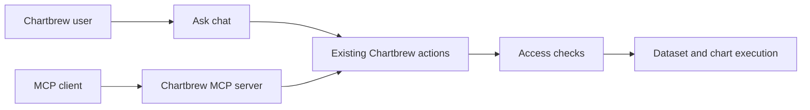

# AI Orchestrator Chat And Chartbrew MCP Server

Status: active — Phase 1 complete

## Summary

Improve Ask so that users can keep exact Chartbrew context, understand completed work, act on chart
results, connect missing data sources, and save explicit memory. Prepare a small, read-only Chartbrew
MCP server without adding a large tool catalog to each agent request.

The first Chartbrew MCP server will expose four direct tools. It will run in the current Node server
and reuse the Data API access, execution, response-size, and audit controls. The first catalog is small
and does not need generated code or a separate execution runtime.

This spec extends these existing specs:

- `FS-20260512-source-ai-orchestrator-rollout.md`
- `FS-20260811-workspace-learning-orchestrator.md`
- `FS-20260813-mcp-connections.md`

Follow `source-plugin-guide.md` for all source and connection work.

## Product Decisions

1. Exact entity context is the first task. Selected context stays active until the user removes it.
2. Ask renders a small set of Chartbrew-owned result components. The model cannot create UI.
3. Ask shows a safe work summary. It does not show hidden model reasoning.
4. Connection suggestions come from installed source plugins and a verified MCP provider catalog.
5. `/remember` is an explicit user command. Ask does not save inferred personal facts.
6. The Chartbrew MCP server is read-only in version 1.
7. The MCP server calls Chartbrew data and access modules. It does not call the Ask orchestrator.
8. Do not add feature flags for this work. Ship each phase only when its acceptance tests pass.

## Goals

- Keep selected dashboards, charts, datasets, and connections exact and stable across turns.
- Let users find the correct context with useful type and parent information.
- Add direct chart actions and source links to chart results.
- Keep the completed tool activity visible after a response and after a page reload.
- Detect a missing connection and give the user the shortest safe setup path.
- Support a verified MCP OAuth setup action from the chat.
- Let users add, view, edit, and delete explicit memory.
- Expose a small Chartbrew MCP tool set with bounded schemas and results.
- Keep the chat and MCP paths under the same access and data execution rules.

## Non-Goals

- Showing private chain-of-thought or hidden reasoning tokens.
- Letting a model write arbitrary components, HTML, JavaScript, SQL, or MCP server code for the UI.
- Searching the open web and trusting an unverified MCP endpoint.
- Creating an active connection before the user starts and completes its authorization action.
- Giving the Chartbrew MCP server write tools in version 1.
- Exposing one MCP tool for each dashboard, chart, dataset, source, or remote MCP tool.
- Adding an internal action framework before two real callers need the same operation.

## Current State

The current implementation provides a useful base but has these limits:

| Area | Current state | Required change |
| --- | --- | --- |
| Chat context | The client can add projects, connections, and datasets. It clears the local selection after a send. | Add charts, use replace semantics, and restore the active set when a conversation opens. |
| Context storage | `AiConversationContext` stores a union through `findOrCreate`. | Treat a supplied array as the full active set so removal is possible. |
| Model context | The orchestrator receives safe labels, but not stable entity references. | Give tools validated IDs, types, team IDs, and project IDs. Keep internal IDs out of normal UI copy. |
| Dashboard intent | The prompt tells the model not to infer a dashboard from context. | Let an exact selected dashboard satisfy the target when the user says “this dashboard.” |
| Home chat | The Home chat expands inside the normal Home layout. | After the first message, make the conversation the main Home content and keep the composer at the center bottom. |
| Chart results | Saved charts can link to an editor and dashboard. Preview charts have no dashboard picker or dataset links. | Add dataset provenance and direct placement actions. |
| Work activity | Live progress disappears. Saved tool calls appear only as a general completed section. | Keep a concise, persistent work summary with success and failure states. |
| Connections | Ask can use existing connections. It does not provide a guided missing-provider setup. | Add a deterministic connection resolver and a connection setup result. |
| Memory | Workspace learning is inferred from product activity. Free-form memory is not stored. | Add explicit personal memory with full user control. |
| Outbound MCP | The MCP source plugin connects Chartbrew to remote MCP servers. | Reuse its verified-provider and OAuth rules in the connection setup flow. |
| Inbound MCP | The Data API and MCP server packages exist. Chartbrew does not expose an MCP server. | Add one stateless, read-only MCP endpoint with four tools. |

## User Experience

### Composer

Keep the composer compact. Keep one **Add context** control at the bottom left below the input, with
status and submit controls at the bottom right. Use this layout in the Home chat and the chat modal.
Entity context applies to the conversation and stays selected until the user removes it.

The context search groups results by Recent, Dashboards, Charts, Datasets, and Connections. Each row
has one main label and one short information line:

- Dashboard: workspace and chart count.
- Chart: dashboard name and chart type.
- Dataset: connection name and source type.
- Connection: source type and connection state.

Do not show database IDs, fingerprints, schema versions, or other implementation data in this menu.
Use the current HeroUI controls and Chartbrew spacing. Do not add permanent helper paragraphs.

### Focused Home chat

The idle Home page keeps its current layout. As soon as the user sends the first Home chat message,
change the Home content area to a focused chat layout. Do this when the message is submitted; do not
wait for the first answer.

- Keep the main application navigation available.
- Hide the Home greeting, discovery panel, onboarding content, and metric activity while the chat is
  focused.
- Put the transcript in one centered content column.
- Keep the composer in the same column at the bottom of the available viewport.
- Let the transcript use the remaining height and scroll without placing the latest message under the
  composer.
- Keep the existing context, status, save, and submit controls in the composer.
- Keep a clear **Close answer** action. It clears the current Home chat and restores the normal Home
  layout.

Use a short fade and position transition when the Home chat enters or leaves the focused layout.
Keep the transition immediate when the user prefers reduced motion.

On small screens, use the available width and keep the composer above the safe-area inset. Do not add
a second chat route, modal, or saved layout preference. This is local Home page state. `Home` owns the
focused layout, and `HomeAsk` reports when its conversation starts or clears.

### Context behavior

An exact entity selection has priority over a name inferred from message text. These examples must
work:

- A selected chart plus “change this to a weekly bar chart” means that chart.
- A selected dataset plus “show this by country” means that dataset.
- A selected dashboard plus “add the preview here” means that dashboard.
- Two selected charts plus “change this chart” is ambiguous. Ask requests a choice.

If the selected entity was deleted or the user lost access, remove it from active context and show:
“This item is no longer available. Select another item.”

Saved dataset selection must preserve scope. A dataset limited to a page path, region, plan, segment,
or filter must not answer a broader request unless the user includes that scope.

### Chart result

The chart result is one component with these parts:

- Chart title, type, and Preview or Saved state. A saved chart title opens the chart in a new tab.
- Chart preview.
- Dataset links with the dataset icon and an external-link icon.
- Saved location, when present, with an **Open dashboard** link in a new tab.
- Dashboard ComboBox that adds a preview to the selected dashboard.

When a chart is updated during the conversation, the visible chart must reload immediately. When a
preview is added to a dashboard, the component must change from Preview to Saved and keep the selected
dashboard visible, both immediately and after the conversation is saved or reloaded. If the same chart
appears more than once, all its result components must show the saved state.

If a preview or saved chart no longer exists, the result must stop loading and show an Unavailable
state. Remove chart and dashboard actions, but keep links to datasets that still exist.

The dashboard ComboBox defaults to an exact dashboard from active context. It does not guess from an
old message or a partial name. Hide placement actions when the user cannot edit the target dashboard.
Do not repeat dashboard placement as reply text or quick-reply suggestions.

The direct placement action must use the same server permission and chart validation path as a normal
chart save. It updates the existing preview state in place and does not add a user or agent message.

### Work summary

While Ask works, show short activity labels such as:

- Read dataset fields
- Previewed data
- Created chart preview
- Added chart to dashboard

Use `aria-live="polite"` for the current activity. After completion, keep one collapsed **Work
completed** section below the answer. It contains the same stable labels and their final states. Keep
failed actions visible with a Retry action when retry is safe.

The work summary is built from saved tool calls and results. Do not ask the model to write it. Do not
show hidden reasoning, raw arguments, credentials, queries, stack traces, or provider responses.

### Missing connection

If the request needs a provider with no usable connection, Ask resolves the next action in this order:

1. A connected and permitted Chartbrew source.
2. An installed native source plugin that the user can configure.
3. A verified MCP provider with a remote HTTPS endpoint and supported OAuth.
4. Manual MCP connection setup.
5. A clear unsupported result.

For a native source, show a **Set up connection** action. For a verified MCP provider, show a compact
connection card with **Connect [provider]**. Only create the inactive connection when the user presses
the action. Activate it after OAuth callback validation and successful MCP discovery.

In the MCP connection form, selecting OAuth changes the new connection's main action to **Save and
connect**. This action saves the inactive connection and starts OAuth without a second click. If OAuth
cannot start, keep the saved connection available for retry. Existing connections keep a separate
reconnect action. Chat must reuse this save-then-start sequence and the existing source OAuth action.

The OAuth state includes a signed conversation reference. After OAuth, open the connection page for
tool approval and keep the chat closed. Keep the conversation and team IDs in the route query for a
later conversation bubble. Do not build that bubble or send a new model request in this phase.

Show the full discovered tool list when it contains 250 tools or fewer, regardless of Tool focus.
Only larger lists use matching against the saved user question plus basic schema, documentation,
and query helpers. Check the actual list during each bounded discovery; do not pre-filter discovery
using a fixed provider shortlist. For later calls, documented provider URL filters can use the
selected tool names. Keep explicit user URL filters unchanged. Keep existing approved tools, do not
auto-approve new tools, and keep response, schema, page, and catalog byte limits. A large tool count
alone must not fail setup. Show Tool focus only when tools were omitted; users can change it and
save to reload the selection.
Render 10 tools per page in the connection form. Search and hint filters apply to the full discovered
list before pagination and return to page 1 when changed. Keep approvals when switching pages.
Use one **Allow access** toggle per tool to enable or disable both Ask and Datasets together. Save
approval changes under a connection row lock so concurrent changes cannot overwrite each other.
Preserve older limited approvals until the user changes them; do not silently expand access.

Owners and admins can approve MCP tools for Ask. Other roles see **Ask an admin** when approval is
required. The model cannot approve a tool.

The verified provider catalog is one static source file in version 1. It stores only official provider
names, official remote endpoints, and safe setup notes. Do not add a database, admin editor, remote
catalog, or web crawler. OAuth metadata still comes from protocol discovery. Unknown providers do not
use open-web search in version 1. They open the normal MCP connection form so the user can supply an
endpoint.

### Explicit memory

`/remember <text>` saves one personal memory without calling the model. On success, show:
“Saved to memory.”

Rules:

- Memory is personal by default.
- A memory is at most 500 characters.
- A user can store at most 50 memories and 8,000 total characters.
- Store memory with the same encrypted-field utility used for other private values.
- Treat memory text as untrusted user data. It cannot change access, safety, or system rules.
- Include memory only when the existing external AI context policy permits it.
- Do not expose memory through the Chartbrew MCP server in version 1.

AI settings has a **Memory** section. The user can list, edit, delete, and delete all memory. Each item
shows its text and last update time. Destructive actions use the current confirmation pattern. Deletion
affects the next Ask turn.

Do not infer and save memory from normal chat. Team memory and automatic memory are later work.

## Chat Contracts

### Active context

The chat request keeps the current `context` field and changes its meaning:

- Omitted `context`: keep the current active context.
- `context: []`: remove all active context.
- Non-empty `context`: replace the active context with the supplied set.

The server validates each entity on every request. It removes duplicates and rejects more than ten
items. The conversation response includes the current safe active set:

```javascript
{
  context: [
    {
      id: 42,
      entity_type: "chart",
      label: "Chart: Weekly signups",
      name: "Weekly signups",
      project_id: 8,
      metadata: {
        chartType: "bar",
        dashboardName: "Growth",
      },
    },
  ],
}
```

The client uses this response when it opens or changes a conversation. Route context seeds only a new
conversation. Opening a saved conversation does not add context from the current page. The server gives
validated references to orchestrator tools. UI and prompt text use safe names.

Add one bounded context search route for the picker:

```text
GET /ai/context?teamId=:teamId&query=:query&type=:type&limit=:limit
```

It searches only entities the user can access. The default limit is 20 and the maximum is 50. Empty
queries return recent items. Reuse this search function for the future MCP `search_workspace` tool.

### Typed chat results

Keep tool results as the stored source of truth. Extend the current chart result parser and quick-reply
behavior instead of adding a general result format. Add one new connection setup component only when a
connection result needs it. Do not add a general artifact table or a model-defined component schema.

Chart tool results add safe references:

```javascript
{
  status: "preview",
  chart: {
    id: "temp_123",
    name: "Weekly signups",
    chartType: "bar",
  },
  datasets: [
    {
      id: 12,
      name: "Signups",
      projectId: 8,
    },
  ],
  dashboard: null,
}
```

The server returns only references that the current user can open. The client builds URLs from these
validated references.

### Direct chat actions

The chart placement action uses a direct preview placement endpoint with the
`add_preview_to_dashboard` action and a small, validated payload. It does not pass through the model
or create a new chat turn. It checks the current user, team, entity access, conversation ownership,
and payload, then updates the existing preview record. OAuth uses the existing connection OAuth route
with a signed conversation return reference. Continue uses a normal quick reply. Retries stay
specific to the failed operation. Do not add a general action registry.

## Connection Resolution

Extend the existing `list_connections` orchestrator tool with an optional provider name and required
data capability. Its output is capped and does not contain credentials or full schemas.

The tool reads:

- Connections that the user can access.
- Compact source summaries from the source registry.
- The verified MCP provider catalog.

It returns at most five options with one of these states:

- `connected`
- `native_setup`
- `mcp_oauth_setup`
- `manual_mcp_setup`
- `admin_required`
- `unsupported`

Keep provider-specific connection behavior in its source plugin. Keep generic MCP discovery, OAuth,
approval, and execution in the MCP source plugin.

## Shared Execution Boundary

Do not create a new general domain framework. Reuse current access and execution modules. Extract a
small function only when both Ask and MCP need the same operation.



The two adapters have different output:

- Ask returns stored tool activity and typed Chartbrew result data.
- MCP returns a short text summary and bounded `structuredContent`.

The MCP path never calls the model and never creates an Ask conversation.

## Chartbrew MCP Server

### Transport and protocol

Add a stateless Streamable HTTP MCP endpoint to the current Express server. Use the installed
`@modelcontextprotocol/server` version 2 package. Follow MCP revision `2026-07-28` and use deterministic
tool order.

The private alpha accepts a manually created Chartbrew API key. The public release requires bearer
authorization with OAuth and read-only scopes. Both paths build the same project and team access object
before a tool runs. Do not call the public MCP work complete until protected-resource metadata, PKCE,
token audience validation, refresh, and revocation tests pass.

Use these scopes:

- `data:read`: search entity metadata and read current chart or dataset data.
- `data:refresh`: permit `refresh: true` for a data tool.

Do not add a separate scope for every tool. Limit the OAuth grant to selected teams and projects.
Filter `tools/list` by granted scope where required.

### Version 1 tools

Expose four tools in this order:

#### `search_workspace`

Search dashboards, charts, and datasets by name.

```javascript
{
  query: "signup",
  types: ["dashboard", "chart", "dataset"],
  limit: 20,
}
```

Return typed references, names, short parent information, and safe Chartbrew links. Do not return
dataset rows, chart configuration, connection secrets, or hidden metadata.

#### `get_workspace_activity`

Return recent changes and metric evaluations for one permitted team. Reuse the current workspace
activity projection and its data minimization rules. Inputs are team, optional date range, and limit.

#### `run_dataset`

Run one permitted dataset with the existing Data API filters, variables, refresh behavior, deadline,
row cap, byte cap, and cache policy.

#### `get_chart_data`

Read one permitted chart through the existing Data API chart path. Accept the existing chart filter,
variable, and refresh inputs.

Each tool returns a short text result for compatibility and the useful data in `structuredContent`.
Keep error codes stable and user-safe. Never return stack traces or credentials.

### Tool context budget

Keep the full serialized version 1 `tools/list` result at or below 8,000 characters. Add a unit test
that serializes the real tool definitions and fails above this limit. This is a simple and stable
budget check; it does not add a tokenizer dependency.

Also require:

- No more than eight direct tools without a design review.
- Descriptions use one short purpose statement and only necessary constraints.
- Input schemas do not repeat long API documentation.
- Search results default to 20 and never exceed 50 items.
- Data results use the current Data API byte and execution limits.
- Tool output does not repeat the same data in text and `structuredContent`.

Protocol references:

- [MCP tools revision 2026-07-28](https://modelcontextprotocol.io/specification/2026-07-28/server/tools)
- [MCP authorization revision 2026-07-28](https://modelcontextprotocol.io/specification/2026-07-28/basic/authorization)

## Data And Security

- Validate team, project, and entity access on every chat action and MCP call.
- Do not trust active context labels, memory, provider descriptions, tool descriptions, or tool data.
- Do not put credentials, queries, raw rows, MCP discovery data, or tool arguments in model prompts
  unless the task requires the safe bounded value.
- Keep MCP remote-server approval separate from Chartbrew inbound MCP authorization.
- Apply the current outbound request policy to remote MCP provider discovery and OAuth.
- Apply the current Data API deadline, rate, request-size, response-size, and refresh-scope controls to
  inbound MCP data calls.
- Audit connection creation, OAuth completion, MCP tool calls, memory changes, and direct chart actions.
- Redact secrets before logs, saved chat activity, client responses, and model context.
- Recheck saved context access when a conversation opens and before every use.
- Never use remembered text to select a team, expand access, or approve a write.

## Persistence

Reuse `AiConversationContext` for the active entity set. Change its update to one transaction:

1. Validate the supplied full set.
2. Delete rows that are not in the supplied set.
3. Insert missing rows.

Do not add a second context table.

Add one `AiMemory` model with:

- `id`
- `user_id`
- `team_id`
- encrypted `content`
- `created_at`
- `updated_at`

Do not add embeddings, tags, confidence, sources, search, export, or automatic ranking in version 1.
Memory is personal inside one team and never crosses workspace boundaries.

Keep chart result and work summary data in existing AI messages and tool results. Do not add artifact
or work-step tables.

## Delivery Order

### Phase 1: exact context

- [x] Add server-backed context search with chart results.
- [x] Add replace semantics and return active context with a conversation.
- [x] Keep entity chips across sends and reloads.
- [x] Pass validated references to orchestrator tools.
- [x] Update dashboard targeting rules.
- [x] Add harness cases for exact, ambiguous, removed, and inaccessible context.

### Phase 2: focused Home chat

- [x] Move the active Home chat into one centered conversation column.
- [x] Keep the composer at the center bottom while the transcript scrolls.
- [x] Restore the normal Home layout when the user closes the answer.
- [x] Add desktop, small-screen, keyboard, and reduced-motion checks.

### Phase 3: chart result and work summary

- [x] Add dataset links and dashboard placement to chart results.
- [x] Add direct action validation and update the preview state in place.
- [x] Keep the safe work summary after completion and reload.
- [x] Add loading accessibility.

### Phase 4: connection setup

- [x] Extend `list_connections` with connection setup options, provider matching, and capability filtering.
- [x] Add server-side native and verified MCP setup results. The first catalog entry is PostHog.
- [x] Render setup results in both chat surfaces as separate connection cards, not quick replies.
- [x] Match chart previews with a gray outer frame and an inner surface. Use source logos and explain which service connects to Chartbrew, whether it uses MCP, and what happens next. Keep primary link-button text readable.
- [x] Explain missing access before setup cards and stop requiring chart tools while setup is needed. Work summaries include only completed tool calls from the current turn, with failures kept visible.
- [x] Reuse the MCP form's combined save-and-connect flow for chat OAuth setup.
- [x] Return OAuth to the connection page for tool approval, with the saved conversation reference in the URL and chat closed.
- [x] Complete role and approval handling in the setup cards. Lookup restricts connection
  details to team owners/admins and excludes inactive or unapproved MCP connections from ready results.

The connection card saves an unsaved chat, creates an inactive connection, and starts OAuth without a
model request. Repeated clicks reuse the conversation's connection. OAuth opens the connection page
for tool approval. The chat stays saved and closed. Opening the chat later refreshes its connection
card; only the user can choose Continue request.
Native and manual setup also open the existing form in a new tab, so the chat stays available.
After the user opens setup, show a secondary **I added the connection** button on the card. It sends
a normal chat message that makes the agent check connections again before continuing the original
request. The button does not grant permissions or mark the connection as ready.
The existing MCP form still provides save-and-connect. PostHog setup uses its documented individual-tool
mode and read-only filter; these do not replace Chartbrew's own tool approval checks.
See [PostHog's setup and authentication documentation](https://posthog.com/docs/model-context-protocol/faq).

### Phase 5: explicit memory

- Add `/remember` command handling.
- Add encrypted personal memory CRUD.
- Add the AI settings section and external context policy check.

### Phase 6: Chartbrew MCP server

- Add the stateless endpoint and API-key authorization for a private alpha.
- Add the four read-only tools over existing access and data modules.
- Add the tool context budget test and protocol tests.
- Add OAuth and its protocol tests before a public release.
- Publish setup instructions for Chartbrew Cloud and self-hosted Chartbrew.

Do not start the next phase until the current phase tests pass. Each phase can merge on its own.

## Test Plan

### Context

- A selected item stays active after send and reload.
- Sending an empty list removes all context.
- Replacing context removes old rows instead of making a union.
- Charts appear in search with the correct dashboard information.
- Search never returns an entity from another team or an inaccessible project.
- “This chart” resolves one selected chart and requests a choice for two selected charts.
- Deleted and inaccessible context is removed safely.
- The orchestrator harness covers exact, ambiguous, removed, and inaccessible context prompts.

### Focused Home chat

- The idle Home page keeps its current layout.
- The first submitted message enters the focused layout before the answer returns.
- The transcript is centered and scrolls independently of the composer.
- The composer stays visible at the bottom and does not cover the latest message.
- Home discovery, onboarding, and activity content do not remain in the focused layout.
- Closing the answer clears the Home chat and restores the normal Home content.
- Keyboard focus remains usable through the layout change.
- Small screens keep all chat actions visible without horizontal scrolling.
- Reduced-motion settings do not receive a layout transition animation.

### Components and activity

- A chart preview shows every dataset and can open each permitted dataset.
- The exact selected dashboard is the ComboBox default.
- A permitted user can add a preview. A read-only user cannot.
- An updated chart reloads in the active chat without a page refresh.
- Placement changes Preview to Saved and preserves the dashboard selection after reload.
- A deleted preview or saved chart shows Unavailable instead of a loading state.
- Saved chart and dashboard links open the correct routes in a new tab.
- Direct actions cannot cross team or project boundaries.
- Live activity uses an accessible status region.
- Completed and failed work stays visible after reload.
- No private reasoning, raw tool arguments, or secrets appear.

### Connections

- Existing native connection wins over setup suggestions.
- Installed native source wins over an MCP suggestion when both support the provider.
- Only verified MCP endpoints can produce the OAuth action.
- Pressing OAuth creates an inactive connection.
- Saving a new MCP connection with OAuth starts sign-in without another click.
- A failed save must not start OAuth; a failed OAuth start must allow retry on the saved connection.
- Failed or abandoned OAuth does not leave an active connection.
- OAuth opens the connection page and retains the signed conversation reference without opening chat.
- Large catalogs select relevant tools and basic helpers without granting permissions or dropping approved tools.
- A non-admin cannot approve an MCP tool.

### Memory

- `/remember` stores text without a model call.
- Limits and empty input are enforced on the server.
- A user cannot read or change another user's or another team's memory.
- Edit, delete, and delete all work.
- External AI receives memory only when the existing policy permits it.
- Instruction-like memory cannot change permissions or system rules.

### MCP server

- `tools/list` is deterministic, read-only, and no larger than 8,000 characters.
- A token sees only tools allowed by its scopes.
- Every tool enforces team and project access.
- `refresh: true` requires `data:refresh`.
- Search and data output obey item and byte caps.
- Timeouts, invalid IDs, and inaccessible entities return stable safe errors.
- `structuredContent` has the declared output shape.
- No write tool or connection credential is available.
- The same chart and dataset request produces the same bounded data result through Data API and MCP.
