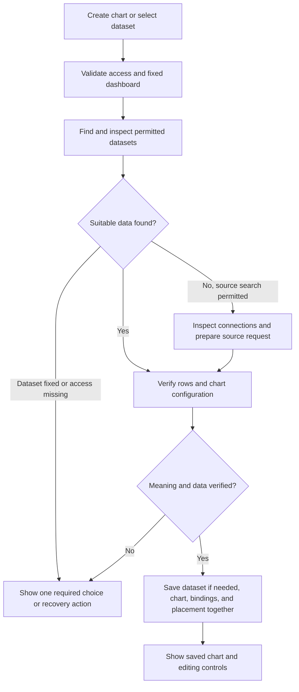

# Inline chart creation

Status: implemented on `chart-creator-v6`. Local browser checks cover dataset selection, AI creation, refinement, reload recovery, and small screens.

Setup: run `npm --prefix server run db:migrate` before use. The migration is already applied to the local development database. No new environment variables are required. Open a dashboard, select **Add chart**, then describe a chart or select **Use a dataset**.

Validation: client build and lint, server lint, unit tests for defaults, query execution and source discovery, and database tests for saving, rollback, retry, cancellation and access. New-source creation is covered with a simulated provider and source; live browser checks used saved PostHog datasets.

Current limits: one chart and one dataset per request. Generic API creation uses GET requests; use a saved dataset for other methods. Cancel prevents saving; a source read that has already started can finish in the background.

Date: 17 September 2026

## 1. Result

Let a user create a chart inside the dashboard that they are viewing. The user describes the chart or selects a dataset. Chartbrew finds suitable data, selects a useful chart configuration, and saves the chart to that dashboard. The user can then change the chart through compact controls beside the dashboard.

The normal flow must not open the separate chart creation page. It must not require a chart preview, a destination choice, or a second **Add to dashboard** action.

### Requirement priority

The user's direct request controls this spec. The attached screenshots and quoted UX discussion are reference material.

| Reference idea | Decision |
| --- | --- |
| Create inside the dashboard | Adopt. Keep the dashboard visible and retain its context. |
| Prompt and dataset entry points | Adopt. Both produce a saved chart in the current dashboard. |
| Right-side chart controls | Adopt. Show controls for the selected chart. |
| Temporary preview followed by Add to dashboard | Replace. Save the chart when creation succeeds. |
| Keep everything as a draft until final approval | Replace. Only unfinished input and preparation are temporary. A completed chart is saved. |
| Ask for chart type or general settings | Omit. Select suitable defaults from the request and verified data. |
| Large animated generation artwork | Omit. Use a short progress message and the normal chart surface. |
| Create several charts from one prompt | Outside this first flow. Keep broader work in Ask your data. |

This spec supersedes the dashboard entry behavior in [Chart Creation From Dataset](FS-20260314-chart-create-from-dataset.md). It does not change the preview behavior of general AI chat.

## 2. Current implementation and gaps

The code was inspected for this spec. These are current behaviors, not proposed features.

| Area | Current behavior | Required change |
| --- | --- | --- |
| Dashboard entry | [ProjectDashboard.jsx](../../client/src/containers/ProjectDashboard/ProjectDashboard.jsx) opens a menu under Add insight. Add chart navigates to `/dashboard/:projectId/chart`. | Add chart opens an inline composer. Keep Add text in the adjacent menu. |
| Empty dashboard | [DashboardStarter.jsx](../../client/src/containers/ProjectDashboard/components/DashboardStarter.jsx) has its own creation controls and dataset flow. | Route its chart actions through the same inline flow. |
| Dataset creation entry | [ChartDescription.jsx](../../client/src/containers/AddChart/components/ChartDescription.jsx) combines datasets, templates, management columns, and manual creation. | Use a small dataset picker for this task. Keep management on the dataset page. |
| Dataset to chart | [AddChart.jsx](../../client/src/containers/AddChart/AddChart.jsx) creates a chart, attaches a dataset, runs data, then opens the editor. These are separate requests. | Prepare a valid configuration first. Save the chart and its bindings together. |
| Automatic bindings | [getDefaultCdcBindings.js](../../client/src/modules/getDefaultCdcBindings.js) uses stored bindings and [autoFieldSelector.js](../../client/src/modules/autoFieldSelector.js). The fallback chooses fields and count operations by type. | Treat these as candidates. Field type alone is not proof of the correct metric or aggregation. |
| AI behavior | [orchestrator.js](../../server/modules/ai/orchestrator/orchestrator.js) normally creates temporary previews. It also supports explicit dashboard placement. | Add a dedicated inline creation path with a fixed target and one-chart limit. |
| Dataset discovery | [searchDatasetProfiles.js](../../server/modules/datasetIntelligence/searchDatasetProfiles.js) uses names, profiles, fields, and prior chart use. It can filter by project, scans at most 500 recent datasets, and returns no results when dataset intelligence is disabled. | Prefer dashboard datasets without excluding other permitted datasets. Provide a metadata fallback and handle truncated search. |
| Saved chart tools | [createChart.js](../../server/modules/ai/orchestrator/tools/createChart.js) uses an existing dataset. [createDashboardChart.js](../../server/modules/ai/orchestrator/tools/createDashboardChart.js) creates source data and a saved chart. | Reuse their preparation and visualization logic. Do not call their current write sequences unchanged. |
| Transaction boundary | Dataset creation in `createDashboardChart` precedes the chart transaction. `ChartController.createWithChartDatasetConfigs` can commit before its data update finishes. | Make the final write atomic. Distinguish a failed write from a later data or image failure. |
| Placement | [dashboardLayout.js](../../server/modules/dashboardLayout.js) locks the dashboard and updates its layout revision. [layout.mjs](../../shared/dashboard/layout.mjs) appends charts below existing widgets at each breakpoint. | Reuse this placement path. Preserve existing widget positions. |
| AI permissions | [rolePolicy.js](../../server/modules/ai/orchestrator/rolePolicy.js) currently excludes chart creation from project-editor chat tools. | Define a narrow inline permission path. Do not expand general chat permissions. |
| Progress and cancellation | [useAiChat.js](../../client/src/containers/Ai/hooks/useAiChat.js) uses socket progress. It does not provide a server cancellation contract for this task. | Reuse transport where useful. Add actual cancellation and result recovery. |

## 3. Scope

Include:

- Prompt to one saved chart on the current dashboard.
- Dataset selection to one saved chart on the current dashboard.
- Dataset discovery, source discovery, query preparation, and required dataset creation.
- Compact chart controls and AI changes to the chart just created.
- AI-disabled behavior, missing data, access errors, cancellation, and safe retry.
- Desktop, small-screen, keyboard, light-theme, and dark-theme behavior.

Exclude:

- A new general chat interface or a second AI platform.
- Automatic creation of multiple charts or a new dashboard.
- A full chart editor inside the dashboard.
- New data connectors, automatic connection authorization, or source permission changes.
- A redesign of dataset management, templates, sharing, or layout editing.
- Feature flags, new AI providers, or new environment variables for this flow.

## 4. Dashboard interaction

### 4.1 Entry

Use a split button. The main **Add chart** button opens creation immediately. The adjacent menu contains **Add text**. Add a quiet **+ Add chart** action below the grid. Show these actions only when the user can create charts on this dashboard. Keep an accessible entry on small screens; do not inherit the current desktop-only button visibility.

Opening creation:

1. Adds one local composer below the existing grid, at the next chart position.
2. Scrolls it into view and focuses the prompt, or the dataset picker when AI is unavailable.
3. Keeps the URL, dashboard filters, and existing charts in place.
4. Opens focused chart editing controls when there is a selected result to edit.

Only one creation flow is active in this dashboard view. Repeated clicks focus that flow. The composer is not a Chart record and must not enter saved layout data.

Keep chart creation separate from the existing `editingLayout` state. Creating a chart must not enable drag, resize, automatic arrangement, or layout compaction. If layout changes are pending, finish or discard them through the existing layout controls before starting creation.

### 4.2 Composer

| Element | Content or behavior |
| --- | --- |
| Label | What would you like to show? |
| Prompt example | Website visits by country in the last 30 days |
| Source control | Using: Automatic, or the selected connection name |
| Main action | Create chart |
| Alternative | Use a dataset |
| Secondary action | Build manually |
| Close action | Cancel |

**Create chart** is authorization to create one chart and any dataset required for it on this dashboard. Do not ask the user to confirm that same action again.

Default to the sole relevant dashboard connection when it is unambiguous. Otherwise use **Automatic**. An automatic choice is a preference, not a hidden source restriction. A connection explicitly selected by the user is a restriction. Do not switch from it silently.

Do not show chart types, field controls, or advanced settings before the user provides a request or selects a dataset.

### 4.3 Dataset picker

Open a HeroUI Modal with search and an optional source filter. Show a selectable list with dataset name, connection name, and one short description when available. Omit author, modification time, and a separate tags column.

Order permitted results by relevance, then prefer datasets already used on this dashboard. Keep other permitted datasets accessible through the same search and pagination. Distinguish **No matching datasets** from **No datasets yet**.

Selecting a dataset closes the picker and starts chart preparation. When the stored configuration has a clear metric and grouping, create and save immediately. When the choice changes the meaning of the data, show only the missing control in the composer. For example, ask which of two unrelated measures to display. Do not guess sum, average, or latest from a numeric field alone.

If a prompt already exists, preserve it and apply it to the selected dataset. Without a prompt, use verified dataset defaults. This path must work without an AI request.

A selected dataset remains fixed during AI refinement. If it cannot answer the request, explain the missing data and offer **Change dataset**. A request to use another grouping does not authorize a silent dataset replacement.

Keep **Browse templates** as a secondary link to the existing template flow. Opening it or **Build manually** must be an explicit navigation action. Do not precreate an empty inline chart for either action. Preserve the dashboard return location and compatible input context. Complex source setup remains in the existing dataset builder.

### 4.4 Saved result and controls

Replace the composer with the actual saved chart. Use the normal Chart renderer and dashboard data flow. Keep that chart selected and scroll it into view if required. Show **Chart added** with an **Undo** action. Do not show a Preview badge or Add to dashboard button.

On desktop, show a compact right-side panel, approximately 320–360 px wide. The panel may reduce the visible grid width but must not write responsive reflow back to saved positions. On small screens, place the same controls below the selected chart, or use the existing accessible Drawer pattern if space requires it.

| Control | Behavior |
| --- | --- |
| Title | Editable text. Save on Enter or blur; Escape restores the last saved text. |
| Chart type | Show only supported types that fit the prepared data. |
| Value and grouping | Show relevant controls for this chart, with existing selections. |
| Aggregation and period | Show only where they apply and can be changed safely. |
| Refine with AI | Accept requests such as Make it weekly or Show the top 10 countries. |
| More options | Open the existing full editor for this saved chart. |
| Done | Close chart controls. The chart is already saved. |

Use one short calculation summary when it helps the user verify meaning, such as **Total visits · By country · Last 30 days**. Generate it from the saved configuration. Do not add an explanation that merely repeats the title.

Save valid control changes automatically. Show Saving, Saved, or an actionable error next to the controls. Keep the last good chart visible while a data change is prepared. A failed change must preserve the saved chart and the user's attempted input. Do not close pending or failed changes through Done without an explicit retry or discard choice.

AI refinement updates this chart ID only. It must not create a second chart or change a shared dataset. If the system chose the dataset automatically and a new query is needed, it may create a separate dataset and replace this chart's binding. If the user fixed the dataset, require an explicit dataset change instead.

Undo removes the newly created chart through the normal authorized delete path. It must not remove a reused dataset. Do not add automatic dataset deletion after a successful save; a dataset can have new users by then. After further chart edits, use the normal delete action instead of an old creation Undo action.

### 4.5 Empty and unavailable states

| State | Required behavior |
| --- | --- |
| AI disabled or unavailable | Make Use a dataset primary. Keep Build manually. Do not show a disabled prompt as the main interface. |
| No datasets; usable connections exist | AI can inspect connections directly. Without AI, offer Create dataset through the existing builder, subject to access. |
| No usable connection | Show Connect a source, or Ask an administrator when the user cannot connect one. Retain input. |
| Connection needs authorization | Offer the existing connection repair action. Do not request credentials in the composer. |
| Missing source capability or approved MCP tool | Explain the required access or offer another source. Never change approvals automatically. |
| Request needs several independent charts | Ask the user to choose one chart, with an optional Continue in Ask your data action. Do not silently omit requested results. |
| Verified query returns no rows | Show No data for this period, with Change period and Retry. Do not publish an empty chart automatically. A verified scalar zero is valid data. |
| Source query or save fails | Keep the composer and input. Show an actionable message and Retry. |

### 4.6 Progress, close, and reload

Use real milestones: **Finding data…**, **Checking your data…**, **Preparing your chart…**, and **Adding your chart…**. Do not simulate percentages or show tool names, queries, internal states, or model reasoning.

Cancel before the final save removes the composer after the server confirms cancellation. Closing the browser request alone is not cancellation. If saving wins the race, show the saved chart and its Undo action. Never report cancellation while leaving an undisclosed saved chart.

Before submission, input is local. After submission, keep the operation reference and composer input in session storage for this user and dashboard. Do not store source rows or credentials there. A reload or return to the dashboard checks that operation and restores its result. Explicit navigation does not move the target or create another chart. A request can finish on its original dashboard; route a late result only to that dashboard.

## 5. Dedicated chart creation orchestration

### 5.1 Entry contract

Use a dedicated server entry for inline chart creation. Do not rely on words such as create or chart appearing in the prompt. A request such as **Visits by country** already has creation intent because it came from this entry.

The server establishes:

- Authenticated actor and team.
- One existing, editable, non-ghost dashboard.
- One creation operation and a maximum of one result chart.
- Optional fixed dataset or connection.
- Dashboard timezone, saved context, and applicable runtime filters.
- Allowed read tools and the exact permitted write result.

The model cannot change these values. Treat dataset names, connection descriptions, query results, and prior generated text as data, not instructions.

Use a small creation-specific instruction set and the existing provider, source tools, usage records, and error handling. Do not append conflicting instructions to the general preview-first prompt. The general chat, workspace reports, and MCP entry points retain their current contracts.

### 5.2 Execution sequence



### 5.3 Dataset discovery

1. Inspect an explicitly selected dataset first. Preserve that selection.
2. Otherwise search datasets used on the dashboard, then widen to all datasets the actor can use.
3. Use names, descriptions, fields, saved bindings, prior chart use, and dataset intelligence when available.
4. Verify metric definition, units, grain, dimensions, filters, date coverage, and connection identity before reuse.
5. Run or inspect a bounded result to verify the actual field paths and data shape.
6. Reuse a suitable dataset. Do not copy it just because another dashboard uses it.

Do not pass `project_id` as a hard search filter for the entire operation. It currently excludes other datasets. Do not treat a missing, stale, or disabled intelligence profile as proof that data is unavailable. Fall back to permitted dataset metadata and bounded execution.

The existing 500-record scan is not an exhaustive catalog. For this path, add bounded database search or pagination under the same access rules. Inspect additional candidates when results are truncated. If the search budget ends first, report that limitation and offer a source or dataset choice; do not claim the dataset does not exist.

Search relevance is only a ranking signal. A dataset for `/tools/` visits cannot answer total website visits. Country totals cannot answer a state breakdown. A scalar total cannot supply a timeline.

### 5.4 Connection and source discovery

When no dataset fits and access permits source exploration:

1. Start with the fixed connection, a source named in the request, or the source of the closest relevant dataset.
2. In Automatic mode, inspect other relevant permitted connections if the first source cannot answer the question.
3. Use registered source capabilities. Follow [source-plugin-guide.md](../../source-plugin-guide.md).
4. For query sources, inspect schema, generate a read-only query, validate it, and execute a bounded sample.
5. For configuration sources, use source-owned discovery, planning, validation, and execution tools. Use persisted-data planning rules before saving.
6. For MCP, use only approved tools. Verify required arguments and obtain structured rows with named fields. Tool output containing only prose is insufficient for a saved chart.
7. Prepare a repeatable DataRequest, not a chart drawn from numbers in an AI answer.

Reuse the current source repair behavior. Allow at most one correction of a failed source request, including any repair already performed inside the plugin. Do not retry unchanged arguments or access failures. Preserve metric, filters, grouping, and period during repair.

A source name match is not proof that the source contains the requested metric. Never invent table names, events, page paths, project IDs, units, or data values.

### 5.5 Defaults and necessary questions

Choose presentation settings without asking:

| Verified data or request | Default |
| --- | --- |
| One scalar measure | Number/KPI, with its unit |
| Measure over time | Line chart, with a time interval appropriate to the requested period |
| Category comparison or ranking | Bar chart; horizontal bars for long labels |
| Requested record details | Table with useful fields |
| Proportion with a verified common total | A supported proportion chart; avoid it when categories do not form a whole |
| Several compatible series for one question | One chart with readable series and consistent units |

Reuse the existing visualization schema, compiler, and presets. Do not introduce another chart specification format or let the model return arbitrary rendering code.

Resolve settings in this order: explicit request, fixed dataset definition, relevant saved dashboard defaults, then a safe data-based choice. A total request must not silently become a last-30-days request. Do not sum a rate, average averages without weights, count already aggregated totals, or interpret latest as total.

Ask a question only when the answer changes the business meaning or is required for access. Examples include gross versus net revenue without an established definition, two equally plausible accounts, or missing required source scope. Show one compact choice with real labels. Do not ask for title, color, chart type, or technical field names that discovery can resolve.

### 5.6 Filters and data scope

Follow the existing [Filtering Guide](../../server/docs/agents/filtering-guide.md). Use `buildChartRuntimeRequest` and server normalization for the saved chart.

- Keep explicit prompt filters in the chart or new dataset configuration as appropriate.
- Keep dashboard session filters separate from saved chart defaults. Do not silently bake local filters into a shared dataset.
- Apply matching dashboard variables and field filters to the new chart through the normal runtime path.
- Existing date filters target explicit chart IDs. Do not silently add the new chart to those lists. Show the relevant scope when this affects the result and retain the normal filter control.
- Preserve date-range intersection behavior. If prompt and dashboard filters produce an empty intersection, explain it and offer a period or filter change.
- Use the same timezone and filter context for validation, initial display, and later refresh. Never show unfiltered initial data while a filtered request is pending.

### 5.7 Bounds

Use fixed server defaults, not new environment variables. Proposed initial limits are 16 model rounds, 24 total tool executions, and a two-minute operation deadline. Count source discovery, nested remote calls, and repair against the applicable shared budget. Respect lower existing provider, source, row, or query limits.

Stop when a verified answer is ready. Thorough discovery means checking suitability and widening a failed search; it does not mean querying every connection. On budget exhaustion, preserve input and offer a narrower source or dataset choice. Never publish a partially verified chart.

## 6. Server contract and persistence

The following endpoints and record are proposed additions. They do not exist today.

### 6.1 API

| Request | Purpose |
| --- | --- |
| `POST /project/:project_id/chart-creations` | Start prompt or dataset creation with a client request ID. |
| `GET /project/:project_id/chart-creations/:request_id` | Recover the current state or saved result. |
| `POST /project/:project_id/chart-creations/:request_id/cancel` | Cancel before commit, or return the result if already committed. |
| `POST /project/:project_id/chart/:chart_id/refinements` | Start an AI change to one saved chart, with a new request ID and expected saved version. |

The start body contains `requestId`, `mode` (`prompt` or `dataset`), optional `prompt`, optional `datasetId` or `connectionId`, applicable runtime context, and only the missing dataset choices needed for creation. Validate lengths, types, field bindings, and mutually inconsistent selections. Derive team and user from authenticated access. The route dashboard is authoritative.

The refinement body contains `requestId`, `prompt`, `expectedVersion`, and applicable runtime context. Fix the chart from the route and restore dataset restrictions from server-held operation context. Status and cancellation use the same operation endpoints. Ordinary title and control changes use existing chart update routes with the same conflict check.

Results have a small typed state: `running`, `needs_input`, `succeeded`, `failed`, or `cancelled`. Success contains the saved chart ID and current dashboard layout revision. Fetch the normal chart representation for display. Required input contains a safe label and permitted choices. Do not use model prose to determine success.

Keep the current request execution style for the first implementation. Socket events improve progress but are optional; status recovery must work without them. Do not add a separate queue service just for this flow. A disconnected HTTP response must not lose the saved result.

When a required answer changes the input, close the old attempt without writes and submit a new request ID with the full corrected input. A network retry uses the original request ID and unchanged input. The same ID with different input returns a conflict.

### 6.2 Durable operation record

Add one small `ChartCreation` record for this specific flow. Store actor, team, dashboard, request ID, action (`create` or `refine`), a normalized input hash, fixed dataset/connection context, state, deadline, target/result chart ID, and safe error/result metadata. Enforce a unique actor/dashboard/request-ID key in the database. Keep result metadata small; do not store credentials or raw source responses.

This record provides duplicate protection, cancellation, and reload recovery. An in-memory lock or a disabled button is insufficient across tabs and server processes. Keep a completed operation reference after chart deletion so replay cannot recreate a chart that the user removed. Reuse existing retention and audit conventions without adding a general workflow framework.

On process loss or deadline expiry, atomically mark an unfinished operation failed before retry is allowed. The original executor must check the operation state and deadline before commit, so a late response cannot write after cancellation or recovery.

### 6.3 Prepare first, commit once

The model may use permitted read tools to produce a validated creation plan. It must not call unrestricted create, update, move, template-bundle, or dashboard tools. A server-owned final step performs the write once.

Preparation performs network calls and verifies the data before opening the write transaction. Refactor only the necessary preparation code from existing chart tools; do not duplicate source-specific behavior.

In one short database transaction:

1. Lock the operation and confirm it is still active, unchanged, and within its deadline.
2. Recheck dashboard, dataset, connection, and actor access.
3. Lock the dashboard through the existing layout helper.
4. Create the required Dataset, DataRequests, and variable bindings, or attach a permitted existing dataset.
5. Create one Chart with `draft=false`, `onReport=true`, canonical visualization, and ChartDatasetConfigs.
6. Update dataset dashboard association when required. Preserve concurrent associations.
7. Append the chart with `appendCharts` and update dashboard order and revision through existing helpers.
8. Mark the operation succeeded with its chart ID.

Use the transaction options already present in `DatasetController.createWithDataRequests` and `ChartController.createWithChartDatasetConfigs`. Pass the same transaction throughout. Failure must roll back all new product records and placement changes.

Keep source calls, image generation, and slow rendering outside the transaction. Reuse prepared results where supported. If normal chart hydration fails after commit, return the existing saved chart with a data recovery state. Do not retry creation. A snapshot failure also does not make creation fail.

A saved chart follows the dashboard's existing access and sharing rules. Do not create a ghost dashboard, a temporary preview, a share link, or a different destination.

### 6.4 Refinement and concurrency

Refinement uses the same data preparation rules with a server-fixed chart ID. Apply the final change through the normal chart update boundary, with an expected saved version checked under a row lock. Update chart, bindings, and any new dataset together. Keep the previous chart intact on failure.

Serialize changes for the selected chart in the client. Reject a stale server update and reload the latest chart before another attempt. Do not let a late AI response overwrite a newer manual edit. Disable conflicting controls while an AI change is active, and provide Cancel.

Retry of refinement must also be idempotent. Reuse the operation record with an explicit refine action and target chart ID rather than inventing a second operation system. Cancellation restores the prior saved chart because no change is written before commit.

Different users may add charts at the same time. The dashboard lock must append against the latest layout. Never submit the client's full, possibly stale layout as part of chart creation. Existing layout-edit revision conflicts remain visible through the normal recovery flow.

## 7. Access rules

Use the existing chart, dataset, connection, AI availability, and source execution checks. Team membership alone is insufficient. The AI tool `teamScope` checks are useful but do not replace project-level authorization.

| User capability | Inline behavior |
| --- | --- |
| Can create charts and inspect/create source datasets | Full prompt and dataset paths, within permitted resources. |
| Can create charts from accessible datasets but cannot configure sources | Dataset path. AI may inspect only permitted dataset evidence and create only on the fixed editable dashboard. No source discovery or dataset creation. |
| Cannot create charts on this dashboard | No creation controls; reject API writes. |
| AI unavailable for actor, team, or platform | Dataset/manual path continues. Reject model execution. |

The limited AI creation permission is specific to this dashboard operation. Do not add unrestricted creation tools to `PROJECT_EDITOR_AI_TOOLS`. Preserve the current dataset field restrictions for model input. If safe evidence is unavailable, use the deterministic dataset controls or request administrator help.

Check ownership and current access on start, status, cancellation, refinement, and commit. Reject cross-team resource IDs, chart IDs from another dashboard, and a supplied target that differs from the route. Source credentials stay on the server. Apply existing read-only query, outbound access, approved-tool, data-egress, and usage controls.

## 8. Design and accessibility

Follow [DESIGN.md](../../../chartbrew-design/DESIGN.md), the chart and editor examples in [ProductPatterns.jsx](../../../chartbrew-design/src/ProductPatterns.jsx), and the project design context. The Basedash images demonstrate the interaction; they do not set Chartbrew's colors, typography, or chart catalog.

- Use the installed HeroUI ButtonGroup and Dropdown for the split button, Modal and SearchField for the picker, and existing Select, TextArea, TextField, progress, and error components.
- Use secondary form controls on primary surfaces. Keep the current theme tokens and spacing scale.
- Keep existing charts readable. Use one selection outline and one control panel. Avoid a page-wide dimming layer on desktop.
- Give each field a label. Restore focus when the picker or controls close. Announce real progress and success through a polite live region.
- Support Enter/submit without trapping multiline input. Support Escape on local input and dialogs without silently cancelling server work.
- Keep all creation and recovery actions available at narrow widths and with keyboard input.
- Honor reduced motion for scrolling and transitions. Do not move focus when an unrelated dashboard receives a late result.
- Keep essential errors and data ambiguity visible. Use tooltips only for optional explanation.

Create and review the visual example in the design lab before changing production UI. This spec does not implement that example.

## 9. Implementation sequence

| Step | Work and completion condition |
| --- | --- |
| 1. Shared save boundary | Add the operation contract, access checks, atomic create, status recovery, and cancellation. Verify rollback and duplicate protection. |
| 2. Dataset path | Add inline entry, picker, deterministic defaults, missing-field choices, actual chart placement, and compact controls. Verify AI-disabled use. |
| 3. Prompt path | Add the dedicated creation instructions, broader dataset search, source discovery, verified defaults, and direct commit. This is required scope, not a later optional feature. |
| 4. Refinement and recovery | Add bounded AI changes, conflict checks, reload recovery, Undo, and complete small-screen behavior. |
| 5. Entry cleanup | Route dashboard and empty-dashboard chart actions through the shared flow. Keep explicit manual/template entry and existing editor links working. |

Keep new UI state near ProjectDashboard. Extract the composer, picker, and controls only where it keeps that file readable. Reuse Redux chart loading, the Chart renderer, data filters, visualization compilation, and layout helpers. Do not build a second rendering or source layer.

Likely server changes are limited to a chart-creation module and route, the operation model/migration, creation-specific AI instructions/tool scope, targeted dataset search changes, and transaction-safe preparation from existing tools. Update those tools' existing callers when shared behavior changes.

## 10. Acceptance checks

| Scenario | Pass condition |
| --- | --- |
| Prompt with an exact matching dataset | One saved chart appears on the current dashboard, without navigation or questions about display settings. No new dataset is created. |
| Suitable dataset outside this dashboard | Search finds and reuses it when access allows. |
| Missing or disabled intelligence | Metadata search and permitted execution still work. No false no-data conclusion. |
| Relevant dataset outside the current search batch | Broader search can find it, or the UI reports the search limit accurately. |
| Dataset has the wrong scope or grain | It is not reused. The correct source is inspected, or a fixed-dataset limit is explained. |
| No suitable dataset; supported connection exists | The source is inspected and one repeatable dataset and chart are saved together. |
| MCP result lacks structured rows | The flow obtains valid rows or stops with recovery guidance. It does not chart prose. |
| Real metric ambiguity | One necessary choice appears with the prompt preserved. Chart type and title are not requested. |
| AI disabled | Dataset selection still produces a saved chart with valid bindings. No AI call occurs. |
| Fixed dataset and incompatible refinement | The dataset remains unchanged; the user receives a Change dataset action. |
| Chart refinement | The chart ID stays the same. Other charts and shared datasets are unchanged. |
| Failed refinement or stale response | The last saved chart remains usable. A newer edit is not overwritten. |
| Cancel before commit | No new chart, dataset, request, binding, or layout change remains. |
| Cancel races with commit | Either cancellation prevents all writes or the saved result is returned. No hidden chart remains. |
| Duplicate submit, retry, or lost response | The same operation returns the same chart. It never creates a duplicate. |
| Reload or route change during creation | The operation recovers on the original dashboard; other dashboards remain unchanged. |
| Server restart or deadline expiry | Recovery fails the unfinished attempt safely; a late executor cannot commit. |
| Dataset or chart write fails | The entire new product write rolls back. |
| Post-commit data or snapshot failure | The UI recognizes the saved chart and offers data recovery. Retry does not create another chart. |
| Concurrent chart additions | Both charts appear with valid non-overlapping appended positions. Existing layouts remain intact. |
| Active filters | Validation and initial rendering use the defined scope. Runtime filters do not become hidden saved defaults. |
| Access revoked or target deleted during preparation | Commit is rejected without partial records. |
| Viewer, cross-team IDs, or tampered destination | Server rejects the operation without exposing inaccessible metadata. |
| Undo after creation | Only the created chart is removed. Reused datasets and other users' layout changes remain. |
| General Ask your data | Preview creation and existing role restrictions remain unchanged. |
| Empty dashboard, narrow viewport, both themes, keyboard | The same entry and recovery path works with visible focus and readable controls. |

Use the existing test frameworks. Add focused state/default tests on the client and database-backed tests for commit, rollback, access, cancellation, and concurrency. Stub model responses and source calls for repeatable tests; use real test-database transactions for persistence guarantees.

Use existing internal usage and audit records to measure completion time, dataset reuse, required questions, failures, and duplicate requests. The main success measure is a saved, usable chart from one request without leaving the dashboard. Do not add raw prompts or source rows to analytics.

## 11. Verification and setup

This change is a spec only. No application behavior, dependencies, or environment settings changed. No UI server or application tests are required to read it.

For implementation, use the existing server, Redis, database, and AI configuration. The operation record requires a normal database migration, applied with `npm --prefix server run db:migrate`. The dataset path requires no AI key. Do not add a feature flag.

Run from the repository root after implementation:

```sh
npm --prefix client run lint
npm --prefix client run test:ai
npm --prefix client run test:visualization
npm --prefix server run lint
npm --prefix server run test:pure
npm --prefix server run test:database
```

Add the new focused tests to the relevant existing scripts. Database tests must use the isolated test database described in the [Testing Guide](../../server/docs/agents/testing-guide.md). Inspect the existing browser session for the UI checks; do not start another UI server.

For the final manual check: open a dashboard, select **Add chart**, enter a request, and confirm that one real chart appears. Reload the page and confirm that it remains. Repeat with **Use a dataset**, AI disabled, cancellation, and a failed source request.
