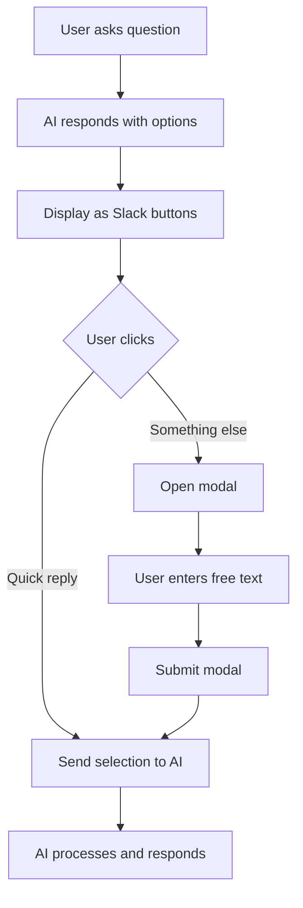

# Slack Interactive Buttons & Modal Implementation

## Overview
The Slack bot now supports interactive buttons that appear when the AI presents options to users. When users don't find a suitable option, they can click "Something else" to open a modal where they can enter free text.

## Features

### 1. **Quick Reply Buttons**
When the AI orchestrator provides suggestions via `cb-actions` blocks, these are automatically converted to Slack interactive buttons.

**Example:**
```
AI: "Which metric would you like? Here are the options:"
[Total Revenue] [Active Users] [Conversion Rate] [Something else]
```

### 2. **"Something else" Button**
- Always appears when quick reply buttons are shown
- Opens a modal dialog for free text input
- Primary style (blue) to stand out

### 3. **Custom Query Modal**
When "Something else" is clicked:
- Opens a Slack modal with the title "Custom Query"
- Shows input field: "What should I query instead?"
- Supports multiline text input
- Has Submit and Cancel buttons

### 4. **Seamless Flow**
- Quick reply clicks → Treated as if user typed that text
- Modal submission → Sent to orchestrator as new query
- All interactions maintain conversation context

## Technical Implementation

### Files Modified

1. **`formatResponse.js`**
   - `extractCbActions()` - Parses cb-actions from orchestrator responses
   - `parseMessageToBlocks()` - Converts cb-actions to Slack button blocks
   - Adds up to 4 suggestion buttons + "Something else" button

2. **`SlackRoute.js`**
   - `/apps/slack/interactions` endpoint handles:
     - Button clicks (`block_actions`)
     - Modal submissions (`view_submission`)
   - Uses WebClient to open modals
   - Routes responses back through `handleAsk()`

3. **`slackClient.js`**
   - Updated to support Block Kit format throughout
   - All message functions accept `{ text, blocks }` objects

## User Flow



## Example Interaction

1. **User:** `/chartbrew ask show me revenue data`

2. **Bot response with buttons:**
   ```
   Sure! I can fetch revenue data. Which timeframe would you like?
   
   [Last 7 days] [Last 30 days] [This year] [Something else]
   ```

3. **User clicks "Something else"**

4. **Modal opens:**
   ```
   ┌─────────────────────────┐
   │   Custom Query          │
   ├─────────────────────────┤
   │ What should I query     │
   │ instead?                │
   │                         │
   │ [Text input field]      │
   │  (multiline)            │
   │                         │
   │    [Cancel]  [Submit]   │
   └─────────────────────────┘
   ```

5. **User types:** "Show me revenue for Q4 2023 broken down by product category"

6. **Bot processes the custom query** and responds with results

## Benefits

✅ **Better UX:** Visual buttons are easier than typing
✅ **Flexibility:** "Something else" allows custom queries
✅ **Context-aware:** AI suggestions are specific to the conversation
✅ **Accessible:** Fallback text ensures compatibility
✅ **Maintainable:** Reuses existing orchestrator suggestions

## Configuration

No additional configuration needed. The feature works automatically when:
- Slack app is installed
- Bot has proper scopes (already configured)
- Orchestrator returns `cb-actions` blocks

## Testing

To test the interactive buttons:
1. Connect Slack workspace to Chartbrew
2. Run `/chartbrew ask [question that triggers options]`
3. Look for button suggestions in the response
4. Click "Something else" to test the modal
5. Submit custom text and verify it's processed

## Future Enhancements

Potential improvements:
- [ ] Support for more complex modal inputs (selects, checkboxes)
- [ ] Store conversation history per Slack channel
- [ ] Add button for "Show me more options"
- [ ] Support for threaded conversations
- [ ] Analytics on which buttons are most used
