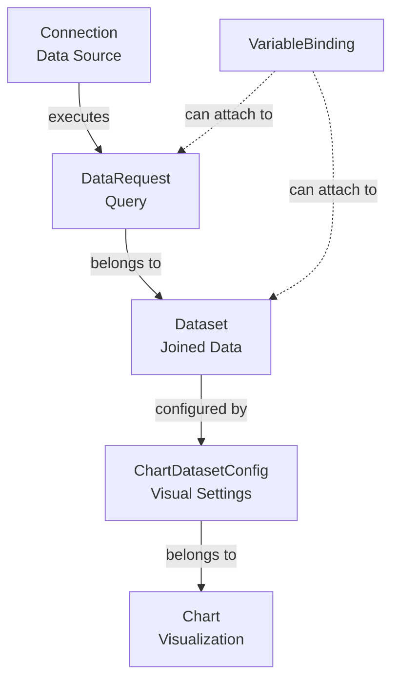

# Data Visualization Pipeline

This document explains how Chartbrew connects to data sources, creates datasets, and generates visualizations. This is critical documentation for understanding the charting algorithm before any rewrite.

## Architecture Overview

The data flow follows this hierarchy:



## Layer 1: Connections

**Controller**: [`controllers/ConnectionController.js`](../../controllers/ConnectionController.js)  
**Routes**: [`api/ConnectionRoute.js`](../../api/ConnectionRoute.js)

### Supported Connection Types

- `mongodb` - MongoDB databases
- `postgres` - PostgreSQL databases
- `mysql` - MySQL databases
- `api` - REST/HTTP APIs
- `firestore` - Google Cloud Firestore
- `realtimedb` - Firebase Realtime Database
- `googleAnalytics` - Google Analytics (OAuth)
- `customerio` - Customer.io API
- `clickhouse` - ClickHouse databases

### Key Operations

- **Testing**: `testConnection()`, `testRequest()`
- **Query execution**:
  - `runMongo()` - Executes MongoDB queries
  - `runMysqlOrPostgres()` - Executes SQL queries
  - `runClickhouse()` - Executes ClickHouse queries
  - `runApiRequest()` - Makes HTTP requests
  - `runFirestore()` - Queries Firestore collections
  - `runRealtimeDb()` - Queries Firebase Realtime DB
  - `runGoogleAnalytics()` - Fetches GA data
  - `runCustomerio()` - Fetches Customer.io data
- **Schema updates**: `updateMongoSchema()` (background job via BullMQ)
- **Caching**: `checkAndGetCache()` checks `DataRequestCache` table

### API Pattern

- Base route: `/team/:team_id/connections/*`
- Key endpoints:
  - `GET /team/:team_id/connections` - List connections
  - `POST /team/:team_id/connections` - Create connection
  - `GET /team/:team_id/connections/:connection_id/test` - Test connection
  - `POST /team/:team_id/connections/:connection_id/update-schema` - Update MongoDB schema

### Important Behaviors

- MongoDB connections auto-trigger schema updates on creation and after queries
- Connection files (SSL certs, SSH keys) are encrypted on upload via `encryptFile()`
- Each connection type has unique authentication patterns (OAuth, basic auth, service accounts, etc.)
- Connection credentials are excluded from API responses for non-editors

## Layer 2: DataRequests

**Controller**: [`controllers/DataRequestController.js`](../../controllers/DataRequestController.js)  
**Routes**: [`api/DataRequestRoute.js`](../../api/DataRequestRoute.js)

### Overview

A DataRequest represents a single query to a Connection. Multiple DataRequests can belong to one Dataset (for joins).

### Key Operations

- **`runRequest({ id, chartId, noSource, getCache, variables })`** - Coordinates with ConnectionController to execute the query
- **`askAi(id, question, conversationHistory, currentQuery)`** - AI query generation using connection schema

### API Pattern

- Base route: `/team/:team_id/datasets/:dataset_id/dataRequests/*`
- Key endpoints:
  - `POST /team/:team_id/datasets/:dataset_id/dataRequests` - Create data request
  - `GET /team/:team_id/datasets/:dataset_id/dataRequests` - List data requests
  - `POST /team/:team_id/datasets/:dataset_id/dataRequests/:id/request` - Execute data request
  - `POST /team/:team_id/datasets/:dataset_id/dataRequests/:id/askAi` - AI query generation

### Variable Substitution

- Applied here via `applyVariables()` from [`modules/applyVariables.js`](../../modules/applyVariables.js)
- Variables use `{{variableName}}` syntax in queries
- See [Variable Substitution System](#variable-substitution-system) section below

### Transformations

- `applyTransformation()` runs if `dataRequest.transform.enabled`
- Transformations are applied after data retrieval

## Layer 3: Datasets

**Controller**: [`controllers/DatasetController.js`](../../controllers/DatasetController.js)  
**Routes**: [`api/DatasetRoute.js`](../../api/DatasetRoute.js)

### Overview

A Dataset represents processed/joined data ready for visualization. It contains configuration for how data should be displayed.

### Core Fields

- `xAxis` - Field to use for X-axis
- `yAxis` - Field to use for Y-axis
- `yAxisOperation` - Aggregation operation (sum, avg, count, etc.)
- `dateField` - Field containing dates
- `conditions` - Filter conditions
- `joinSettings` - Configuration for joining multiple DataRequests

### Key Operations

- **`runRequest({ dataset_id, chart_id, noSource, getCache, filters, timezone, variables })`** - Orchestrates running all DataRequests and joining results
- **`joinData(joins, index, requests, data)`** - Private function handling join logic (lines 10-90)
- **`createWithDataRequests(data)`** - Batch creation endpoint (lines 563-694)

### API Pattern

- Base route: `/team/:team_id/datasets/*`
- Key endpoints:
  - `GET /team/:team_id/datasets` - List datasets
  - `POST /team/:team_id/datasets` - Create dataset
  - `POST /team/:team_id/datasets/quick-create` - Create dataset with data requests
  - `POST /team/:team_id/datasets/:dataset_id/request` - Execute dataset query

### Join Mechanics

- Controlled by `dataset.joinSettings.joins` array
- Each join specifies:
  - `dr_id` - Source DataRequest ID
  - `join_id` - DataRequest to join with
  - `dr_field` - Field from source (e.g., `root[].userId`)
  - `join_field` - Field from join target (e.g., `root[].id`)
  - `alias` - Name for joined data in result
- Joins execute sequentially; data flows through each join
- Join logic handles nested object paths and array selections

## Layer 4: ChartDatasetConfig (The Glue Layer)

**Model**: [`models/models/chartdatasetconfig.js`](../../models/models/chartdatasetconfig.js)

### Overview

ChartDatasetConfig maps Datasets to Charts with visual configuration. It allows one Chart to use multiple Datasets with different visual settings.

### Configuration Fields

- `datasetColor` - Color for the dataset
- `fillColor` - Fill color (can be gradient object)
- `legend` - Display name/label
- `pointRadius` - Size of data points
- `formula` - Formula to transform values (e.g., `{val / 100}`)
- `excludedFields` - Fields to exclude from visualization
- `order` - Rendering order (determines dataset order in charts)
- `maxRecords` - Maximum records to display
- `goal` - Goal line value

### Routes

- Routes in [`api/ChartRoute.js`](../../api/ChartRoute.js):
  - `POST /project/:project_id/chart/:id/chart-dataset-config` - Create CDC
  - `PUT /project/:project_id/chart/:id/chart-dataset-config/:cdcId` - Update CDC
  - `DELETE /project/:project_id/chart/:id/chart-dataset-config/:cdcId` - Delete CDC

## Layer 5: Charts

**Controller**: [`controllers/ChartController.js`](../../controllers/ChartController.js)  
**Routes**: [`api/ChartRoute.js`](../../api/ChartRoute.js)

### Chart Types

- `line` - Line chart
- `bar` - Bar chart
- `pie` - Pie chart
- `doughnut` - Doughnut chart
- `radar` - Radar chart
- `polar` - Polar area chart
- `table` - Table view
- `kpi` - KPI/metric display

### Core Method: `updateChartData()`

**Location**: Lines 297-512 in [`ChartController.js`](../../controllers/ChartController.js)

This is **THE charting pipeline** - critical for understanding before any rewrite.

#### Parameters

- `id` - Chart ID
- `user` - User object (for caching)
- `options`:
  - `noSource` - Use cached data without re-querying
  - `skipParsing` - Skip chart configuration generation
  - `filters` - Client-side filtering (doesn't re-query)
  - `variables` - Runtime variable values
  - `getCache` - Enable/disable cache lookup
  - `skipSave` - Don't save to database (for testing/preview)

#### Flow

1. Fetch all ChartDatasetConfigs for chart
2. For each CDC, merge CDC-level variables with chart-level variables (lines 331-341)
3. Call `datasetController.runRequest()` for each dataset
4. Check ChartCache if `noSource: true` and user exists
5. Pass data through AxisChart or TableView (lines 400-413)
6. Save `chartData` configuration to database (unless `skipSave`)

### API Pattern

- Base route: `/project/:project_id/chart/*`
- Key endpoints:
  - `GET /project/:project_id/chart` - List charts
  - `POST /project/:project_id/chart` - Create chart
  - `POST /project/:project_id/chart/quick-create` - Create chart with CDCs (lines 1098-1195)
  - `POST /project/:project_id/chart/:id/query` - Execute query and render chart
  - `POST /project/:project_id/chart/:id/filter` - Apply filters (client-side)

### Public Routes

- `/chart/:share_string/embedded` - Embedded chart (deprecated, uses Chartshare)
- `/chart/share/:share_string` - Shared chart via SharePolicy

## Variable Substitution System

**Module**: [`modules/applyVariables.js`](../../modules/applyVariables.js)

### Syntax

Variables use `{{variableName}}` syntax in queries.

### VariableBindings

- Can attach to DataRequest or Dataset entities
- Stored in `VariableBinding` table with `entity_type` and `entity_id`
- Fields: `name`, `type`, `default_value`, `required`

### Connection-Specific Logic

Each connection type has custom substitution logic:

- **SQL** (`applyMysqlOrPostgresVariables`): Auto-quoting, escaping, type conversion
- **MongoDB** (`applyMongoVariables`): JSON escaping, proper type handling
- **API** (`applyApiVariables`): Substitutes in route, headers, body
- **Firestore** (`applyFirestoreVariables`): Collection paths, conditions, configuration
- **RealtimeDB** (`applyRealtimeDbVariables`): Route field substitution

### Priority Order

1. Runtime values (from `variables` parameter)
2. Default values (from VariableBinding)
3. Error if required, removal if optional

### Critical Behavior

- **Original DataRequest never modified**; returns `{ dataRequest, processedQuery }`
- Special variables: `{{start_date}}` and `{{end_date}}` handled separately in API requests (lines 973-1072 in ConnectionController)

## Caching Architecture

### Level 1: DataRequestCache

- Stored after each DataRequest execution
- Key: `DataRequest.id`
- Invalidation: When DataRequest configuration changes
- Check: `checkAndGetCache()` compares current DR with cached DR (excluding timestamps) (lines 38-63 in ConnectionController)
- Location: `DataRequestCacheController`

### Level 2: ChartCache

- User-specific full chart data cache
- Key: `user.id` + `chart.id`
- Used when: `noSource: true` parameter
- Created: During `updateChartData()` for authenticated users (line 390 in ChartController)
- Location: `ChartCacheController`

## Critical Edge Cases

### 1. MongoDB ObjectIds

- Auto-stringified via `stringifyMongoIds()` (lines 93-119 in ConnectionController) for JSON serialization
- Handles circular references and nested ObjectIds

### 2. Date Variables in APIs

- `{{start_date}}` and `{{end_date}}` resolved from Chart.startDate/endDate
- Timezone-aware via `getMomentObj(timezone)` (lines 30-36 in ConnectionController)
- Format controlled by `chart.dateVarsFormat`
- Handles `currentEndDate` flag for relative date ranges

### 3. Variable Scope Hierarchy

- ChartDatasetConfig variables override chart-level variables (lines 331-341 in ChartController)
- Runtime variables override default values
- Variables cascade: chart → CDC → runtime

### 4. Response Truncation

- DataRequest responses limited to 20 items for UI performance (lines 179-198 in DataRequestRoute)
- Dataset responses also truncated similarly

### 5. Schema Updates

- MongoDB schema updates run in background via BullMQ queue (lines 1456-1489 in ConnectionController)
- Triggered on connection creation and after queries
- Uses `updateMongoSchema` worker

### 6. Join Execution

- Must execute in order; each join modifies data for next join (lines 440-444 in DatasetController)
- Join logic handles nested paths like `root[].field.subfield`

## API Flow Examples

### Example 1: Create Visualization from Scratch

```
1. POST /team/:team_id/connections
   Body: { type: "mongodb", host: "...", ... }
   → Create connection, test it

2. POST /team/:team_id/datasets/quick-create
   Body: { 
     dataRequests: [
       { connection_id: 1, query: "db.users.find()" },
       { connection_id: 1, query: "db.orders.find()" }
     ],
     joinSettings: {
       joins: [{
         dr_id: 1,
         join_id: 2,
         dr_field: "root[].userId",
         join_field: "root[].id",
         alias: "orders"
       }]
     }
   }
   → Create dataset with all data requests

3. POST /project/:project_id/chart/quick-create
   Body: { 
     name: "User Orders",
     type: "bar",
     chartDatasetConfigs: [{
       dataset_id: 1,
       legend: "Total Orders"
     }]
   }
   → Create chart, auto-calculate layout, link datasets

4. POST /project/:project_id/chart/:id/query
   → Execute pipeline, render chart
```

### Example 2: Runtime Variables

```
POST /project/:project_id/chart/:id/query
Body: { 
  variables: { userId: "123", dateRange: "30d" },
  filters: [{ field: "status", value: "active" }]
}
→ Variables flow: applyVariables() → DataRequest → Chart rendering
→ Filters applied client-side without re-querying
```

### Example 3: Embedded Chart with Variables

```
GET /chart/share/:share_string?token=JWT&userId=123&period=7d
→ SharePolicy validates token
→ Variables extracted from query params (lines 902-914 in ChartController)
→ updateChartData() with variables
→ Returns embedded chart data
```

## Important Files to Study Before Charting Rewrite

### Core Pipeline

- [`controllers/ConnectionController.js`](../../controllers/ConnectionController.js) - Query execution per connection type
- [`controllers/DatasetController.js`](../../controllers/DatasetController.js) - Join logic and orchestration
- [`controllers/ChartController.js`](../../controllers/ChartController.js) - Main charting pipeline
- [`modules/applyVariables.js`](../../modules/applyVariables.js) - Variable substitution
- `charts/AxisChart.js` - Chart rendering logic (needs study)
- `charts/TableView.js` - Table rendering logic (needs study)
- `charts/DataExtractor.js` - Data extraction and formatting (needs study)

### Support Modules

- `modules/dataTransformations.js` - Data transformation logic
- `modules/chartLayoutEngine.js` - Auto-layout calculation
- `modules/snapshots.js` - Chart snapshot system
- `crons/workers/updateMongoSchema.js` - Background schema updates

## Key Architectural Decisions

1. **Separation of Concerns**: Each layer has a distinct responsibility
2. **Immutability**: Original DataRequests are never modified; processed queries returned separately
3. **Caching Strategy**: Two-level cache (DataRequest + Chart) for performance
4. **Variable System**: Flexible variable binding at multiple levels
5. **Join Execution**: Sequential joins allow complex data relationships
6. **Connection Abstraction**: Each connection type has custom execution logic but unified interface

