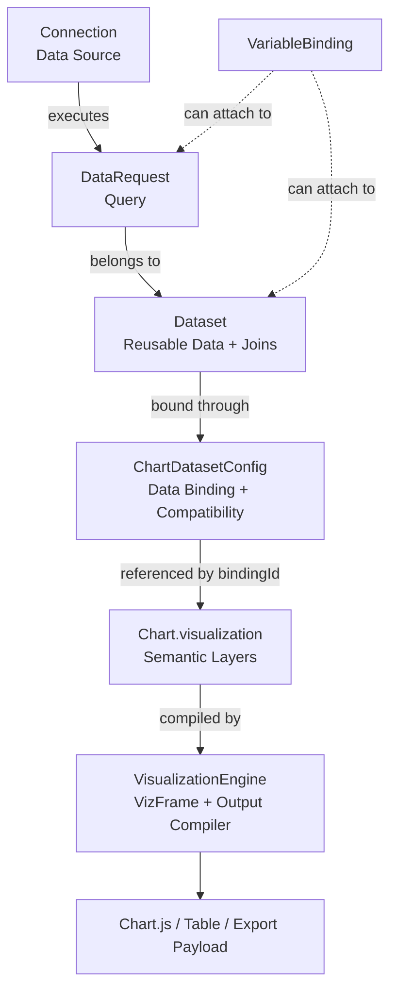

# Data Visualization Pipeline

This document explains how Chartbrew connects to data sources, creates datasets, and compiles canonical visualization specifications.

## Architecture Overview

The data flow follows this hierarchy:


```mermaid
flowchart TD
    Connection[Connection<br/>Data Source] -->|executes| DataRequest[DataRequest<br/>Query]
    DataRequest -->|belongs to| Dataset[Dataset<br/>Reusable Data + Joins]
    Dataset -->|bound through| ChartDatasetConfig[ChartDatasetConfig<br/>Data Binding + Compatibility]
    ChartDatasetConfig -->|referenced by bindingId| Visualization[Chart.visualization<br/>Semantic Layers]
    Visualization -->|compiled by| Engine[VisualizationEngine<br/>VizFrame + Output Compiler]
    Engine --> Chart[Chart.js / Table / Export Payload]
    
    VariableBinding[VariableBinding] -.->|can attach to| DataRequest
    VariableBinding -.->|can attach to| Dataset
```

## Layer 1: Connections

**Controller**: [`controllers/ConnectionController.js`](../../controllers/ConnectionController.js)  
**Routes**: [`api/ConnectionRoute.js`](../../api/ConnectionRoute.js)

### Supported Connection Types

- `mongodb` - MongoDB databases
- `postgres` - PostgreSQL databases
- `mysql` - MySQL databases
- `api` - REST/HTTP APIs
- `firestore` - Google Cloud Firestore
- `realtimedb` - Firebase Realtime Database
- `googleAnalytics` - Google Analytics (OAuth)
- `customerio` - Customer.io API
- `clickhouse` - ClickHouse databases

### Key Operations

- **Testing**: `testConnection()`, `testRequest()`
- **Query execution**:
  - `runMongo()` - Executes MongoDB queries
  - `runMysqlOrPostgres()` - Executes SQL queries
  - `runClickhouse()` - Executes ClickHouse queries
  - `runApiRequest()` - Makes HTTP requests
  - Firestore runtime is source-owned in `server/sources/plugins/firestore/firestore.protocol.js`
  - RealtimeDB runtime is source-owned in `server/sources/plugins/realtimedb/realtimedb.protocol.js`
  - `runGoogleAnalytics()` - Fetches GA data
  - Customer.io runtime is source-owned in `server/sources/plugins/customerio/customerio.protocol.js`
- **Schema updates**: `updateMongoSchema()` (background job via BullMQ)
- **Caching**: `checkAndGetCache()` in `server/sources/shared/connectorRuntime.js` checks `DataRequestCache` table

### API Pattern

- Base route: `/team/:team_id/connections/*`
- Key endpoints:
  - `GET /team/:team_id/connections` - List connections
  - `POST /team/:team_id/connections` - Create connection
  - `GET /team/:team_id/connections/:connection_id/test` - Test connection
  - `POST /team/:team_id/connections/:connection_id/update-schema` - Update MongoDB schema

### Important Behaviors

- MongoDB connections auto-trigger schema updates on creation and after queries
- Connection files (SSL certs, SSH keys) are encrypted on upload via `encryptFile()`
- Each connection type has unique authentication patterns (OAuth, basic auth, service accounts, etc.)
- Connection credentials are excluded from API responses for non-editors

## Layer 2: DataRequests

**Controller**: [`controllers/DataRequestController.js`](../../controllers/DataRequestController.js)  
**Routes**: [`api/DataRequestRoute.js`](../../api/DataRequestRoute.js)

### Overview

A DataRequest represents a single query to a Connection. Multiple DataRequests can belong to one Dataset (for joins).

### Key Operations

- **`runRequest({ id, chartId, noSource, getCache, variables })`** - Coordinates with ConnectionController to execute the query
- **`askAi(id, question, conversationHistory, currentQuery)`** - AI query generation using connection schema

### API Pattern

- Base route: `/team/:team_id/datasets/:dataset_id/dataRequests/*`
- Key endpoints:
  - `POST /team/:team_id/datasets/:dataset_id/dataRequests` - Create data request
  - `GET /team/:team_id/datasets/:dataset_id/dataRequests` - List data requests
  - `POST /team/:team_id/datasets/:dataset_id/dataRequests/:id/request` - Execute data request
  - `POST /team/:team_id/datasets/:dataset_id/dataRequests/:id/askAi` - AI query generation

### Variable Substitution

- Applied here via `applySourceVariables()` from [`sources/applySourceVariables.js`](../../sources/applySourceVariables.js)
- Variables use `{{variableName}}` syntax in queries
- See [Variable Substitution System](#variable-substitution-system) section below

### Transformations

- `applyTransformation()` runs if `dataRequest.transform.enabled`
- Transformations are applied after data retrieval

## Layer 3: Datasets

**Controller**: [`controllers/DatasetController.js`](../../controllers/DatasetController.js)  
**Routes**: [`api/DatasetRoute.js`](../../api/DatasetRoute.js)

### Overview

A Dataset represents reusable source data and join configuration. It owns the query grouping, access scope, schema, and join behavior, but it no longer owns the active chart visualization settings.

The old dataset-side visualization fields still exist in [`models/models/dataset.js`](../../models/models/dataset.js) as legacy compatibility fields. New chart rendering reads semantic fields and presentation settings from `Chart.visualization`; ChartDatasetConfig remains the reusable-data binding and compatibility bridge.

### Core Fields

- `name` - Canonical reusable dataset name
- `team_id` - Team that owns the dataset
- `project_ids` - Projects where members can access the dataset
- `draft` - Whether dashboard viewers should see the dataset
- `fieldsSchema` - Encrypted schema of detected fields
- `main_dr_id` - Main DataRequest for the dataset
- `joinSettings` - Configuration for joining multiple DataRequests

### Legacy Visualization Fields

These fields remain on Dataset for older charts and callers during the CDC migration, but they are not the active source of truth for new chart rendering:

- `xAxis`, `xAxisOperation`
- `yAxis`, `yAxisOperation`
- `dateField`, `dateFormat`
- `conditions`
- `legend`, `formula`
- `chart_id`, `connection_id`, `query`
- `excludedFields`, `configuration`
- `datasetColor`, `fillColor`, `fill`, `multiFill`, `pointRadius`, `patterns`

### Key Operations

- **`runRequest({ dataset_id, chart_id, noSource, getCache, filters, timezone, variables })`** - Orchestrates running all DataRequests and joining results. It returns raw/joined dataset data plus dataset options; ChartController later overlays ChartDatasetConfig options before plotting.
- **`joinData(joins, index, requests, data)`** - Private function handling join logic (lines 10-90)
- **`createWithDataRequests(data)`** - Batch creation endpoint (lines 563-694)

### API Pattern

- Base route: `/team/:team_id/datasets/*`
- Key endpoints:
  - `GET /team/:team_id/datasets` - List datasets
  - `POST /team/:team_id/datasets` - Create dataset
  - `POST /team/:team_id/datasets/quick-create` - Create dataset with data requests
  - `POST /team/:team_id/datasets/:dataset_id/request` - Execute dataset query

### Join Mechanics

- Controlled by `dataset.joinSettings.joins` array
- Each join specifies:
  - `dr_id` - Source DataRequest ID
  - `join_id` - DataRequest to join with
  - `dr_field` - Field from source (e.g., `root[].userId`)
  - `join_field` - Field from join target (e.g., `root[].id`)
  - `alias` - Name for joined data in result
- Joins execute sequentially; data flows through each join
- Join logic handles nested object paths and array selections

## Layer 4: ChartDatasetConfig (The Glue Layer)

**Model**: [`models/models/chartdatasetconfig.js`](../../models/models/chartdatasetconfig.js)  
**Option resolver**: [`modules/resolveChartDatasetOptions.js`](../../modules/resolveChartDatasetOptions.js)

### Overview

ChartDatasetConfig maps Datasets to Charts. A canonical visualization layer references it through `bindingId`, allowing one dataset result to power multiple value layers and generated breakdown series without adding CDC rows.

During chart rendering, [`ChartController.updateChartData()`](../../controllers/ChartController.js) runs each CDC's Dataset through `DatasetController.runRequest()`, overlays compatibility options, and passes the bound results to `VisualizationEngine`. The engine filters rows, builds a sparse `VizFrame`, and selects the Chart.js, metric, table, matrix, markdown, or export compiler.

### Ownership Rule

- Dataset owns source/query concerns: DataRequests, joins, schema, access scope, and reusable dataset name.
- `Chart.visualization.layers` owns semantic fields, aggregation, breakdown, transforms, formulas, goals, generated-series settings, and styles.
- ChartDatasetConfig owns the dataset binding, query-variable defaults, chart-local conditions, date-filter compatibility, and legacy fields required by unmigrated callers.
- Dataset legacy visualization fields are fallback compatibility only. Do not add new visualization behavior to Dataset.

### Configuration Fields

- `xAxis` - Field to use for X-axis or metric field using traversal syntax (`root[].field`)
- `xAxisOperation` - Operation for X-axis values
- `yAxis` - Field to use for Y-axis or metric field using traversal syntax (`root[].field`)
- `yAxisOperation` - Aggregation operation (none, sum, avg, min, max, count)
- `dateField` - Field containing dates for date filtering/timeseries parsing
- `dateFormat` - Date format used to parse `dateField`
- `conditions` - Chart-specific filter conditions layered on top of the dataset
- `datasetColor` - Color for the dataset
- `fillColor` - Fill color (can be gradient object)
- `fill` - Whether to fill the dataset
- `multiFill` - Whether the UI should prompt for multiple fill colors
- `legend` - Display name/label
- `pointRadius` - Size of data points
- `formula` - Formula to transform values (e.g., `{val / 100}`)
- `excludedFields` - Fields to exclude from visualization
- `sort` - Sort order (`asc` or `desc`)
- `columnsOrder` - Table column order
- `order` - Rendering order (determines dataset order in charts)
- `maxRecords` - Maximum records to display
- `goal` - Goal line value
- `configuration.variables` - CDC-level default variable values. Runtime variables take precedence.

### Migration Notes

- Migration `20260321090000-add-dataset-name-and-cdc-viz-fields.js` added the active CDC visualization fields and backfilled them from Dataset with `models/scripts/migrateDatasetVizToCdc.js`.
- `resolveChartDatasetOptions()` keeps old charts working by merging Dataset options first, then overlaying non-null CDC fields.
- When chart conditions are updated after parsing, `ChartController.updateChartData()` writes condition value updates back to `ChartDatasetConfig.conditions`, not `Dataset.conditions`.

### Routes

- Routes in [`api/ChartRoute.js`](../../api/ChartRoute.js):
  - `POST /project/:project_id/chart/:id/chart-dataset-config` - Create CDC
  - `PUT /project/:project_id/chart/:id/chart-dataset-config/:cdcId` - Update CDC
  - `DELETE /project/:project_id/chart/:id/chart-dataset-config/:cdcId` - Delete CDC

## Layer 5: Charts

**Controller**: [`controllers/ChartController.js`](../../controllers/ChartController.js)  
**Routes**: [`api/ChartRoute.js`](../../api/ChartRoute.js)

### Chart Types

- `line` - Line chart
- `bar` - Bar chart
- `pie` - Pie chart
- `doughnut` - Doughnut chart
- `radar` - Radar chart
- `polar` - Polar area chart
- `table` - Table view
- `kpi` - KPI/metric display

### Core Method: `updateChartData()`

**Location**: Lines 297-512 in [`ChartController.js`](../../controllers/ChartController.js)

This is the chart-runtime entry point. `VisualizationEngine` is the presentation boundary; do not add new parsing behavior to `AxisChart`.

#### Parameters

- `id` - Chart ID
- `user` - User object (for caching)
- `options`:
  - `noSource` - Use cached data without re-querying
  - `skipParsing` - Skip chart configuration generation
  - `filters` - Client-side filtering (doesn't re-query)
  - `variables` - Runtime variable values
  - `getCache` - Enable/disable cache lookup
  - `skipSave` - Don't save to database (for testing/preview)

#### Flow

1. Fetch all ChartDatasetConfigs for chart
2. For each CDC, merge CDC-level variables with chart-level variables (lines 331-341)
3. Call `datasetController.runRequest()` for each dataset
4. Check ChartCache if `noSource: true` and user exists
5. Pass data through AxisChart or TableView (lines 400-413)
6. Save `chartData` configuration to database (unless `skipSave`)

### API Pattern

- Base route: `/project/:project_id/chart/*`
- Key endpoints:
  - `GET /project/:project_id/chart` - List charts
  - `POST /project/:project_id/chart` - Create chart
  - `POST /project/:project_id/chart/quick-create` - Create chart with CDCs (lines 1098-1195)
  - `POST /project/:project_id/chart/:id/query` - Execute query and render chart
  - `POST /project/:project_id/chart/:id/filter` - Apply filters (client-side)

### Public Routes

- `/chart/:share_string/embedded` - Embedded chart (deprecated, uses Chartshare)
- `/chart/share/:share_string` - Shared chart via SharePolicy

## Variable Substitution System

**Public dispatcher**: [`sources/applySourceVariables.js`](../../sources/applySourceVariables.js)

`modules/applyVariables.js` remains as a small compatibility wrapper for older imports. Source-specific substitution logic lives beside the owning source protocol.

### Syntax

Variables use `{{variableName}}` syntax in queries.

### VariableBindings

- Can attach to DataRequest or Dataset entities
- Stored in `VariableBinding` table with `entity_type` and `entity_id`
- Fields: `name`, `type`, `default_value`, `required`

### Connection-Specific Logic

Each source protocol has custom substitution logic:

- **SQL** (`sources/shared/sql/sql.variables.js`): Auto-quoting, escaping, type conversion
- **MongoDB** (`mongodb.protocol.applyMongoVariables`): JSON escaping, proper type handling
- **API** (`sources/shared/protocols/api.variables.js`): Substitutes in route, headers, body
- **Firestore** (`sources/plugins/firestore/firestore.variables.js`): Collection paths, conditions, configuration
- **RealtimeDB** (`sources/plugins/realtimedb/realtimedb.variables.js`): Route field substitution

### Priority Order

1. Runtime values (from `variables` parameter)
2. Default values (from VariableBinding)
3. Error if required, removal if optional

### Critical Behavior

- **Original DataRequest never modified**; returns `{ dataRequest, processedQuery }`
- Special variables: `{{start_date}}` and `{{end_date}}` are preserved by the API variable processor and handled separately during API request execution.

## Caching Architecture

### Level 1: DataRequestCache

- Stored after each DataRequest execution
- Key: `DataRequest.id`
- Invalidation: When DataRequest configuration changes
- Check: `checkAndGetCache()` compares current DR with cached DR (excluding timestamps) in `server/sources/shared/connectorRuntime.js`
- Location: `DataRequestCacheController`

### Level 2: ChartCache

- User-specific full chart data cache
- Key: `user.id` + `chart.id`
- Used when: `noSource: true` parameter
- Created: During `updateChartData()` for authenticated users (line 390 in ChartController)
- Location: `ChartCacheController`

## Critical Edge Cases

### 1. MongoDB ObjectIds

- Auto-stringified via `stringifyMongoIds()` (lines 93-119 in ConnectionController) for JSON serialization
- Handles circular references and nested ObjectIds

### 2. Date Variables in APIs

- `{{start_date}}` and `{{end_date}}` resolved from Chart.startDate/endDate
- Timezone-aware via `getMomentObj(timezone)` (lines 30-36 in ConnectionController)
- Format controlled by `chart.dateVarsFormat`
- Handles `currentEndDate` flag for relative date ranges

### 3. Variable Scope Hierarchy

- Runtime/chart variables are built first by `buildChartRuntimeContext()`
- Each ChartDatasetConfig can provide `configuration.variables` defaults for its dataset binding
- CDC variable defaults only fill missing, null, or empty runtime values; they do not override provided runtime values
- Variables cascade: runtime/chart context → CDC missing-value defaults → DataRequest/Dataset VariableBinding defaults

### 4. Response Truncation

- DataRequest responses limited to 20 items for UI performance (lines 179-198 in DataRequestRoute)
- Dataset responses also truncated similarly

### 5. Schema Updates

- MongoDB schema updates run in background via BullMQ queue (lines 1456-1489 in ConnectionController)
- Triggered on connection creation and after queries
- Uses `updateMongoSchema` worker

### 6. Join Execution

- Must execute in order; each join modifies data for next join (lines 440-444 in DatasetController)
- Join logic handles nested paths like `root[].field.subfield`

## API Flow Examples

### Example 1: Create Visualization from Scratch

```
1. POST /team/:team_id/connections
   Body: { type: "mongodb", host: "...", ... }
   → Create connection, test it

2. POST /team/:team_id/datasets/quick-create
   Body: { 
     dataRequests: [
       { connection_id: 1, query: "db.users.find()" },
       { connection_id: 1, query: "db.orders.find()" }
     ],
     joinSettings: {
       joins: [{
         dr_id: 1,
         join_id: 2,
         dr_field: "root[].userId",
         join_field: "root[].id",
         alias: "orders"
       }]
     }
   }
   → Create dataset with all data requests

3. POST /project/:project_id/chart/quick-create
   Body: { 
     name: "User Orders",
     type: "bar",
     chartDatasetConfigs: [{
       dataset_id: 1,
       legend: "Total Orders"
     }]
   }
   → Create chart, auto-calculate layout, link datasets

4. POST /project/:project_id/chart/:id/query
   → Execute pipeline, render chart
```

### Example 2: Runtime Variables

```
POST /project/:project_id/chart/:id/query
Body: { 
  variables: { userId: "123", dateRange: "30d" },
  filters: [{ field: "status", value: "active" }]
}
→ Variables flow: applyVariables() → DataRequest → Chart rendering
→ Filters applied client-side without re-querying
```

### Example 3: Embedded Chart with Variables

```
GET /chart/share/:share_string?token=JWT&userId=123&period=7d
→ SharePolicy validates token
→ Variables extracted from query params (lines 902-914 in ChartController)
→ updateChartData() with variables
→ Returns embedded chart data
```

## Important Files to Study Before Charting Rewrite

### Core Pipeline

- [`controllers/ConnectionController.js`](../../controllers/ConnectionController.js) - Query execution per connection type
- [`controllers/DatasetController.js`](../../controllers/DatasetController.js) - Join logic and orchestration
- [`controllers/ChartController.js`](../../controllers/ChartController.js) - Main charting pipeline
- [`sources/applySourceVariables.js`](../../sources/applySourceVariables.js) - Source-owned variable substitution dispatcher
- `charts/AxisChart.js` - Chart rendering logic (needs study)
- `charts/TableView.js` - Table rendering logic (needs study)
- `charts/DataExtractor.js` - Data extraction and formatting (needs study)

### Support Modules

- `modules/dataTransformations.js` - Data transformation logic
- `modules/chartLayoutEngine.js` - Auto-layout calculation
- `modules/snapshots.js` - Chart snapshot system
- `crons/workers/updateMongoSchema.js` - Background schema updates

## Key Architectural Decisions

1. **Separation of Concerns**: Each layer has a distinct responsibility
2. **Immutability**: Original DataRequests are never modified; processed queries returned separately
3. **Caching Strategy**: Two-level cache (DataRequest + Chart) for performance
4. **Variable System**: Flexible variable binding at multiple levels
5. **Join Execution**: Sequential joins allow complex data relationships
6. **Connection Abstraction**: Each connection type has custom execution logic but unified interface
